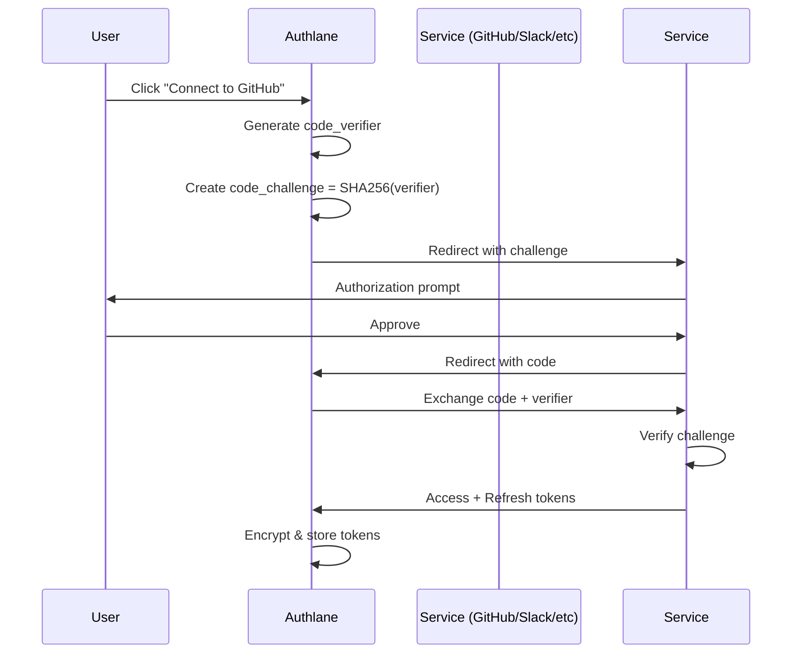

## Overview

Each integration in Authlane requires an OAuth application to be created with the external service. This guide walks you through the setup process for each supported integration.

## General OAuth Concepts

### OAuth 2.0 Flow

Authlane implements the **Authorization Code Flow with PKCE** for maximum security:



### PKCE (Proof Key for Code Exchange)

PKCE prevents authorization code interception attacks:

- **code_verifier**: Random 43-128 character string
- **code_challenge**: SHA256 hash of verifier
- **code_challenge_method**: Always `S256`

Authlane handles PKCE automatically - no configuration needed.

### Scopes

Scopes define what permissions your integration requests. Use the **minimum required scopes** for your use case.

## Integration-Specific Setup

### GitHub

<Steps>
  <Step title="Create OAuth App">
    1. Go to [github.com/settings/developers](https://github.com/settings/developers)
    2. Click **New OAuth App**
    3. Fill in:
       - **Application name**: `Your App Name (Authlane)`
       - **Homepage URL**: `https://yourapp.com`
       - **Authorization callback URL**: `https://api.authlane.com/api/v1/oauth/callback`
    4. Click **Register application**
  </Step>

  <Step title="Get Credentials">
    - Copy **Client ID**
    - Click **Generate a new client secret**
    - Copy **Client Secret** (shown once!)
  </Step>

  <Step title="Configure in Authlane">
    ```bash
    curl -X POST https://api.authlane.com/api/v1/admin/services/github/credentials \
      -H "Authorization: Bearer YOUR_ADMIN_API_KEY" \
      -H "Content-Type: application/json" \
      -d '{
        "tenantId": "your-tenant-id",
        "clientId": "YOUR_GITHUB_CLIENT_ID",
        "clientSecret": "YOUR_GITHUB_CLIENT_SECRET"
      }'
    ```
  </Step>
</Steps>

**Recommended Scopes:**
- `repo` - Full control of private repositories
- `read:org` - Read organization membership
- `user:email` - Access user email addresses

### Slack

<Steps>
  <Step title="Create Slack App">
    1. Go to [api.slack.com/apps](https://api.slack.com/apps)
    2. Click **Create New App** → **From scratch**
    3. Enter app name and select workspace
  </Step>

  <Step title="Configure OAuth">
    1. Navigate to **OAuth & Permissions**
    2. Add redirect URL: `https://api.authlane.com/api/v1/oauth/callback`
    3. Under **Scopes**, add:
       - `chat:write` - Send messages
       - `channels:read` - View channels
       - `users:read` - View users
  </Step>

  <Step title="Get Credentials">
    - Go to **Basic Information**
    - Copy **Client ID**
    - Copy **Client Secret**
  </Step>

  <Step title="Configure in Authlane">
    ```bash
    curl -X POST https://api.authlane.com/api/v1/admin/services/slack/credentials \
      -H "Authorization: Bearer YOUR_ADMIN_API_KEY" \
      -H "Content-Type: application/json" \
      -d '{
        "tenantId": "your-tenant-id",
        "clientId": "YOUR_SLACK_CLIENT_ID",
        "clientSecret": "YOUR_SLACK_CLIENT_SECRET"
      }'
    ```
  </Step>
</Steps>

### Linear

<Steps>
  <Step title="Create OAuth App">
    1. Go to [linear.app/settings/api](https://linear.app/settings/api)
    2. Click **Create new** under OAuth applications
    3. Fill in:
       - **Name**: Your app name
       - **Redirect URL**: `https://api.authlane.com/api/v1/oauth/callback`
  </Step>

  <Step title="Get Credentials">
    - Copy **Client ID**
    - Copy **Client Secret**
  </Step>

  <Step title="Configure in Authlane">
    ```bash
    curl -X POST https://api.authlane.com/api/v1/admin/services/linear/credentials \
      -H "Authorization: Bearer YOUR_ADMIN_API_KEY" \
      -H "Content-Type: application/json" \
      -d '{
        "tenantId": "your-tenant-id",
        "clientId": "YOUR_LINEAR_CLIENT_ID",
        "clientSecret": "YOUR_LINEAR_CLIENT_SECRET"
      }'
    ```
  </Step>
</Steps>

**Recommended Scopes:**
- `read` - Read issues, projects, teams
- `write` - Create and update issues

### Gmail (Google)

<Steps>
  <Step title="Create Google Cloud Project">
    1. Go to [console.cloud.google.com](https://console.cloud.google.com)
    2. Create new project
    3. Enable **Gmail API**
  </Step>

  <Step title="Configure OAuth Consent">
    1. Go to **OAuth consent screen**
    2. Choose **External** (unless Google Workspace)
    3. Fill in app information
    4. Add scopes:
       - `https://www.googleapis.com/auth/gmail.send`
       - `https://www.googleapis.com/auth/gmail.readonly`
  </Step>

  <Step title="Create OAuth Credentials">
    1. Go to **Credentials** → **Create Credentials** → **OAuth client ID**
    2. Application type: **Web application**
    3. Add redirect URI: `https://api.authlane.com/api/v1/oauth/callback`
    4. Copy **Client ID** and **Client Secret**
  </Step>

  <Step title="Configure in Authlane">
    ```bash
    curl -X POST https://api.authlane.com/api/v1/admin/services/gmail/credentials \
      -H "Authorization: Bearer YOUR_ADMIN_API_KEY" \
      -H "Content-Type: application/json" \
      -d '{
        "tenantId": "your-tenant-id",
        "clientId": "YOUR_GOOGLE_CLIENT_ID",
        "clientSecret": "YOUR_GOOGLE_CLIENT_SECRET"
      }'
    ```
  </Step>
</Steps>

<Note>
  The same Google OAuth app can be reused for **Google Drive** and **Google Calendar** integrations.
</Note>

### Notion

<Steps>
  <Step title="Create Integration">
    1. Go to [notion.so/my-integrations](https://www.notion.so/my-integrations)
    2. Click **New integration**
    3. Fill in basic information
    4. Under **Capabilities**, enable:
       - Read content
       - Update content
       - Insert content
  </Step>

  <Step title="Configure OAuth">
    1. Enable **Public integration**
    2. Add redirect URI: `https://api.authlane.com/api/v1/oauth/callback`
  </Step>

  <Step title="Get Credentials">
    - Copy **OAuth client ID**
    - Copy **OAuth client secret**
  </Step>

  <Step title="Configure in Authlane">
    ```bash
    curl -X POST https://api.authlane.com/api/v1/admin/services/notion/credentials \
      -H "Authorization: Bearer YOUR_ADMIN_API_KEY" \
      -H "Content-Type: application/json" \
      -d '{
        "tenantId": "your-tenant-id",
        "clientId": "YOUR_NOTION_CLIENT_ID",
        "clientSecret": "YOUR_NOTION_CLIENT_SECRET"
      }'
    ```
  </Step>
</Steps>

## Multi-Tenant Configuration

If you're building a multi-tenant application, each tenant can use:

### Option 1: Shared OAuth App (Recommended)

One OAuth app for all tenants - simplest setup:

```typescript
// Configure once per service
await authlane.admin.configureService({
  serviceId: 'github',
  clientId: 'YOUR_GITHUB_CLIENT_ID',
  clientSecret: 'YOUR_GITHUB_CLIENT_SECRET',
  global: true, // Use for all tenants
});
```

### Option 2: Per-Tenant OAuth Apps

Each tenant uses their own OAuth apps (more isolation):

```typescript
// Configure per tenant
await authlane.admin.configureService({
  tenantId: 'tenant_123',
  serviceId: 'github',
  clientId: 'TENANT_GITHUB_CLIENT_ID',
  clientSecret: 'TENANT_GITHUB_CLIENT_SECRET',
});
```

Use this if:
- Tenants need custom branding in OAuth prompts
- Regulatory compliance requires data isolation
- Different tenants need different scopes

## Testing OAuth Flows

### Using cURL

```bash
# Step 1: Get authorization URL
curl -X GET "https://api.authlane.com/api/v1/oauth/authorize?user_id=test_user&service_id=github" \
  -H "Authorization: Bearer YOUR_API_KEY"

# Returns:
# {
#   "url": "https://github.com/login/oauth/authorize?client_id=...&state=...&code_challenge=..."
# }

# Step 2: Visit URL in browser, approve

# Step 3: Copy code and state from redirect URL

# Step 4: Exchange code for connection
curl -X POST "https://api.authlane.com/api/v1/oauth/callback" \
  -H "Content-Type: application/json" \
  -d '{
    "code": "AUTHORIZATION_CODE",
    "state": "STATE_FROM_URL"
  }'
```

### Using Test Scripts

Authlane includes test scripts for each integration:

```bash
# Test GitHub OAuth
./scripts/test-github-oauth.sh

# Test Slack OAuth
./scripts/test-slack-oauth.sh

# Test all integrations
./scripts/test-all-oauth.sh
```

## Common Issues

<AccordionGroup>
  <Accordion title="Redirect URI mismatch">
    **Error:** `redirect_uri_mismatch`

    **Solution:**
    - Ensure callback URL exactly matches in:
      1. OAuth app settings
      2. Authlane configuration
      3. Request parameters
    - Check for trailing slashes
    - Verify HTTP vs HTTPS
  </Accordion>

  <Accordion title="Invalid client credentials">
    **Error:** `invalid_client`

    **Solution:**
    - Verify Client ID and Secret are correct
    - Check if secret has been rotated
    - Ensure credentials are for the correct environment (dev/prod)
  </Accordion>

  <Accordion title="Scope not granted">
    **Error:** `insufficient_scope`

    **Solution:**
    - Check which scopes were actually granted vs requested
    - User may have denied some permissions
    - Request minimum required scopes only
  </Accordion>

  <Accordion title="Token refresh failed">
    **Error:** `invalid_grant`

    **Solution:**
    - Ensure `offline_access` scope is included (or equivalent)
    - Check if refresh token has been revoked
    - Verify token hasn't expired (some services have max lifetime)
  </Accordion>
</AccordionGroup>

## Security Best Practices

<Warning>
  **Never commit OAuth credentials to version control!** Use environment variables or secret management.
</Warning>

### Credential Storage

```bash
# ❌ WRONG - Hardcoded
const authlane = new Authlane({
  apiKey: 'sk_live_1234567890',
});

# ✅ CORRECT - Environment variable
const authlane = new Authlane({
  apiKey: process.env.AUTHLANE_API_KEY,
});
```

### Rotation Policy

Rotate credentials regularly:

- **Client secrets**: Every 90 days
- **API keys**: Every 180 days
- **After security incident**: Immediately

### Monitoring

Enable webhook notifications for:

- `connection.created` - New OAuth connection
- `connection.failed` - OAuth flow failed
- `token.refresh.failed` - Token refresh failed

```typescript
// Configure webhook
await authlane.admin.configureWebhook({
  url: 'https://yourapp.com/webhooks/authlane',
  events: ['connection.created', 'connection.failed', 'token.refresh.failed'],
});
```

## Next Steps

<CardGroup cols={2}>
  <Card
    title="Security Guide"
    icon="shield"
    href="/guides/security"
  >
    Learn security best practices
  </Card>
  <Card
    title="Webhooks"
    icon="webhook"
    href="/guides/webhooks"
  >
    Configure webhook notifications
  </Card>
  <Card
    title="Integration Guides"
    icon="puzzle-piece"
    href="/integrations"
  >
    Detailed setup for each integration
  </Card>
  <Card
    title="API Reference"
    icon="book"
    href="/api-reference"
  >
    Full API documentation
  </Card>
</CardGroup>
