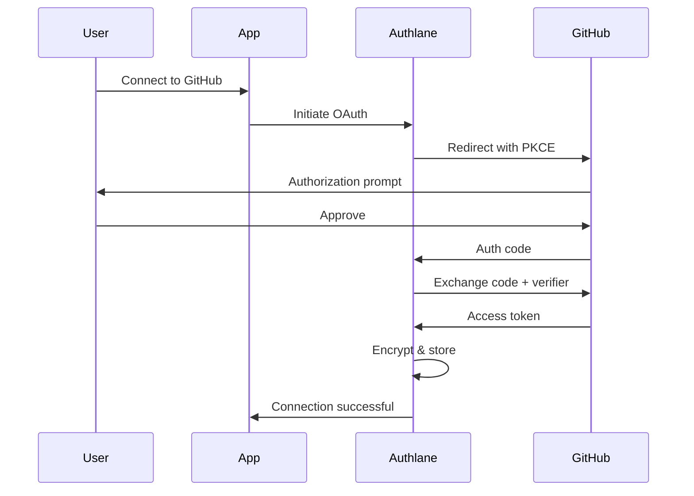

## What is Authlane?

Authlane is an **open-source platform** that manages third-party integrations for AI agents and SaaS applications. It handles OAuth2 flows, credential storage, token refresh, and provides a unified API for accessing external services.

### The Problem

Building integrations is time-consuming and repetitive:

- **OAuth complexity**: Every service has different OAuth flows, scopes, and token formats
- **Credential management**: Secure storage and encryption of API keys and tokens
- **Token refresh**: Handling expiration and automatic renewal
- **Multi-tenancy**: Isolating data between different users/organizations
- **Maintenance**: Keeping up with API changes across dozens of services

### The Solution

Authlane provides:

<CardGroup cols={2}>
  <Card
    title="OAuth2 + PKCE"
    icon="shield-halved"
  >
    Secure authentication flows with PKCE support for all integrations
  </Card>
  <Card
    title="AES-256-GCM Encryption"
    icon="lock"
  >
    Military-grade encryption for storing sensitive credentials
  </Card>
  <Card
    title="Auto Token Refresh"
    icon="arrows-rotate"
  >
    Automatic background token renewal with BullMQ job queue
  </Card>
  <Card
    title="15+ Integrations"
    icon="puzzle-piece"
  >
    GitHub, Slack, Linear, Jira, Gmail, Notion, and more out of the box
  </Card>
</CardGroup>

## How It Works

## Key Features

### 🔐 Security First

- **OAuth2 with PKCE**: Protection against authorization code interception
- **AES-256-GCM encryption**: All credentials encrypted at rest
- **Row-Level Security (RLS)**: Database-level tenant isolation
- **Rate limiting**: Protection against abuse
- **Audit logs**: Track all credential access (coming soon)

### 🚀 Developer Experience

- **TypeScript SDK**: Type-safe client library
- **React Components**: Pre-built UI components for OAuth flows
- **MCP Server**: Integration with AI frameworks (Claude, LangChain)
- **OpenAPI Spec**: Auto-generated API documentation
- **Webhooks**: Real-time notifications for connection events

### 🏗️ Self-Hosting Ready

- **Docker Compose**: One-command deployment
- **PostgreSQL + Redis**: Battle-tested infrastructure
- **Environment variables**: Easy configuration
- **No vendor lock-in**: Own your data

## Use Cases

<AccordionGroup>
  <Accordion title="AI Agent Integrations">
    Enable AI agents to interact with external services:
    - **Claude Desktop**: Use MCP server for GitHub, Slack, Linear
    - **LangChain**: Add tools for CRM, email, calendar
    - **Custom agents**: Build autonomous workflows
  </Accordion>

  <Accordion title="SaaS Multi-Tenant Platforms">
    Add integrations to your SaaS application:
    - **Customer connections**: Let users connect their own accounts
    - **Data sync**: Pull/push data from external services
    - **Workflow automation**: Trigger actions across platforms
  </Accordion>

  <Accordion title="Internal Tools">
    Centralize access to company services:
    - **Admin dashboards**: Unified view of all integrations
    - **Employee onboarding**: Auto-provision access
    - **Compliance**: Audit credential usage
  </Accordion>
</AccordionGroup>

## Architecture

Authlane consists of:

- **Core API** (`@authlane/api`): REST API for managing connections
- **Database** (`@authlane/database`): PostgreSQL schema with Drizzle ORM
- **Crypto** (`@authlane/crypto`): Encryption/decryption utilities
- **SDK** (`@authlane/sdk`): TypeScript client library
- **React** (`@authlane/react`): React components
- **MCP Server** (`@authlane/mcp-server`): Model Context Protocol server
- **Dashboard**: Admin UI for managing tenants
- **Widget**: Embeddable connection UI

## Comparison

| Feature | Authlane | Composio | Nango | Merge.dev |
|---------|----------|----------|-------|-----------|
| **Open Source** | ✅ Elastic 2.0 | ✅ AGPL | ✅ Apache 2.0 | ❌ Closed |
| **Self-Hosting** | ✅ Docker Compose | ⚠️ Complex | ✅ Docker | ❌ Cloud only |
| **MCP Support** | ✅ Native | ❌ | ❌ | ❌ |
| **Encryption** | ✅ AES-256-GCM | ✅ | ✅ | ✅ |
| **Token Refresh** | ✅ Auto | ✅ Auto | ✅ Auto | ✅ Auto |
| **AI-First** | ✅ Tools format | ✅ | ❌ | ❌ |
| **Pricing** | Free (self-host) | $99/mo | $250/mo | $299/mo |

## Getting Started

Ready to integrate? Follow our [Quickstart Guide](/quickstart) to connect your first service in under 5 minutes.

<CardGroup cols={2}>
  <Card
    title="Quickstart"
    icon="rocket"
    href="/quickstart"
  >
    Get up and running in 5 minutes
  </Card>
  <Card
    title="Self-Hosting"
    icon="server"
    href="/guides/self-hosting"
  >
    Deploy Authlane on your own infrastructure
  </Card>
  <Card
    title="TypeScript SDK"
    icon="code"
    href="/sdk/typescript"
  >
    Use the SDK to manage connections
  </Card>
  <Card
    title="API Reference"
    icon="book"
    href="/api-reference"
  >
    Explore the REST API
  </Card>
</CardGroup>
