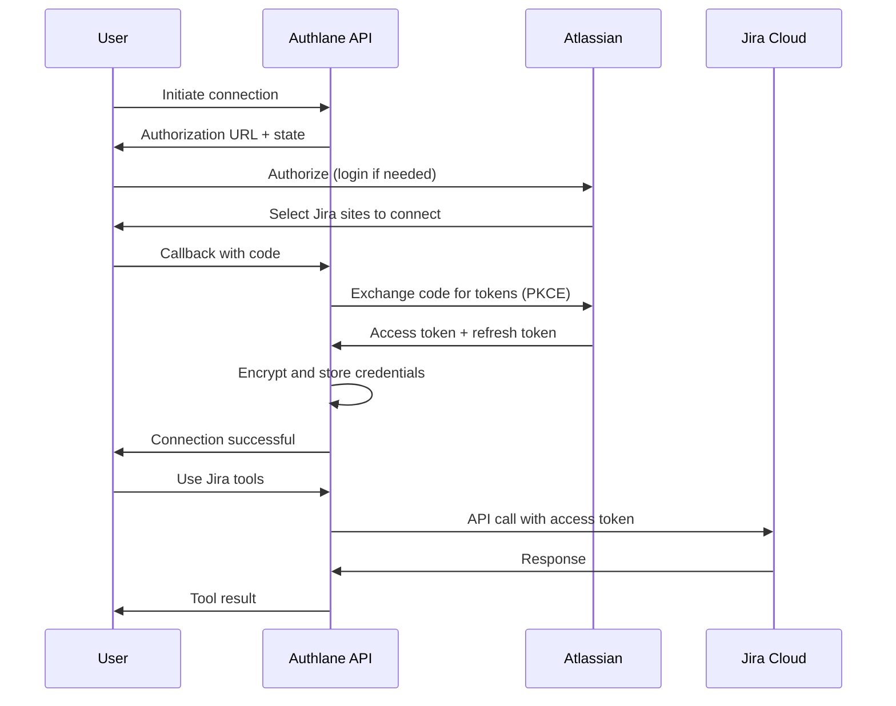

# Jira OAuth Setup Guide

This guide walks you through setting up OAuth 2.0 authentication for Jira Cloud integration with Authlane.

## Prerequisites

- Atlassian account with access to Jira Cloud
- Authlane API running locally or deployed
- Access to Atlassian Developer Console

## Step 1: Create OAuth 2.0 App in Atlassian Developer Console

1. Navigate to [Atlassian Developer Console](https://developer.atlassian.com/console/myapps/)
2. Click **Create** button
3. Select **OAuth 2.0 integration**
4. Fill in the app details:
   - **App name**: Choose a descriptive name (e.g., "Authlane Dev" or "Your App Name")
   - **Description**: Optional brief description of your app

## Step 2: Configure OAuth 2.0 (3LO)

OAuth 2.0 (3LO) stands for "3-legged OAuth" - the standard OAuth flow involving user authorization.

1. In your newly created app, navigate to the **Authorization** tab in the left sidebar
2. Click **Add** under the **OAuth 2.0 (3LO)** section
3. Configure the **Callback URL**:

   **For local development:**
   ```
   http://localhost:3000/api/v1/users/{userId}/connections/jira/callback
   ```

   **For production:**
   ```
   https://api.yourdomain.com/api/v1/users/{userId}/connections/jira/callback
   ```

   > **Important**: The callback URL must match exactly, including the protocol (http vs https)

4. Click **Save changes**

## Step 3: Configure API Scopes (Permissions)

Jira uses granular scopes to control what your app can access.

1. Navigate to the **Permissions** tab
2. Click **Add** next to **Jira API**
3. Select the following scopes:

### Required Scopes:

| Scope | Description | Required For |
|-------|-------------|--------------|
| `read:jira-work` | Read project and issue data | Listing issues, reading issue details |
| `write:jira-work` | Create and edit issues | Creating issues, updating issues, adding comments |
| `read:jira-user` | Read user information | Getting user details, assignee information |
| `offline_access` | Get refresh tokens | Long-lived sessions, automatic token refresh |

### Optional Scopes (for extended functionality):

| Scope | Description |
|-------|-------------|
| `read:jira-project` | Read project configuration |
| `read:jira-board` | Read board data (for Scrum/Kanban boards) |
| `write:jira-project` | Manage project configuration |

4. Click **Save changes**

## Step 4: Get Client Credentials

1. Navigate to the **Settings** tab
2. Locate the **Client ID** and **Secret** section
3. Click **Show** to reveal the client secret
4. Copy both values

> **Security Note**: Keep your client secret secure! Never commit it to version control or expose it in client-side code.

## Step 5: Configure Environment Variables

Add your Jira OAuth credentials to your `.env` file:

```bash
# Jira OAuth Credentials
JIRA_CLIENT_ID="your_client_id_here"
JIRA_CLIENT_SECRET="your_client_secret_here"
```

## Step 6: Add Jira Service to Database

If you haven't already run the database seed, Jira should already be included:

```bash
pnpm --filter @authlane/database seed
```

Verify Jira service is available:

```bash
curl -H "Authorization: Bearer YOUR_API_KEY" \
  http://localhost:3000/api/v1/services/jira
```

Expected response:
```json
{
  "data": {
    "id": "jira",
    "name": "Jira",
    "auth_type": "oauth2",
    "config": {
      "authorization_url": "https://auth.atlassian.com/authorize",
      "token_url": "https://auth.atlassian.com/oauth/token",
      "scopes": [
        "read:jira-work",
        "write:jira-work",
        "read:jira-user",
        "offline_access"
      ]
    },
    "enabled": true
  }
}
```

## Step 7: Test OAuth Flow

Use the provided test script to verify your setup:

```bash
export API_KEY="your_api_key"
export JIRA_CLIENT_ID="your_jira_client_id"
export JIRA_CLIENT_SECRET="your_jira_client_secret"

./scripts/test-jira-oauth.sh
```

The test script will:
1. ✓ Verify API health
2. ✓ Check Jira service configuration
3. ✓ Initiate OAuth authorization
4. ✓ Guide you through the authorization flow
5. ✓ Exchange authorization code for tokens
6. ✓ Verify credentials are encrypted and stored
7. ✓ Test credentials with Jira API
8. ✓ Run connection health check

### Manual Testing Steps

1. **Initiate Authorization:**
   ```bash
   curl -H "Authorization: Bearer YOUR_API_KEY" \
     "http://localhost:3000/api/v1/users/test_user/connections/jira/authorize?client_id=YOUR_CLIENT_ID&redirect_uri=YOUR_CALLBACK_URL"
   ```

2. **Open the authorization URL** returned in the response
3. **Authorize the application** in your browser
4. **Complete the callback** by visiting the callback URL with the authorization code

## Step 8: Distribution Settings (Production)

Before launching your app to production:

1. Navigate to the **Distribution** tab
2. Choose your distribution method:
   - **Development**: For testing only (up to 100 users)
   - **Private**: For internal company use
   - **Public**: Submit for Atlassian Marketplace review

3. Fill in required information:
   - Privacy policy URL
   - Support contact
   - App description and screenshots

4. Submit for review (for public apps)

## OAuth Flow Architecture



## Common Issues and Solutions

### Issue: "Invalid redirect_uri"

**Solution**: Ensure your callback URL matches exactly what you configured in Atlassian Developer Console. Common mistakes:
- Missing `/callback` at the end
- Using `http` instead of `https` (or vice versa)
- Wrong port number in development

### Issue: "Insufficient scope"

**Solution**: Verify all required scopes are enabled in the Permissions tab. You may need to:
1. Add the missing scope
2. Delete existing connection
3. Re-authorize to get new token with updated scopes

### Issue: "No accessible resources"

**Solution**: The user must grant access to at least one Jira site during authorization:
1. During OAuth flow, Atlassian shows a site selector
2. User must check at least one Jira site
3. If no sites are selected, the token works but has no accessible resources

### Issue: "Token expired"

**Solution**:
1. Ensure you requested `offline_access` scope to get refresh tokens
2. Verify Redis is configured for automatic token refresh
3. Check that BullMQ worker is running to process refresh jobs

### Issue: "PKCE verification failed"

**Solution**: This is typically caused by:
- State parameter mismatch (CSRF protection)
- Code verifier not found (session expired)
- Try the authorization flow again

## Security Best Practices

1. **Never expose client secret**: Keep it server-side only
2. **Use HTTPS in production**: Atlassian requires HTTPS for production apps
3. **Validate state parameter**: Authlane does this automatically (CSRF protection)
4. **Implement PKCE**: Authlane uses PKCE by default for enhanced security
5. **Rotate secrets regularly**: Update client secret periodically
6. **Monitor token usage**: Use Authlane's health checks to detect issues
7. **Store tokens encrypted**: Authlane uses AES-256-GCM encryption

## Next Steps

- Review [Available Jira Tools](/integrations/jira/README.md)
- Explore [Jira API Documentation](https://developer.atlassian.com/cloud/jira/platform/rest/v3/)
- Learn about [JQL (Jira Query Language)](https://support.atlassian.com/jira-software-cloud/docs/use-advanced-search-with-jira-query-language-jql/)
- Set up automatic token refresh with Redis
- Implement webhooks for real-time updates

## Resources

- [Atlassian OAuth 2.0 Documentation](https://developer.atlassian.com/cloud/jira/platform/oauth-2-3lo-apps/)
- [Scopes Reference](https://developer.atlassian.com/cloud/jira/platform/scopes-for-oauth-2-3LO-and-forge-apps/)
- [Jira REST API v3](https://developer.atlassian.com/cloud/jira/platform/rest/v3/)
- [Rate Limits](https://developer.atlassian.com/cloud/jira/platform/rate-limiting/)

## Support

If you encounter issues:
1. Check the [Troubleshooting](#common-issues-and-solutions) section above
2. Review Authlane API logs
3. Test with the provided test script
4. Check Atlassian Developer Console for app status
5. Visit [Atlassian Developer Community](https://community.developer.atlassian.com/)
