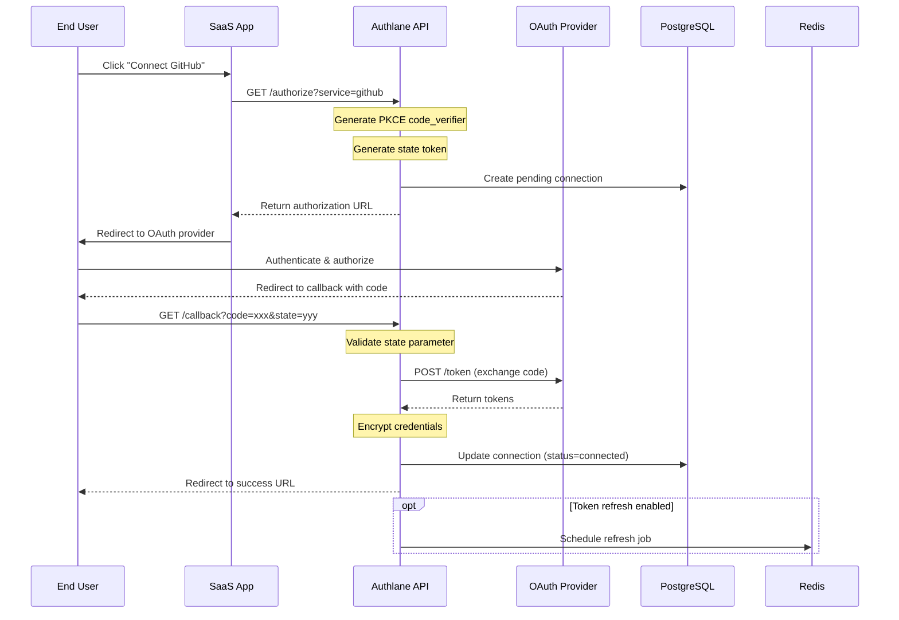
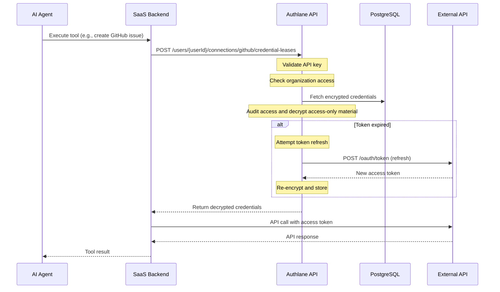
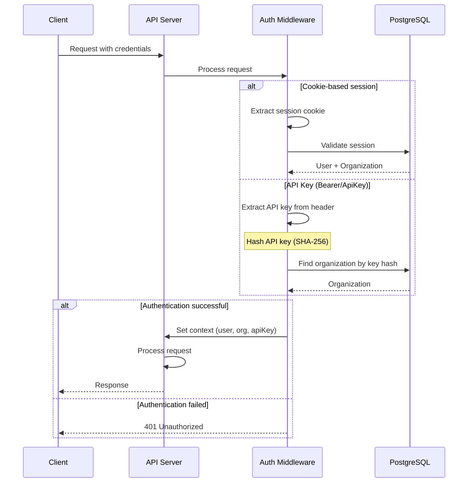
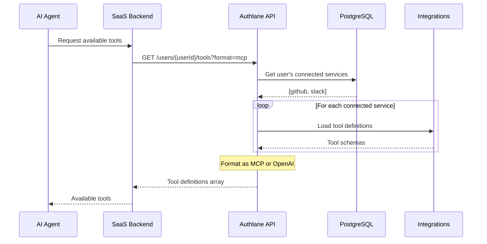
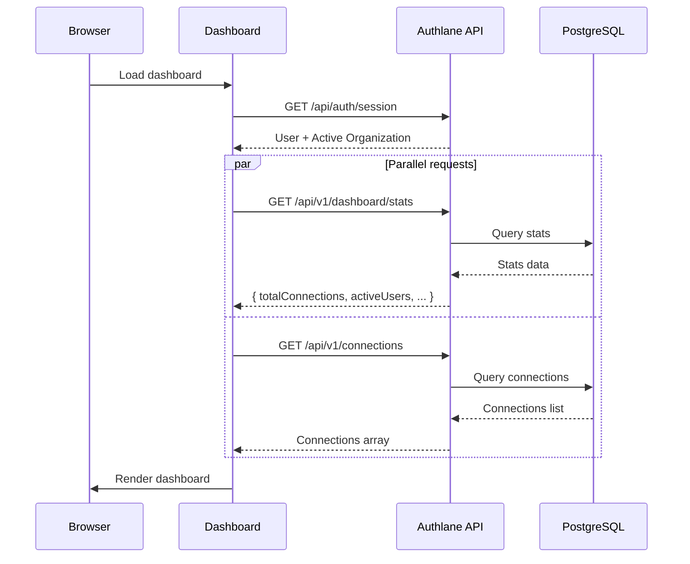
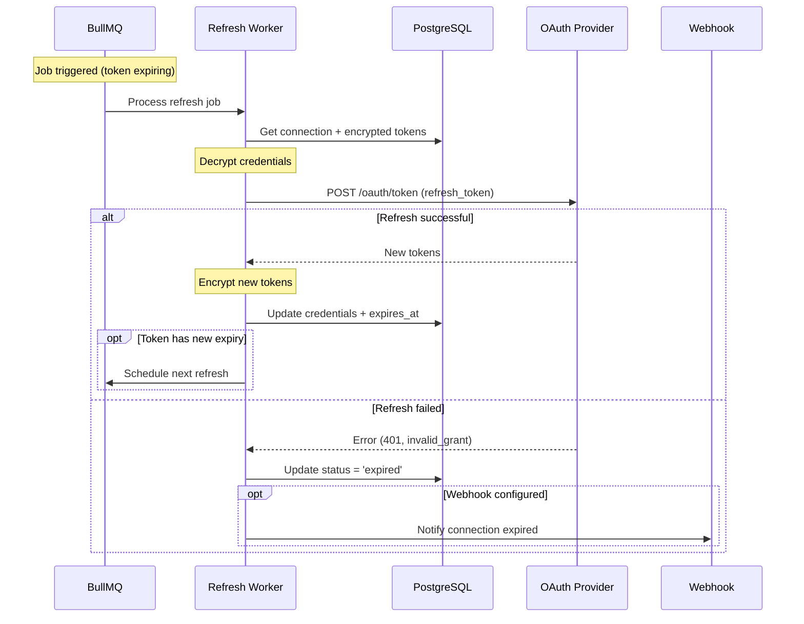
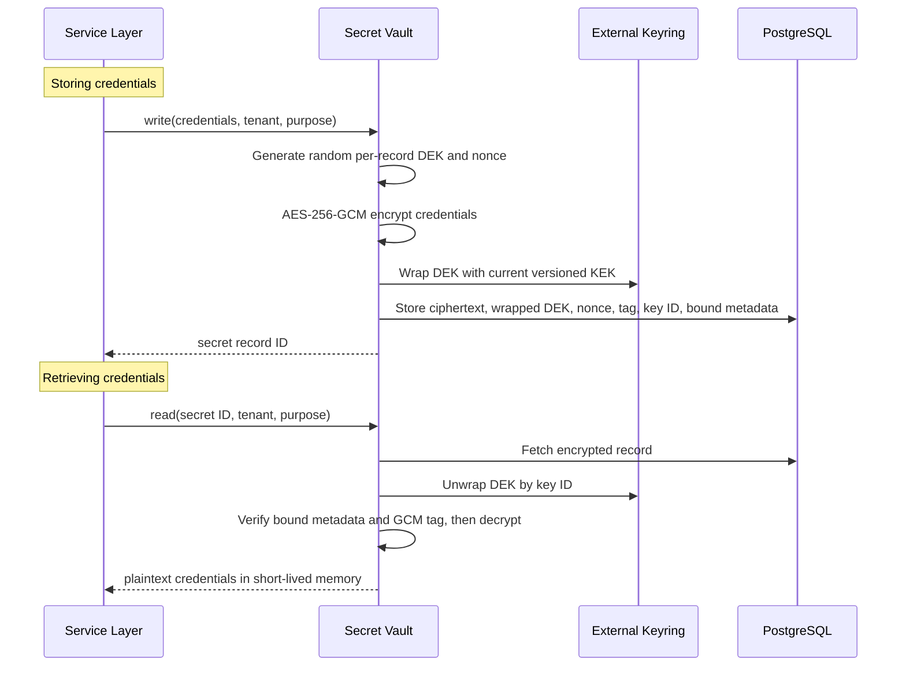
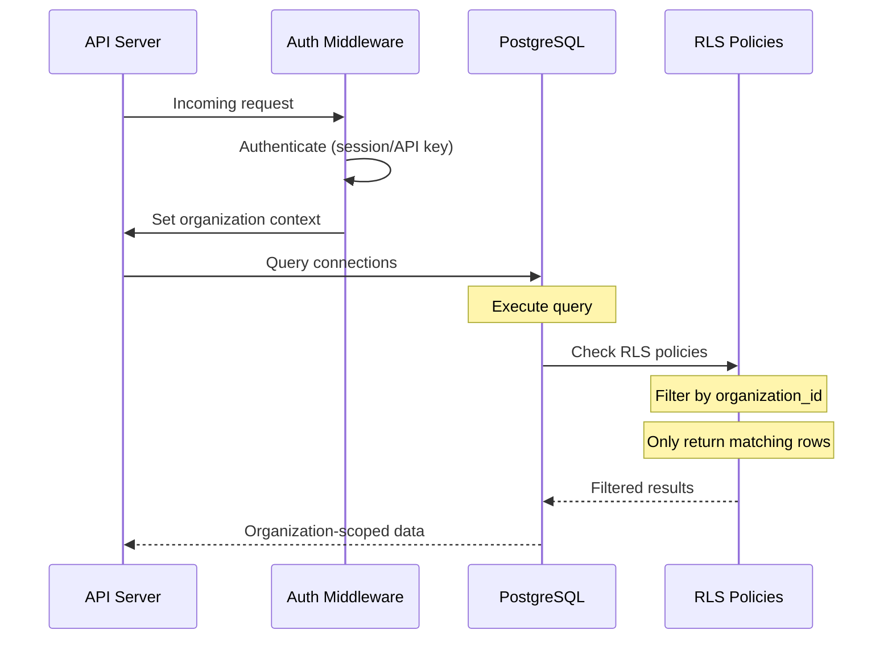
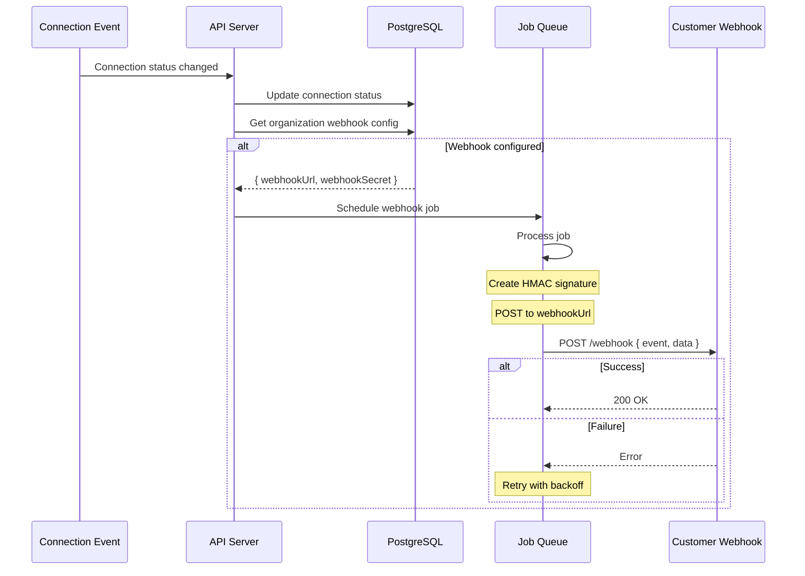

# Data Flow

Request/response flows and sequence diagrams for key Authlane operations.

## OAuth Connection Flow

The complete flow when a user connects a service via OAuth.



## Credential Retrieval Flow

How credentials are retrieved for external API calls.



## API Authentication Flow

How requests are authenticated via session or API key.



## Tool Definition Flow

How tool definitions are retrieved for AI agents.



## Dashboard Data Flow

How the dashboard loads and displays data.



## Token Refresh Flow

Background job for automatic token refresh.



## Encryption/Decryption Flow

How credentials are encrypted and decrypted. The deployment KEK stays outside PostgreSQL.



## Multi-Tenant Data Access

How RLS ensures tenant isolation.



## Webhook Notification Flow

How webhooks are triggered for connection events.



## Request Lifecycle

Complete lifecycle of an API request.

```
1. Request arrives at Hono server
   │
2. Logger middleware (request logging)
   │
3. Error handler middleware (try/catch wrapper)
   │
5. CORS middleware (cross-origin headers)
   │
6. Rate limit middleware (check limits)
   │
7. Auth middleware (session/API key validation)
   │
8. Route handler (business logic)
   │  ├── Validate input (Zod)
   │  ├── Database operations (Drizzle)
   │  ├── Encryption operations (Crypto)
   │  └── External calls (if needed)
   │
9. Response formatting (Supabase-style)
   │
10. Response sent to client
```
