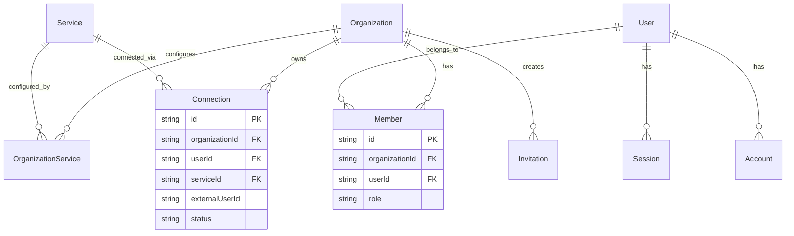

# Multi-Tenancy Model

Authlane's organization-based multi-tenancy architecture and isolation mechanisms.

## Overview

Authlane uses an **organization-based multi-tenancy** model where each organization (tenant) has complete isolation of:
- Users and team members
- Service configurations
- Connections and credentials
- API keys
- Settings

## Terminology

| Term | Definition |
|------|------------|
| **Organization** | A tenant - a company or team using Authlane |
| **Member** | A user belonging to an organization with a role |
| **External User** | End-user of the organization's SaaS product |
| **Connection** | Link between External User and a Service |

## Data Model



## Isolation Mechanisms

### 1. Database-Level Isolation (RLS)

PostgreSQL Row-Level Security ensures queries only return data for the current organization.

```sql
-- Enable RLS on connections table
ALTER TABLE connections ENABLE ROW LEVEL SECURITY;

-- Policy: Users can only see their organization's connections
CREATE POLICY org_isolation ON connections
    USING (organization_id = current_setting('app.current_org')::text);
```

**Per-Request Context:**
```typescript
// Set organization context per request
await db.execute(
  sql`SET LOCAL app.current_org = ${organizationId}`
);
```

### 2. Application-Level Validation

Every request validates organization access:

```typescript
// Middleware extracts organization from session or API key
const organization = c.get('organization');

// All queries filter by organization
const connections = await db.query.connections.findMany({
  where: eq(connections.organizationId, organization.id),
});
```

### 3. API Key Scoping

API keys are scoped to a single organization:

```typescript
interface ApiKey {
  id: string;
  organizationId: string;  // Scoped to one org
  keyHash: string;         // SHA-256 hash
  name: string;
  expiresAt?: Date;
}
```

## Organization Structure

### Organization Entity

```typescript
interface Organization {
  id: string;                    // UUID
  name: string;                  // Display name
  slug: string;                  // URL-safe identifier
  logo?: string;                 // Logo URL
  metadata?: {
    apiKeys: ApiKeyMetadata[];   // API keys
    webhookUrl?: string;         // Webhook endpoint
    webhookSecret?: string;      // HMAC secret
    rateLimit?: RateLimitConfig;
    customDomain?: string;
  };
  createdAt: Date;
}
```

### Member Roles

| Role | Permissions |
|------|-------------|
| **owner** | Full control, can delete organization |
| **admin** | Manage services, connections, members, API keys |
| **member** | View-only access to connections and services |

```typescript
interface Member {
  id: string;
  organizationId: string;
  userId: string;
  role: 'owner' | 'admin' | 'member';
  createdAt: Date;
}
```

## Connection Scoping

Connections can be scoped to users or the entire organization:

### User-Scoped Connections

Individual end-users connect their own accounts.

```typescript
const connection = {
  scope: 'user',
  userId: 'user_123',           // Authlane user
  externalUserId: 'ext_456',    // External user ID
  organizationId: 'org_789',    // Owner organization
  serviceId: 'github',
};
```

### Organization-Scoped Connections

Shared connections for the entire organization.

```typescript
const connection = {
  scope: 'organization',
  userId: null,                 // No specific user
  organizationId: 'org_789',
  serviceId: 'github',
};
```

## Per-Organization Service Configuration

Organizations can customize service settings:

```typescript
interface OrganizationService {
  organizationId: string;
  serviceId: string;
  enabled: boolean;             // Enable/disable for this org
  oauthClientId?: string;       // Custom OAuth app
  oauthClientSecretEnc?: string; // Encrypted
  customScopes?: string[];      // Custom OAuth scopes
  apiKeyEnc?: string;           // For API key auth services
}
```

### Use Cases

1. **Use default OAuth app**: Leave `oauthClientId` empty
2. **Use custom OAuth app**: Provide organization's own OAuth credentials
3. **Limit scopes**: Define `customScopes` for restricted access
4. **Disable service**: Set `enabled: false`

## Authentication Context

Every authenticated request has context:

```typescript
interface AuthContext {
  // Session-based auth
  user?: User;
  session?: Session;

  // API key auth
  apiKey?: string;

  // Always present for authenticated requests
  organization: Organization;
}
```

### Context Flow

```
Request → Auth Middleware → Extract Context → Set Context → Route Handler
                                    │
                    ┌───────────────┼───────────────┐
                    │               │               │
              Session Auth    API Key Auth    No Auth
                    │               │               │
               User + Org      Org only         401
```

## Multi-Organization Users

Users can belong to multiple organizations:

```typescript
// User with multiple memberships
const memberships = await db.query.members.findMany({
  where: eq(members.userId, userId),
  with: { organization: true },
});

// Returns: [
//   { organizationId: 'org_1', role: 'owner', organization: {...} },
//   { organizationId: 'org_2', role: 'member', organization: {...} },
// ]
```

### Active Organization

Sessions track the currently active organization:

```typescript
interface Session {
  id: string;
  userId: string;
  activeOrganizationId?: string;  // Currently selected org
  // ...
}
```

## API Request Examples

### Session-Based Request

```bash
# User is logged in, cookie contains session
curl -X GET https://api.authlane.com/api/v1/connections \
  -H "Cookie: session=..."
```

Context:
- User: From session
- Organization: From `activeOrganizationId` or first membership

### API Key Request

```bash
# API key scoped to organization
curl -X GET https://api.authlane.com/api/v1/connections \
  -H "Authorization: Bearer ak_abc123..."
```

Context:
- User: null
- Organization: From API key lookup

## Data Isolation Verification

To verify isolation, connections are always filtered:

```typescript
// CORRECT: Always filter by organization
const connections = await db.query.connections.findMany({
  where: and(
    eq(connections.organizationId, organization.id),
    userId ? eq(connections.externalUserId, userId) : undefined
  ),
});

// WRONG: Never query without organization filter
// const connections = await db.query.connections.findMany();
```

## Cross-Organization Access

Cross-organization access is **never allowed**:

- No API endpoint returns data from other organizations
- No admin override exists
- Even Authlane operators cannot access tenant data
- Audit logs track all data access

## Testing Multi-Tenancy

E2E tests verify isolation:

```typescript
test('cannot access other organization data', async () => {
  // Create two organizations
  const org1 = await createOrganization('Org 1');
  const org2 = await createOrganization('Org 2');

  // Create connection in org1
  const conn = await createConnection(org1.id, 'github');

  // Try to access from org2 API key
  const response = await api
    .get(`/connections/${conn.id}`)
    .set('Authorization', `Bearer ${org2.apiKey}`);

  expect(response.status).toBe(404); // Not found, not forbidden
});
```

## Best Practices

1. **Always validate organization context** before database operations
2. **Never expose internal IDs** across organization boundaries
3. **Log organization context** in all audit entries
4. **Test isolation** in E2E tests
5. **Use RLS as defense in depth**, not sole protection
