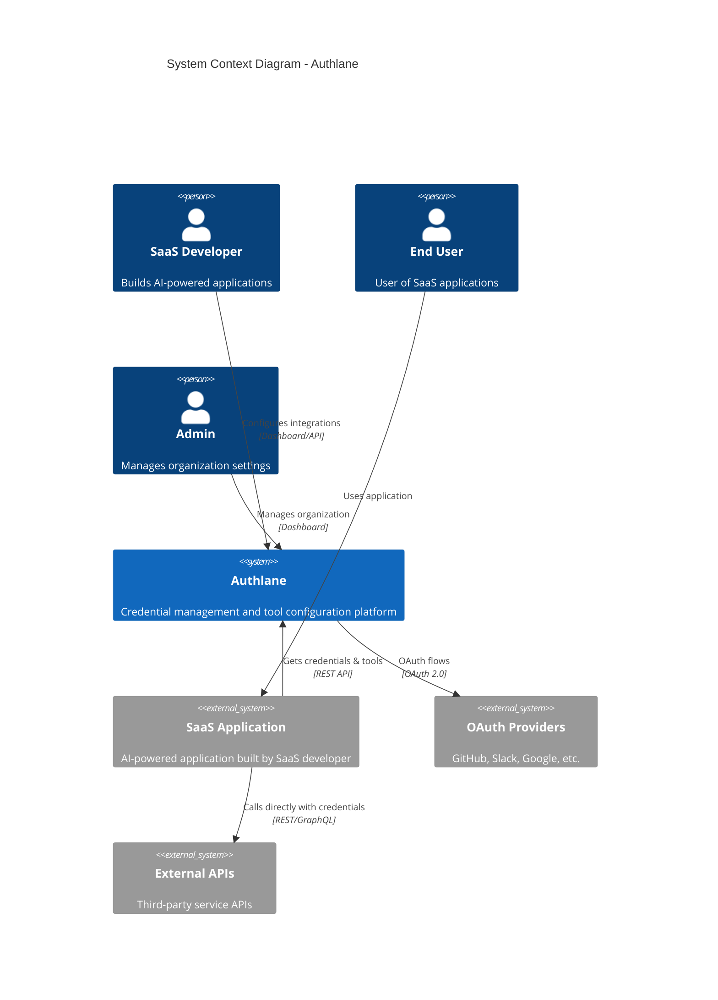
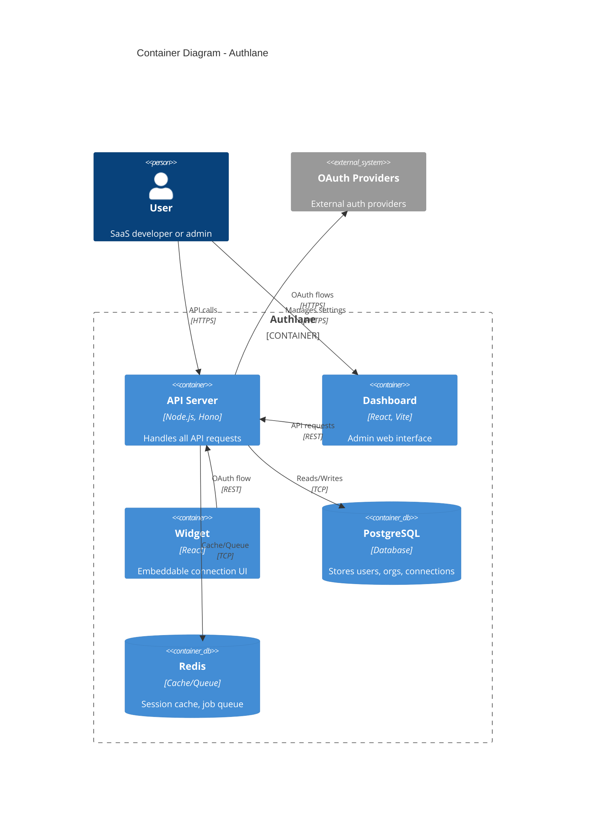
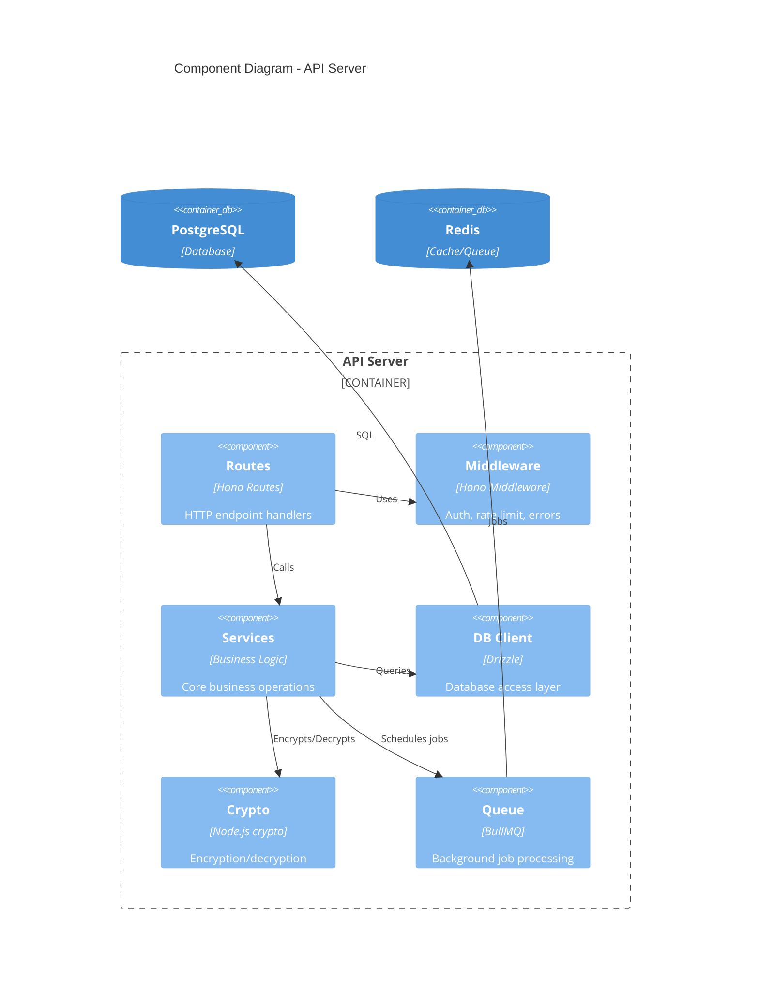

# System Architecture

High-level system design and architecture diagrams for Authlane.

## System Context Diagram

This diagram shows Authlane's position in the broader ecosystem.



## Container Diagram

Shows the major containers (deployable units) within Authlane.



## Component Diagram - API Server

Detailed view of the API server's internal components.



## High-Level Architecture

```
┌─────────────────────────────────────────────────────────────────────────┐
│                              Authlane Cloud                              │
├─────────────────────────────────────────────────────────────────────────┤
│  ┌──────────────┐  ┌──────────────┐  ┌──────────────┐  ┌─────────────┐ │
│  │   API        │  │  Dashboard   │  │  Connection  │  │   Docs      │ │
│  │   Server     │  │   (React)    │  │   Widget     │  │  (Mintlify) │ │
│  │   (Hono)     │  │              │  │   (React)    │  │             │ │
│  └──────┬───────┘  └──────────────┘  └──────────────┘  └─────────────┘ │
│         │                                                               │
│  ┌──────┴───────┐  ┌──────────────┐  ┌──────────────┐  ┌─────────────┐ │
│  │  PostgreSQL  │  │    Redis     │  │   Vault      │  │  Queue      │ │
│  │  (RLS)       │  │   (Cache)    │  │ (Encryption) │  │  (BullMQ)   │ │
│  └──────────────┘  └──────────────┘  └──────────────┘  └─────────────┘ │
└─────────────────────────────────────────────────────────────────────────┘
```

## Request Flow Architecture

### API Request Flow

```
Client Request
      │
      ▼
┌─────────────────┐
│  Load Balancer  │  (Optional in production)
└────────┬────────┘
         │
         ▼
┌─────────────────┐
│   Hono Server   │
│  ┌───────────┐  │
│  │ Middleware│  │  1. Sentry (error tracking)
│  │   Stack   │  │  2. Logger (request logging)
│  │           │  │  3. CORS (cross-origin)
│  │           │  │  4. Rate Limit
│  │           │  │  5. Auth (session/API key)
│  └─────┬─────┘  │
│        │        │
│  ┌─────▼─────┐  │
│  │  Routes   │  │  Route handlers
│  └─────┬─────┘  │
│        │        │
│  ┌─────▼─────┐  │
│  │ Services  │  │  Business logic
│  └─────┬─────┘  │
│        │        │
└────────┼────────┘
         │
    ┌────┴────┬──────────┐
    │         │          │
    ▼         ▼          ▼
┌───────┐ ┌───────┐ ┌───────┐
│Postgres│ │ Redis │ │ Queue │
└───────┘ └───────┘ └───────┘
```

## Deployment Architecture

### Single-Node Deployment (Development/Small Scale)

```
┌─────────────────────────────────────────┐
│              Docker Host                 │
│  ┌─────────┐ ┌─────────┐ ┌─────────┐   │
│  │   API   │ │Postgres │ │  Redis  │   │
│  │ :3000   │ │ :5432   │ │ :6379   │   │
│  └─────────┘ └─────────┘ └─────────┘   │
└─────────────────────────────────────────┘
```

### Production Deployment (High Availability)

```
                    ┌─────────────────┐
                    │  Load Balancer  │
                    │   (nginx/ALB)   │
                    └────────┬────────┘
                             │
           ┌─────────────────┼─────────────────┐
           │                 │                 │
           ▼                 ▼                 ▼
    ┌─────────────┐   ┌─────────────┐   ┌─────────────┐
    │  API Pod 1  │   │  API Pod 2  │   │  API Pod N  │
    └──────┬──────┘   └──────┬──────┘   └──────┬──────┘
           │                 │                 │
           └─────────────────┼─────────────────┘
                             │
              ┌──────────────┼──────────────┐
              │              │              │
              ▼              ▼              ▼
       ┌──────────┐   ┌──────────┐   ┌──────────┐
       │ Postgres │   │  Redis   │   │  Redis   │
       │ Primary  │   │ Primary  │   │ Replica  │
       └────┬─────┘   └──────────┘   └──────────┘
            │
       ┌────▼─────┐
       │ Postgres │
       │ Replica  │
       └──────────┘
```

## Key Architectural Characteristics

### Scalability
- **Horizontal scaling**: Stateless API servers can be replicated
- **Database scaling**: Read replicas for PostgreSQL
- **Cache scaling**: Redis cluster for high throughput

### Reliability
- **Health checks**: `/health` endpoint for load balancers
- **Graceful shutdown**: Proper connection draining
- **Retry logic**: Exponential backoff for external calls

### Security
- **Defense in depth**: Multiple security layers
- **Encryption**: At rest and in transit
- **Isolation**: Multi-tenant RLS

### Observability
- **Metrics**: Prometheus format at `/metrics`
- **Logging**: Structured JSON logs (Pino)
- **Tracing**: Sentry for error tracking

## Network Requirements

| Service | Port | Protocol | Purpose |
|---------|------|----------|---------|
| API | 3000 | HTTP/HTTPS | API requests |
| PostgreSQL | 5432 | TCP | Database |
| Redis | 6379 | TCP | Cache/Queue |
| Dashboard | 3001 | HTTP/HTTPS | Admin UI |

## External Dependencies

| Service | Purpose | Required |
|---------|---------|----------|
| PostgreSQL | Primary database | Yes |
| Redis | Cache and job queue | Optional* |
| SMTP/Resend | Email delivery | Optional |
| Sentry | Error tracking | Optional |

*Redis is optional but required for token refresh jobs.
