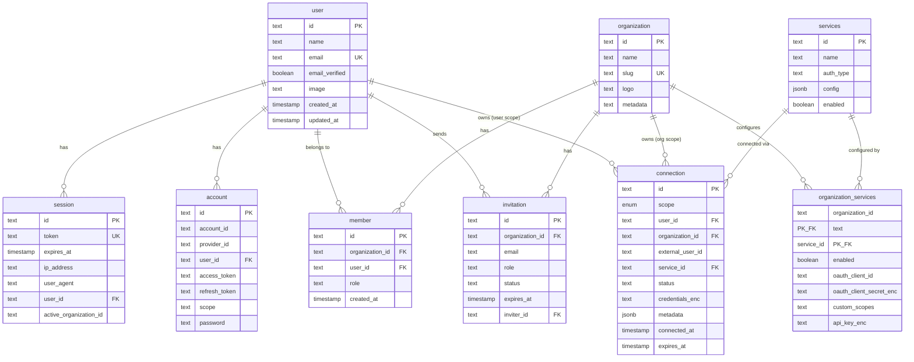

# Entity Relationship

Entity relationship diagrams and relationship documentation for the Authlane database.

## ER Diagram



## Relationship Details

### User → Session (1:N)

A user can have multiple active sessions (multiple devices/browsers).

```typescript
// Get all sessions for a user
const sessions = await db.query.session.findMany({
  where: eq(session.userId, userId),
});
```

### User → Account (1:N)

A user can link multiple OAuth accounts (Google, GitHub, etc.).

```typescript
// Get linked accounts
const accounts = await db.query.account.findMany({
  where: eq(account.userId, userId),
});
```

### User ↔ Organization (N:N via Member)

Users belong to organizations through the member junction table.

```typescript
// Get user's organizations
const memberships = await db.query.member.findMany({
  where: eq(member.userId, userId),
  with: { organization: true },
});

// Get organization's members
const members = await db.query.member.findMany({
  where: eq(member.organizationId, orgId),
  with: { user: true },
});
```

### Organization → Invitation (1:N)

Organizations can have multiple pending invitations.

```typescript
// Get pending invitations
const invitations = await db.query.invitation.findMany({
  where: and(
    eq(invitation.organizationId, orgId),
    eq(invitation.status, 'pending'),
  ),
});
```

### Organization ↔ Services (N:N via OrganizationServices)

Organizations configure services through the organization_services junction.

```typescript
// Get enabled services for organization
const orgServices = await db.query.organizationServices.findMany({
  where: and(
    eq(organizationServices.organizationId, orgId),
    eq(organizationServices.enabled, true),
  ),
  with: { service: true },
});
```

### Connection → User/Organization (N:1)

Connections belong to either a user OR an organization based on scope.

```typescript
// User-scoped connection
const userConnection = {
  scope: 'user',
  userId: 'user_123',
  organizationId: null,
  serviceId: 'github',
};

// Organization-scoped connection
const orgConnection = {
  scope: 'organization',
  userId: null,
  organizationId: 'org_456',
  serviceId: 'github',
};
```

### Connection → Services (N:1)

Each connection links to exactly one service.

```typescript
// Get connection with service details
const connection = await db.query.connections.findFirst({
  where: eq(connections.id, connectionId),
  with: { service: true },
});
```

## Cardinality Summary

| Relationship | Cardinality | Notes |
|--------------|-------------|-------|
| user → session | 1:N | Multiple devices |
| user → account | 1:N | Multiple OAuth providers |
| user → member | 1:N | Multiple organizations |
| organization → member | 1:N | Multiple team members |
| organization → invitation | 1:N | Multiple pending invites |
| organization → organization_services | 1:N | Service configurations |
| organization → connection | 1:N | Org-scoped connections |
| user → connection | 1:N | User-scoped connections |
| services → organization_services | 1:N | Per-org configurations |
| services → connection | 1:N | All connections to service |

## Integrity Constraints

### Cascade Deletes

All foreign keys use `ON DELETE CASCADE`:

- Deleting a user deletes their sessions, accounts, memberships, and connections
- Deleting an organization deletes its members, invitations, org_services, and connections
- Deleting a service deletes its org_services and connections

### Unique Constraints

| Table | Constraint | Purpose |
|-------|------------|---------|
| user | email | Unique email addresses |
| session | token | Unique session tokens |
| organization | slug | Unique URL-safe identifiers |
| connection | (user_id, service_id) | One connection per user-service |
| connection | (organization_id, service_id) | One connection per org-service |
| organization_services | (organization_id, service_id) | Primary key |

## Query Patterns

### Get User's Full Context

```typescript
const user = await db.query.user.findFirst({
  where: eq(user.id, userId),
  with: {
    sessions: true,
    accounts: true,
    members: {
      with: {
        organization: true,
      },
    },
  },
});
```

### Get Organization Dashboard Data

```typescript
// Single query for dashboard
const orgData = await db.query.organization.findFirst({
  where: eq(organization.id, orgId),
  with: {
    members: {
      with: { user: true },
    },
    organizationServices: {
      where: eq(organizationServices.enabled, true),
      with: { service: true },
    },
  },
});
```

### Get User's Connections with Service Details

```typescript
const connections = await db.query.connections.findMany({
  where: or(
    eq(connections.userId, userId),
    eq(connections.organizationId, orgId),
  ),
  with: {
    service: true,
  },
});
```
