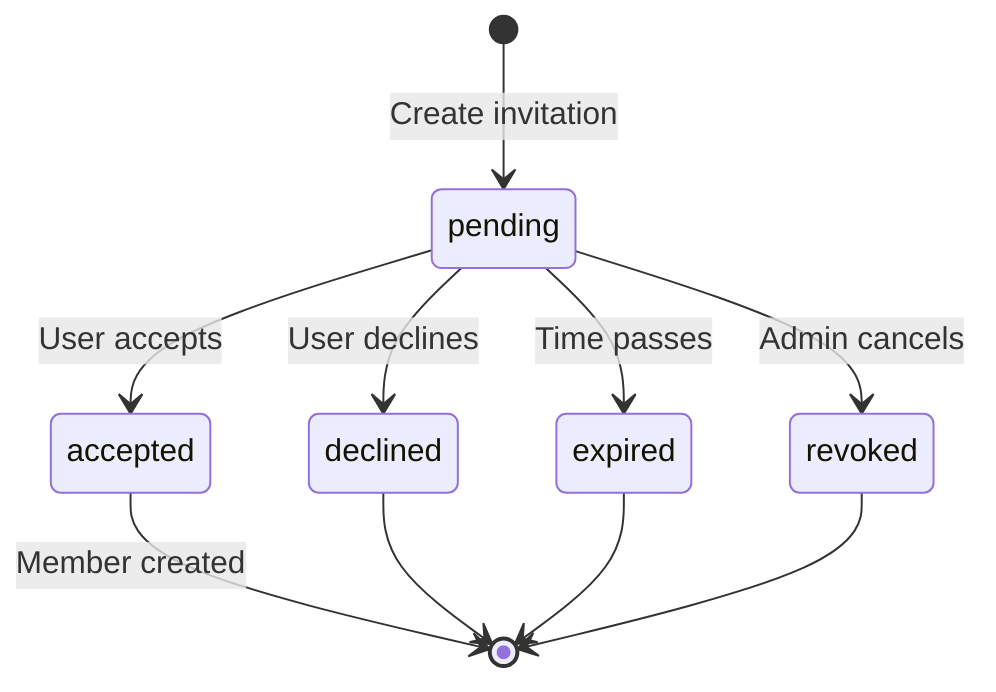

# invitation Table

Pending organization invitations.

## Overview

The `invitation` table stores invitations sent to users to join organizations. Invitations are email-based and expire after a set time.

## Schema Definition

```typescript
// packages/database/src/schema/auth.ts
export const invitation = pgTable('invitation', {
  id: text('id').primaryKey(),
  organizationId: text('organization_id')
    .notNull()
    .references(() => organization.id, { onDelete: 'cascade' }),
  email: text('email').notNull(),
  role: text('role').notNull().default('member'),
  status: text('status').notNull().default('pending'),
  expiresAt: timestamp('expires_at', { withTimezone: true }).notNull(),
  inviterId: text('inviter_id')
    .notNull()
    .references(() => user.id, { onDelete: 'cascade' }),
  createdAt: timestamp('created_at', { withTimezone: true }).notNull().defaultNow(),
});
```

## Columns

| Column | Type | Nullable | Default | Description |
|--------|------|----------|---------|-------------|
| `id` | text | No | - | Primary key |
| `organization_id` | text | No | - | Target organization FK |
| `email` | text | No | - | Invitee's email |
| `role` | text | No | 'member' | Role to be assigned |
| `status` | text | No | 'pending' | Invitation status |
| `expires_at` | timestamp | No | - | Expiration time |
| `inviter_id` | text | No | - | Who sent the invitation |
| `created_at` | timestamp | No | now() | When invitation was sent |

## Foreign Keys

| Column | References | On Delete |
|--------|------------|-----------|
| `organization_id` | organization.id | CASCADE |
| `inviter_id` | user.id | CASCADE |

## Status Values

| Status | Description |
|--------|-------------|
| `pending` | Waiting for user to accept |
| `accepted` | User accepted and joined |
| `declined` | User declined the invitation |
| `expired` | Invitation expired |
| `revoked` | Invitation cancelled by admin |

## Common Queries

### Create Invitation

```typescript
await db.insert(invitation).values({
  id: crypto.randomUUID(),
  organizationId: orgId,
  email: inviteeEmail,
  role: 'member',
  status: 'pending',
  expiresAt: new Date(Date.now() + 7 * 24 * 60 * 60 * 1000), // 7 days
  inviterId: currentUserId,
});
```

### Get Pending Invitations for Organization

```typescript
const invitations = await db.query.invitation.findMany({
  where: and(
    eq(invitation.organizationId, orgId),
    eq(invitation.status, 'pending'),
    gt(invitation.expiresAt, new Date()),
  ),
  with: {
    inviter: true,
  },
});
```

### Get Invitations for Email

```typescript
const myInvitations = await db.query.invitation.findMany({
  where: and(
    eq(invitation.email, userEmail),
    eq(invitation.status, 'pending'),
    gt(invitation.expiresAt, new Date()),
  ),
  with: {
    organization: true,
    inviter: true,
  },
});
```

### Accept Invitation

```typescript
await db.transaction(async (tx) => {
  // Update invitation status
  await tx.update(invitation)
    .set({ status: 'accepted' })
    .where(eq(invitation.id, invitationId));

  // Create membership
  await tx.insert(member).values({
    id: crypto.randomUUID(),
    organizationId: inv.organizationId,
    userId: userId,
    role: inv.role,
  });
});
```

### Decline Invitation

```typescript
await db.update(invitation)
  .set({ status: 'declined' })
  .where(eq(invitation.id, invitationId));
```

### Revoke Invitation

```typescript
await db.update(invitation)
  .set({ status: 'revoked' })
  .where(eq(invitation.id, invitationId));
```

### Clean Expired Invitations

```typescript
await db.update(invitation)
  .set({ status: 'expired' })
  .where(and(
    eq(invitation.status, 'pending'),
    lt(invitation.expiresAt, new Date()),
  ));
```

### Check for Existing Invitation

```typescript
const existing = await db.query.invitation.findFirst({
  where: and(
    eq(invitation.organizationId, orgId),
    eq(invitation.email, email),
    eq(invitation.status, 'pending'),
    gt(invitation.expiresAt, new Date()),
  ),
});

if (existing) {
  throw new Error('Invitation already exists');
}
```

## TypeScript Types

```typescript
import { Invitation, NewInvitation } from '@authlane/database';

// Select type
const existingInvitation: Invitation = {
  id: 'inv_123',
  organizationId: 'org_456',
  email: 'new@example.com',
  role: 'member',
  status: 'pending',
  expiresAt: new Date(Date.now() + 7 * 24 * 60 * 60 * 1000),
  inviterId: 'usr_789',
  createdAt: new Date(),
};

// Insert type
const newInvitation: NewInvitation = {
  id: 'inv_new',
  organizationId: 'org_456',
  email: 'another@example.com',
  role: 'admin',
  expiresAt: new Date(Date.now() + 7 * 24 * 60 * 60 * 1000),
  inviterId: 'usr_789',
};
```

## Invitation Flow



## Email Integration

Invitations trigger email notifications:

```typescript
// After creating invitation
await sendEmail({
  to: invitation.email,
  template: 'organization-invitation',
  data: {
    organizationName: org.name,
    inviterName: inviter.name,
    role: invitation.role,
    acceptUrl: `${baseUrl}/invitations/${invitation.id}/accept`,
    expiresAt: invitation.expiresAt,
  },
});
```

## Security Notes

1. **Email verification** - Verify invitee owns the email before accepting
2. **Expiration** - Invitations should expire (7 days recommended)
3. **Rate limiting** - Prevent invitation spam
4. **Duplicate prevention** - One active invitation per email per org
5. **Cascading delete** - Invitations deleted when org or inviter is deleted
