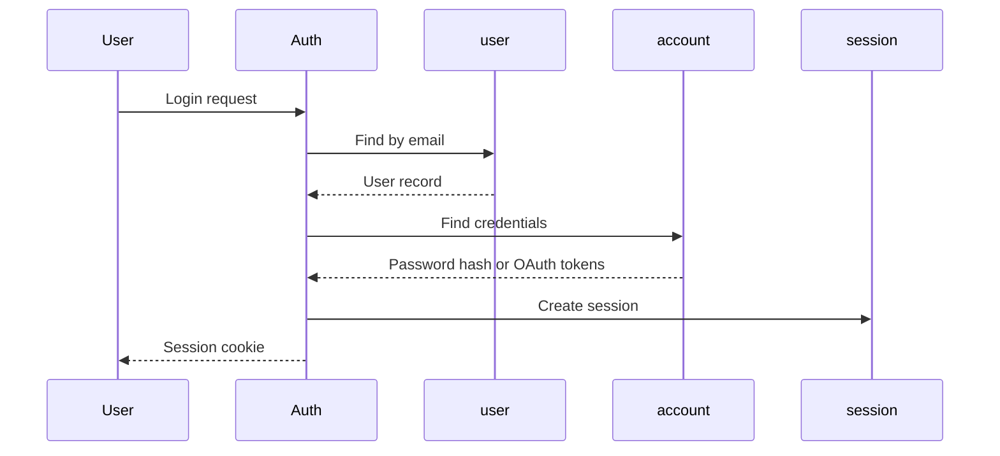

# user Table

Authenticated users in the Authlane system.

## Overview

The `user` table stores users who have access to the Authlane dashboard and API. These are typically SaaS developers and administrators, not end-users of their applications.

## Schema Definition

```typescript
// packages/database/src/schema/auth.ts
export const user = pgTable('user', {
  id: text('id').primaryKey(),
  name: text('name').notNull(),
  email: text('email').notNull().unique(),
  emailVerified: boolean('email_verified').notNull().default(false),
  image: text('image'),
  createdAt: timestamp('created_at', { withTimezone: true }).notNull().defaultNow(),
  updatedAt: timestamp('updated_at', { withTimezone: true }).notNull().defaultNow(),
});
```

## Columns

| Column | Type | Nullable | Default | Description |
|--------|------|----------|---------|-------------|
| `id` | text | No | - | Primary key (UUID or CUID) |
| `name` | text | No | - | User's display name |
| `email` | text | No | - | Email address (unique) |
| `email_verified` | boolean | No | false | Email verification status |
| `image` | text | Yes | - | Profile image URL |
| `created_at` | timestamp | No | now() | Account creation time |
| `updated_at` | timestamp | No | now() | Last update time |

## Unique Constraints

| Name | Columns | Purpose |
|------|---------|---------|
| `user_email_key` | email | Unique email addresses |

## Relationships

| Related Table | Cardinality | Description |
|---------------|-------------|-------------|
| session | 1:N | User's active sessions |
| account | 1:N | Linked OAuth accounts |
| member | 1:N | Organization memberships |
| invitation | 1:N | Invitations sent by user |
| connection | 1:N | User-scoped connections |

## Common Queries

### Find User by Email

```typescript
const user = await db.query.user.findFirst({
  where: eq(user.email, email),
});
```

### Find User by ID with Organizations

```typescript
const userWithOrgs = await db.query.user.findFirst({
  where: eq(user.id, userId),
  with: {
    members: {
      with: {
        organization: true,
      },
    },
  },
});
```

### Create User

```typescript
const [newUser] = await db.insert(user).values({
  id: crypto.randomUUID(),
  name: 'John Doe',
  email: 'john@example.com',
  emailVerified: false,
}).returning();
```

### Update User

```typescript
await db.update(user)
  .set({
    name: 'John Smith',
    updatedAt: new Date(),
  })
  .where(eq(user.id, userId));
```

### Verify Email

```typescript
await db.update(user)
  .set({
    emailVerified: true,
    updatedAt: new Date(),
  })
  .where(eq(user.id, userId));
```

## TypeScript Types

```typescript
import { User, NewUser } from '@authlane/database';

// Select type
const existingUser: User = {
  id: 'usr_123',
  name: 'John Doe',
  email: 'john@example.com',
  emailVerified: true,
  image: 'https://example.com/avatar.jpg',
  createdAt: new Date(),
  updatedAt: new Date(),
};

// Insert type
const newUser: NewUser = {
  id: 'usr_456',
  name: 'Jane Doe',
  email: 'jane@example.com',
};
```

## Authentication Flow

Users can authenticate via:

1. **Email/Password** - Credentials stored in `account` table
2. **OAuth** - Linked via `account` table (Google, GitHub, etc.)
3. **Magic Link** - Verification token sent to email



## Email Verification

```typescript
// Send verification email
const token = crypto.randomBytes(32).toString('hex');
await db.insert(verification).values({
  id: crypto.randomUUID(),
  identifier: user.email,
  value: token,
  expiresAt: new Date(Date.now() + 24 * 60 * 60 * 1000), // 24 hours
});

// Verify email
const verification = await db.query.verification.findFirst({
  where: and(
    eq(verification.identifier, email),
    eq(verification.value, token),
    gt(verification.expiresAt, new Date()),
  ),
});

if (verification) {
  await db.update(user)
    .set({ emailVerified: true })
    .where(eq(user.email, email));
}
```

## Better Auth Integration

This table is managed by Better Auth. The schema follows Better Auth conventions for:
- ID generation
- Session management
- OAuth account linking
- Email verification

```typescript
// Better Auth creates users automatically
const auth = betterAuth({
  database: drizzleAdapter(db, {
    provider: 'pg',
    schema: { user, session, account, verification },
  }),
});
```

## Security Notes

1. **Password not stored here** - Passwords are in `account.password` (hashed with bcrypt)
2. **Email is unique** - Prevents duplicate accounts
3. **Email verification** - Required for sensitive operations
4. **Cascading deletes** - Deleting a user removes all related data
