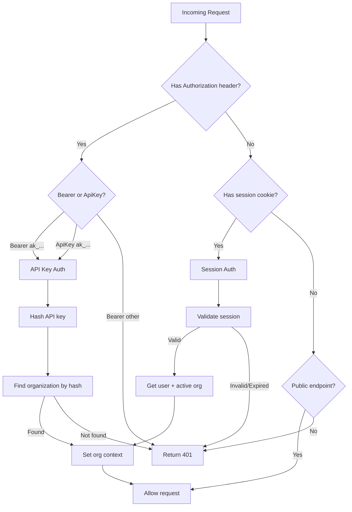

# API Authentication

Authlane supports two authentication methods: API keys for programmatic access and session cookies for browser-based access.

## API Key Authentication

API keys are the primary method for authenticating API requests from your backend.

### Format

API keys have the format: `ak_<32 hex characters>`

Example: `ak_a1b2c3d4e5f6789012345678901234ab`

### Usage

Include the API key in the `Authorization` header:

```bash
# Bearer format (preferred)
curl -H "Authorization: Bearer ak_a1b2c3d4..." \
  https://api.authlane.com/api/v1/services

# ApiKey format (alternative)
curl -H "Authorization: ApiKey ak_a1b2c3d4..." \
  https://api.authlane.com/api/v1/services
```

### SDK Usage

```typescript
import { Authlane } from '@authlane/sdk';

const authlane = new Authlane({
  apiKey: process.env.AUTHLANE_API_KEY,
});

// All requests will use this API key
const { data, error } = await authlane.services.list();
```

### Creating API Keys

API keys are created in the Authlane Dashboard:

1. Navigate to **API Keys** page
2. Click **Create API Key**
3. Enter a name (e.g., "Production")
4. Optionally set an expiration date
5. Copy the key immediately - it won't be shown again

Or via API (requires existing authentication):

```bash
curl -X POST https://api.authlane.com/api/v1/api-keys \
  -H "Authorization: Bearer ak_existing..." \
  -H "Content-Type: application/json" \
  -d '{"name": "New Key", "expiresInDays": 365}'
```

Response:

```json
{
  "data": {
    "id": "key_abc123",
    "name": "New Key",
    "key": "ak_newkey...",  // Only shown once!
    "keyPrefix": "ak_newkey",
    "expiresAt": "2025-12-12T00:00:00Z"
  }
}
```

### Key Security

- **Store securely**: Use environment variables or secret management
- **Don't commit**: Never commit API keys to version control
- **Rotate regularly**: Create new keys and revoke old ones periodically
- **Use least privilege**: Create separate keys for different environments
- **Monitor usage**: Review API key usage in the dashboard

### Key Scoping

API keys are scoped to a single organization. The key grants access to:

- All connections for the organization
- Organization settings
- Service configuration
- Tool definitions for connected users

## Session Authentication

Session authentication is used for browser-based access to the Dashboard.

### How It Works

1. User logs in via Dashboard (`/api/auth/signin`)
2. Server creates a session and sets a cookie
3. Subsequent requests include the session cookie
4. Session expires after 7 days (refreshed on activity)

### Cookie Details

| Property | Value |
|----------|-------|
| Name | `session` |
| HttpOnly | Yes |
| Secure | Yes (production) |
| SameSite | Lax |
| Max-Age | 7 days |

### Session Context

Session-authenticated requests include:

- **User**: The authenticated user
- **Organization**: The user's active organization
- **Session**: Session metadata (IP, user agent)

```typescript
// Available in request context
const { user, organization, session } = getAuthContext(c);
```

### Switching Organizations

Users can belong to multiple organizations. Switch via:

```bash
curl -X POST https://api.authlane.com/api/auth/organization/switch \
  -H "Cookie: session=..." \
  -H "Content-Type: application/json" \
  -d '{"organizationId": "org_xyz"}'
```

## Authentication Flow



## Error Responses

### 401 Unauthorized

Missing or invalid authentication:

```json
{
  "data": null,
  "error": {
    "message": "Authentication required",
    "code": "UNAUTHORIZED",
    "hint": "Include an API key in the Authorization header",
    "statusCode": 401
  }
}
```

### Invalid API Key

```json
{
  "data": null,
  "error": {
    "message": "Invalid API key",
    "code": "INVALID_API_KEY",
    "hint": "Check that the API key is correct and not expired",
    "statusCode": 401
  }
}
```

### Expired Session

```json
{
  "data": null,
  "error": {
    "message": "Session expired",
    "code": "SESSION_EXPIRED",
    "hint": "Please log in again",
    "statusCode": 401
  }
}
```

## Public Endpoints

Some endpoints don't require authentication:

| Endpoint | Description |
|----------|-------------|
| `GET /health` | Health check |
| `GET /api/auth/*` | Authentication routes |
| `GET /api/v1/services` | List available services |

## Best Practices

### For Backend Integration

1. **Use API keys** for server-to-server communication
2. **Store keys in environment variables**
3. **Create separate keys** for dev/staging/production
4. **Set expiration dates** for temporary access
5. **Monitor key usage** in dashboard

### For Frontend Integration

1. **Never expose API keys** in client-side code
2. **Use session authentication** for dashboard
3. **Proxy API calls** through your backend
4. **Handle session expiration** gracefully

### Example: Secure Backend Proxy

```typescript
// Your backend (Next.js API route)
export async function GET(request: Request) {
  const { searchParams } = new URL(request.url);
  const userId = searchParams.get('userId');

  // API key is on server only
  const response = await fetch(
    `https://api.authlane.com/api/v1/users/${userId}/connections`,
    {
      headers: {
        Authorization: `Bearer ${process.env.AUTHLANE_API_KEY}`,
      },
    }
  );

  return Response.json(await response.json());
}
```
