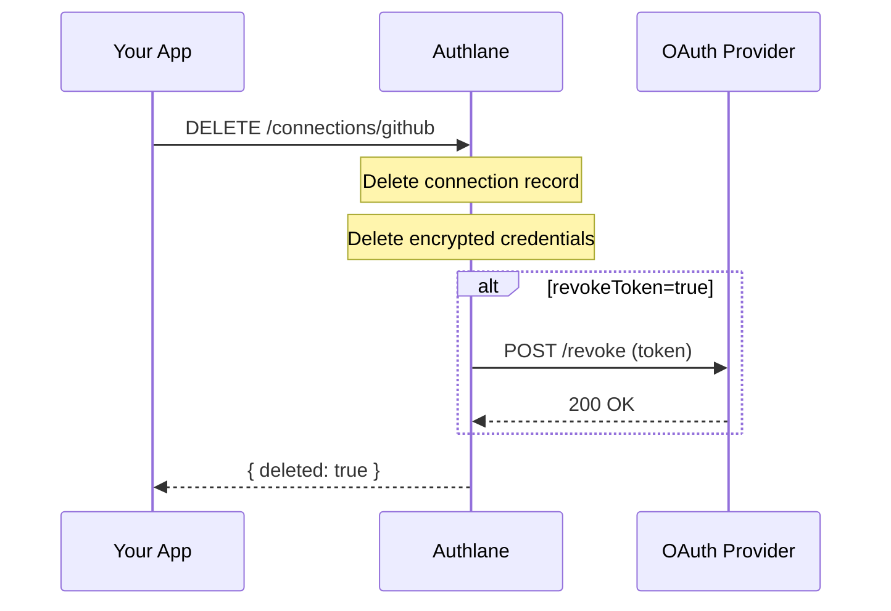

# Delete Connection

Remove a user's service connection and all associated data.

## Endpoint

```
DELETE /api/v1/users/:userId/connections/:serviceId
```

## Authentication

- **API Key**: Required
- **Session**: Allowed (dashboard access)

## Parameters

### Path Parameters

| Parameter | Type | Required | Description |
|-----------|------|----------|-------------|
| `userId` | string | Yes | External user ID |
| `serviceId` | string | Yes | Service identifier (e.g., "github") |

### Query Parameters

| Parameter | Type | Required | Description |
|-----------|------|----------|-------------|
| `revokeToken` | boolean | No | Also revoke token at provider (default: false) |

## Response

### Success (200)

```json
{
  "data": {
    "deleted": true,
    "connectionId": "conn_abc123",
    "serviceId": "github",
    "tokenRevoked": true
  },
  "error": null
}
```

### Error - Connection Not Found (404)

```json
{
  "data": null,
  "error": {
    "message": "Connection not found",
    "code": "CONNECTION_NOT_FOUND",
    "hint": "The user doesn't have this service connected",
    "statusCode": 404
  }
}
```

## Examples

### cURL

```bash
# Delete connection (keep token at provider)
curl -X DELETE \
  -H "Authorization: Bearer ak_..." \
  "https://api.authlane.com/api/v1/users/user_456/connections/github"

# Delete and revoke token at provider
curl -X DELETE \
  -H "Authorization: Bearer ak_..." \
  "https://api.authlane.com/api/v1/users/user_456/connections/github?revokeToken=true"
```

### TypeScript SDK

```typescript
const { data, error } = await authlane.connections.delete({
  userId: 'user_456',
  serviceId: 'github',
  revokeToken: true, // Also revoke at GitHub
});

if (error) {
  console.error(error.message);
  return;
}

console.log(`Connection deleted: ${data.connectionId}`);
if (data.tokenRevoked) {
  console.log('Token also revoked at provider');
}
```

### With Confirmation Dialog

```typescript
async function disconnectService(userId: string, serviceId: string) {
  const confirmed = await showConfirmDialog({
    title: `Disconnect ${serviceId}?`,
    message: 'This will remove access to this service. You can reconnect anytime.',
    confirmText: 'Disconnect',
    dangerous: true,
  });

  if (!confirmed) return;

  const { data, error } = await authlane.connections.delete({
    userId,
    serviceId,
    revokeToken: true,
  });

  if (error) {
    showErrorToast(error.message);
    return;
  }

  showSuccessToast(`${serviceId} disconnected`);
  refreshConnections();
}
```

## Response Fields

| Field | Type | Description |
|-------|------|-------------|
| `deleted` | boolean | Always true on success |
| `connectionId` | string | ID of deleted connection |
| `serviceId` | string | Service that was disconnected |
| `tokenRevoked` | boolean | Whether token was revoked at provider |

## What Gets Deleted

When a connection is deleted:

1. **Connection Record**: Removed from database
2. **Encrypted Credentials**: Permanently deleted
3. **OAuth State**: Any pending OAuth flows invalidated
4. **Provider Token** (optional): Revoked if `revokeToken=true`



## Token Revocation

When `revokeToken=true`, Authlane attempts to revoke the token at the OAuth provider:

| Service | Revocation Endpoint | Notes |
|---------|-------------------|-------|
| GitHub | `DELETE /applications/:client_id/token` | Requires client credentials |
| Google | `POST https://oauth2.googleapis.com/revoke` | Token as parameter |
| Slack | `POST /api/auth.revoke` | Uses access token |
| Linear | Not supported | Token just expires |

**Note**: Token revocation is best-effort. If revocation fails (e.g., provider unavailable), the connection is still deleted locally.

## Batch Disconnection

```typescript
// Disconnect all services for a user (e.g., account deletion)
async function disconnectAllServices(userId: string) {
  const { data: connections } = await authlane.connections.list({ userId });

  const results = await Promise.allSettled(
    connections.items.map((conn) =>
      authlane.connections.delete({
        userId,
        serviceId: conn.serviceId,
        revokeToken: true,
      })
    )
  );

  const failed = results.filter((r) => r.status === 'rejected');
  if (failed.length > 0) {
    console.warn(`Failed to delete ${failed.length} connections`);
  }
}
```

## React Hook Example

```typescript
function useDisconnect() {
  const [isDisconnecting, setIsDisconnecting] = useState(false);
  const { refreshConnections } = useAuthlane();

  const disconnect = async (serviceId: string) => {
    setIsDisconnecting(true);
    try {
      const { error } = await authlane.connections.delete({
        userId: currentUser.id,
        serviceId,
        revokeToken: true,
      });

      if (error) throw new Error(error.message);

      await refreshConnections();
      return true;
    } catch (err) {
      console.error('Disconnect failed:', err);
      return false;
    } finally {
      setIsDisconnecting(false);
    }
  };

  return { disconnect, isDisconnecting };
}
```

## Audit Trail

All deletions are logged with:

- User ID
- Service ID
- Connection ID
- Timestamp
- Whether token was revoked
- IP address
- User agent

## Notes

- Deletion is permanent and cannot be undone
- Users can reconnect the service after deletion
- Pending OAuth flows for this user+service are cancelled
- Organization-scope connections require organization admin permissions
- Consider prompting users to explain why they're disconnecting (for analytics)

