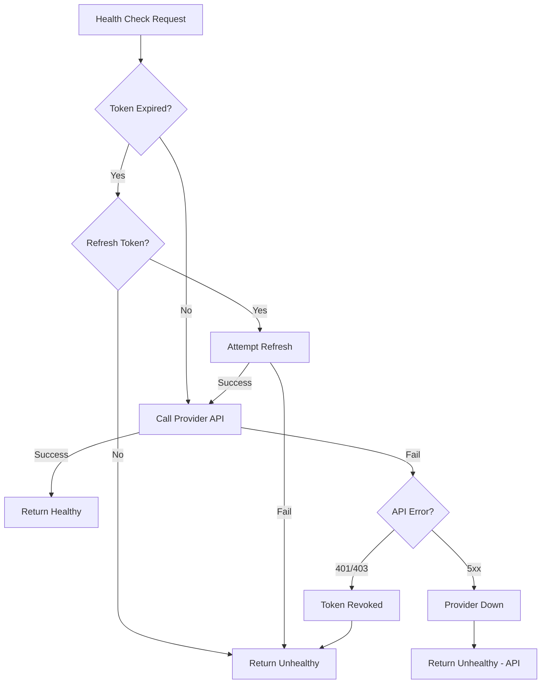

# Health Check Connection

Test if a user's service connection is valid and working.

## Endpoint

```
GET /api/v1/users/:userId/connections/:serviceId/health
```

## Authentication

- **API Key**: Required
- **Session**: Allowed

## Parameters

### Path Parameters

| Parameter | Type | Required | Description |
|-----------|------|----------|-------------|
| `userId` | string | Yes | External user ID |
| `serviceId` | string | Yes | Service identifier (e.g., "github") |

## Response

### Success - Healthy (200)

```json
{
  "data": {
    "healthy": true,
    "status": "connected",
    "lastChecked": "2024-12-12T10:30:00Z",
    "responseTime": 142,
    "details": {
      "tokenValid": true,
      "scopesValid": true,
      "apiReachable": true
    }
  },
  "error": null
}
```

### Success - Unhealthy (200)

```json
{
  "data": {
    "healthy": false,
    "status": "expired",
    "lastChecked": "2024-12-12T10:30:00Z",
    "responseTime": null,
    "details": {
      "tokenValid": false,
      "scopesValid": false,
      "apiReachable": true,
      "reason": "Token expired and refresh failed"
    }
  },
  "error": null
}
```

### Error - Connection Not Found (404)

```json
{
  "data": null,
  "error": {
    "message": "Connection not found",
    "code": "CONNECTION_NOT_FOUND",
    "hint": "The user hasn't connected this service yet",
    "statusCode": 404
  }
}
```

## Examples

### cURL

```bash
curl -H "Authorization: Bearer ak_..." \
  "https://api.authlane.com/api/v1/users/user_456/connections/github/health"
```

### TypeScript SDK

```typescript
const { data, error } = await authlane.connections.healthCheck({
  userId: 'user_456',
  serviceId: 'github',
});

if (error) {
  console.error(error.message);
  return;
}

if (data.healthy) {
  console.log('Connection is healthy');
} else {
  console.log('Connection needs attention:', data.details.reason);
  // Prompt user to reconnect
  showReconnectPrompt('github');
}
```

### Periodic Health Monitoring

```typescript
async function monitorConnections(userId: string) {
  const { data: connections } = await authlane.connections.list({
    userId,
    status: 'connected',
  });

  const healthChecks = await Promise.all(
    connections.items.map(async (conn) => {
      const { data: health } = await authlane.connections.healthCheck({
        userId,
        serviceId: conn.serviceId,
      });
      return { serviceId: conn.serviceId, ...health };
    })
  );

  const unhealthy = healthChecks.filter((h) => !h.healthy);
  if (unhealthy.length > 0) {
    // Notify user about unhealthy connections
    notifyUser(userId, unhealthy);
  }
}
```

## Response Fields

| Field | Type | Description |
|-------|------|-------------|
| `healthy` | boolean | Overall health status |
| `status` | string | Connection status |
| `lastChecked` | string | ISO 8601 timestamp of check |
| `responseTime` | number | API response time in ms (null if unreachable) |
| `details.tokenValid` | boolean | Access token is valid |
| `details.scopesValid` | boolean | Required scopes are present |
| `details.apiReachable` | boolean | Provider API is reachable |
| `details.reason` | string | Reason for unhealthy status |

## Health Check Logic

The health check performs the following validations:

1. **Token Validity**: Verifies the access token hasn't expired
2. **Scope Check**: Confirms all required scopes are still granted
3. **API Connectivity**: Makes a lightweight API call to the provider
4. **Token Refresh**: If token expired, attempts automatic refresh



## Provider-Specific Checks

| Service | Health Check Endpoint |
|---------|----------------------|
| GitHub | `GET /user` |
| Slack | `POST /api/auth.test` |
| Google | `GET /oauth2/v1/tokeninfo` |
| Linear | `POST /graphql` (viewer query) |
| Notion | `GET /v1/users/me` |

## Use Cases

### Pre-Flight Check

```typescript
// Check connection before executing a tool
async function executeToolSafely(userId: string, tool: string, params: any) {
  const serviceId = tool.split('_')[0]; // e.g., "github_create_issue" -> "github"

  const { data: health } = await authlane.connections.healthCheck({
    userId,
    serviceId,
  });

  if (!health.healthy) {
    throw new Error(`Please reconnect ${serviceId} to continue`);
  }

  // Proceed with tool execution
  return authlane.tools.execute({ userId, tool, params });
}
```

### Dashboard Status Display

```typescript
// Display connection status in dashboard
function ConnectionCard({ connection }) {
  const [health, setHealth] = useState(null);

  useEffect(() => {
    authlane.connections
      .healthCheck({
        userId: connection.externalUserId,
        serviceId: connection.serviceId,
      })
      .then(({ data }) => setHealth(data));
  }, [connection]);

  return (
    <div className={`card ${health?.healthy ? 'healthy' : 'warning'}`}>
      <h3>{connection.serviceId}</h3>
      <span>{health?.healthy ? '✓ Connected' : '⚠ Needs Attention'}</span>
      {!health?.healthy && (
        <button onClick={() => reconnect(connection.serviceId)}>
          Reconnect
        </button>
      )}
    </div>
  );
}
```

## Notes

- Health checks are rate-limited more strictly (30/min)
- Results are cached for 30 seconds to prevent API abuse
- Provider API calls count against their rate limits
- Consider implementing background health checks for critical integrations

