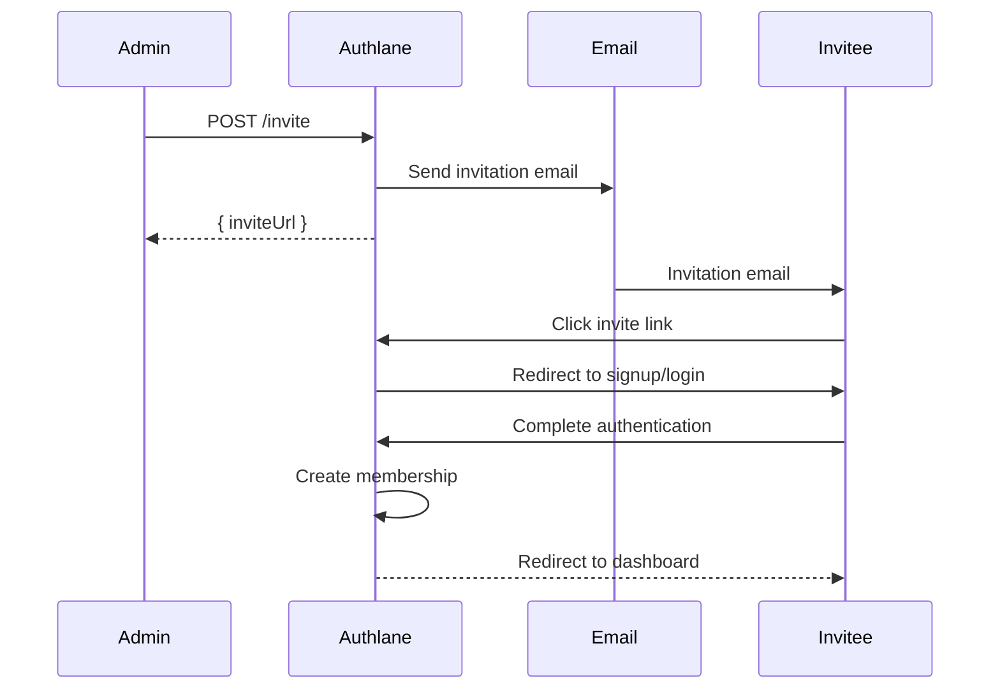

# Organization Members

Manage organization team members.

## Endpoints

| Method | Endpoint | Description |
|--------|----------|-------------|
| GET | `/api/v1/dashboard/organization/members` | List members |
| POST | `/api/v1/dashboard/organization/members/invite` | Invite member |
| PATCH | `/api/v1/dashboard/organization/members/:memberId` | Update role |
| DELETE | `/api/v1/dashboard/organization/members/:memberId` | Remove member |

## Authentication

- **Session**: Required (dashboard only)
- **Role**: Admin required for modifications

---

## List Members

Retrieve all organization members and pending invitations.

### Request

```
GET /api/v1/dashboard/organization/members
```

### Query Parameters

| Parameter | Type | Description |
|-----------|------|-------------|
| `status` | string | Filter: "active", "pending", "all" |

### Response (200)

```json
{
  "data": {
    "members": [
      {
        "id": "mem_abc123",
        "userId": "usr_xyz",
        "email": "john@acme.com",
        "name": "John Doe",
        "role": "owner",
        "status": "active",
        "joinedAt": "2024-01-15T00:00:00Z",
        "lastActiveAt": "2024-12-12T10:30:00Z"
      },
      {
        "id": "mem_def456",
        "userId": "usr_abc",
        "email": "jane@acme.com",
        "name": "Jane Smith",
        "role": "admin",
        "status": "active",
        "joinedAt": "2024-03-01T00:00:00Z",
        "lastActiveAt": "2024-12-11T15:00:00Z"
      }
    ],
    "invitations": [
      {
        "id": "inv_ghi789",
        "email": "bob@acme.com",
        "role": "member",
        "status": "pending",
        "invitedBy": "john@acme.com",
        "invitedAt": "2024-12-10T00:00:00Z",
        "expiresAt": "2024-12-17T00:00:00Z"
      }
    ],
    "total": {
      "members": 2,
      "invitations": 1
    }
  },
  "error": null
}
```

---

## Invite Member

Send an invitation to join the organization.

### Request

```
POST /api/v1/dashboard/organization/members/invite
```

### Request Body

```json
{
  "email": "bob@acme.com",
  "role": "member",
  "message": "Welcome to the team!"
}
```

### Response (201)

```json
{
  "data": {
    "invitationId": "inv_ghi789",
    "email": "bob@acme.com",
    "role": "member",
    "expiresAt": "2024-12-19T10:30:00Z",
    "inviteUrl": "https://authlane.com/invite/xxx"
  },
  "error": null
}
```

---

## Update Member Role

Change a member's role.

### Request

```
PATCH /api/v1/dashboard/organization/members/:memberId
```

### Request Body

```json
{
  "role": "admin"
}
```

### Response (200)

```json
{
  "data": {
    "memberId": "mem_def456",
    "role": "admin",
    "updatedAt": "2024-12-12T10:30:00Z"
  },
  "error": null
}
```

---

## Remove Member

Remove a member from the organization.

### Request

```
DELETE /api/v1/dashboard/organization/members/:memberId
```

### Response (200)

```json
{
  "data": {
    "removed": true,
    "memberId": "mem_def456",
    "email": "jane@acme.com"
  },
  "error": null
}
```

---

## Examples

### cURL

```bash
# List members
curl -b "session=xxx" \
  "https://api.authlane.com/api/v1/dashboard/organization/members"

# Invite member
curl -X POST \
  -b "session=xxx" \
  -H "Content-Type: application/json" \
  -d '{"email": "bob@acme.com", "role": "member"}' \
  "https://api.authlane.com/api/v1/dashboard/organization/members/invite"

# Update role
curl -X PATCH \
  -b "session=xxx" \
  -H "Content-Type: application/json" \
  -d '{"role": "admin"}' \
  "https://api.authlane.com/api/v1/dashboard/organization/members/mem_def456"

# Remove member
curl -X DELETE \
  -b "session=xxx" \
  "https://api.authlane.com/api/v1/dashboard/organization/members/mem_def456"
```

### TypeScript SDK

```typescript
// List members
const { data } = await authlane.dashboard.organization.members.list();

// Invite member
const { data: invite } = await authlane.dashboard.organization.members.invite({
  email: 'bob@acme.com',
  role: 'member',
  message: 'Welcome to the team!',
});

// Update role
await authlane.dashboard.organization.members.update({
  memberId: 'mem_def456',
  role: 'admin',
});

// Remove member
await authlane.dashboard.organization.members.remove({
  memberId: 'mem_def456',
});
```

### React Members Management

```tsx
function MembersManager() {
  const { data, refetch } = useQuery(['members'], () =>
    authlane.dashboard.organization.members.list()
  );

  const inviteMember = async (email: string, role: string) => {
    const { error } = await authlane.dashboard.organization.members.invite({
      email,
      role,
    });

    if (error) {
      if (error.code === 'ALREADY_MEMBER') {
        showError('This person is already a member');
      } else {
        showError(error.message);
      }
      return;
    }

    showSuccess('Invitation sent');
    refetch();
  };

  const removeMember = async (memberId: string) => {
    const confirmed = await confirm('Remove this member?');
    if (!confirmed) return;

    await authlane.dashboard.organization.members.remove({ memberId });
    refetch();
  };

  return (
    <div>
      <h2>Team Members</h2>

      <InviteForm onSubmit={inviteMember} />

      <table>
        <thead>
          <tr>
            <th>Member</th>
            <th>Role</th>
            <th>Status</th>
            <th>Actions</th>
          </tr>
        </thead>
        <tbody>
          {data?.members.map((member) => (
            <tr key={member.id}>
              <td>
                <div>{member.name}</div>
                <div className="text-sm">{member.email}</div>
              </td>
              <td>
                <RoleSelector
                  value={member.role}
                  onChange={(role) => updateRole(member.id, role)}
                  disabled={member.role === 'owner'}
                />
              </td>
              <td>
                <Badge variant={member.status === 'active' ? 'success' : 'warning'}>
                  {member.status}
                </Badge>
              </td>
              <td>
                {member.role !== 'owner' && (
                  <Button
                    variant="danger"
                    onClick={() => removeMember(member.id)}
                  >
                    Remove
                  </Button>
                )}
              </td>
            </tr>
          ))}
        </tbody>
      </table>

      {data?.invitations.length > 0 && (
        <>
          <h3>Pending Invitations</h3>
          <ul>
            {data.invitations.map((inv) => (
              <li key={inv.id}>
                {inv.email} - {inv.role}
                <Button onClick={() => resendInvite(inv.id)}>Resend</Button>
                <Button onClick={() => cancelInvite(inv.id)}>Cancel</Button>
              </li>
            ))}
          </ul>
        </>
      )}
    </div>
  );
}
```

## Roles

| Role | Permissions |
|------|-------------|
| `owner` | Full access, billing, delete org |
| `admin` | Manage members, services, settings |
| `member` | View dashboard, manage own connections |

### Role Hierarchy

```
owner > admin > member
```

- Owners can modify admins and members
- Admins can modify members only
- Cannot modify your own role
- Only one owner per organization

## Invitation Flow



## Error Codes

| Code | Description |
|------|-------------|
| `ALREADY_MEMBER` | Email is already a member |
| `INVITATION_PENDING` | Invitation already sent |
| `INVITATION_EXPIRED` | Invitation has expired |
| `INVALID_ROLE` | Invalid role specified |
| `CANNOT_REMOVE_OWNER` | Cannot remove organization owner |
| `CANNOT_MODIFY_SELF` | Cannot modify own role |

## Limits

| Plan | Members |
|------|---------|
| Free | 3 |
| Pro | 25 |
| Enterprise | Unlimited |

## Notes

- Invitations expire after 7 days
- Removed members lose access immediately
- Owner transfer requires support contact
- All member changes are audit-logged

