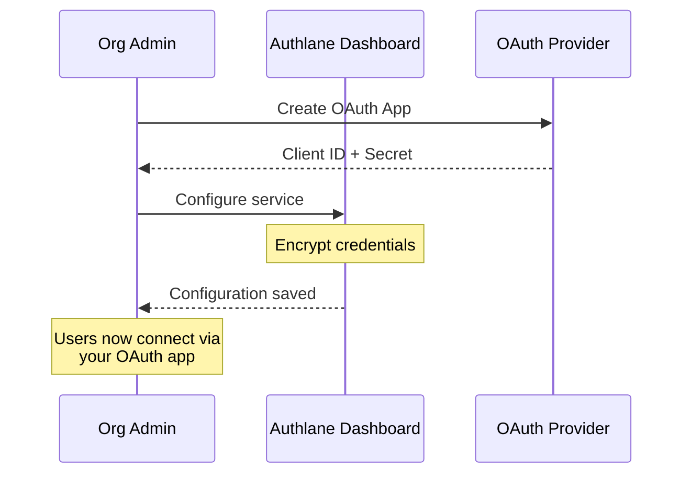

# Organization Services

Manage service configurations for an organization.

## Endpoints

| Method | Endpoint | Description |
|--------|----------|-------------|
| GET | `/api/v1/dashboard/organization/services` | List organization services |
| GET | `/api/v1/dashboard/organization/services/:serviceId` | Get service config |
| PUT | `/api/v1/dashboard/organization/services/:serviceId` | Update service config |

## Authentication

- **Session**: Required (dashboard only)
- **Role**: Organization admin required

---

## List Organization Services

Retrieve all services with organization-specific configuration.

### Request

```
GET /api/v1/dashboard/organization/services
```

### Response (200)

```json
{
  "data": {
    "items": [
      {
        "serviceId": "github",
        "serviceName": "GitHub",
        "enabled": true,
        "hasCustomCredentials": true,
        "connectionCount": 142,
        "lastConnectionAt": "2024-12-12T10:30:00Z"
      },
      {
        "serviceId": "slack",
        "serviceName": "Slack",
        "enabled": true,
        "hasCustomCredentials": false,
        "connectionCount": 89,
        "lastConnectionAt": "2024-12-11T15:00:00Z"
      },
      {
        "serviceId": "linear",
        "serviceName": "Linear",
        "enabled": false,
        "hasCustomCredentials": false,
        "connectionCount": 0,
        "lastConnectionAt": null
      }
    ],
    "total": 15
  },
  "error": null
}
```

---

## Get Service Configuration

Retrieve detailed configuration for a specific service.

### Request

```
GET /api/v1/dashboard/organization/services/:serviceId
```

### Response (200)

```json
{
  "data": {
    "serviceId": "github",
    "serviceName": "GitHub",
    "enabled": true,
    "config": {
      "hasClientId": true,
      "hasClientSecret": true,
      "scopes": ["repo", "user", "read:org"],
      "customScopes": ["admin:org"],
      "callbackUrl": "https://api.authlane.com/api/v1/oauth/callback"
    },
    "stats": {
      "connectionCount": 142,
      "activeConnections": 138,
      "toolExecutions": 4520,
      "lastConnectionAt": "2024-12-12T10:30:00Z"
    },
    "createdAt": "2024-11-01T00:00:00Z",
    "updatedAt": "2024-12-10T14:00:00Z"
  },
  "error": null
}
```

---

## Update Service Configuration

Update organization-specific settings for a service.

### Request

```
PUT /api/v1/dashboard/organization/services/:serviceId
```

### Request Body

```json
{
  "enabled": true,
  "clientId": "Iv1.xxxxxxxxxx",
  "clientSecret": "xxxxxxxxxxxxxxxxxxxxxxxxxx",
  "scopes": ["repo", "user", "read:org", "admin:org"],
  "webhookUrl": "https://myapp.com/webhooks/github"
}
```

### Response (200)

```json
{
  "data": {
    "serviceId": "github",
    "enabled": true,
    "updated": true,
    "config": {
      "hasClientId": true,
      "hasClientSecret": true,
      "scopes": ["repo", "user", "read:org", "admin:org"]
    }
  },
  "error": null
}
```

---

## Examples

### cURL

```bash
# List all services
curl -b "session=xxx" \
  "https://api.authlane.com/api/v1/dashboard/organization/services"

# Get service config
curl -b "session=xxx" \
  "https://api.authlane.com/api/v1/dashboard/organization/services/github"

# Update service config
curl -X PUT \
  -b "session=xxx" \
  -H "Content-Type: application/json" \
  -d '{
    "enabled": true,
    "clientId": "Iv1.xxx",
    "clientSecret": "xxx",
    "scopes": ["repo", "user"]
  }' \
  "https://api.authlane.com/api/v1/dashboard/organization/services/github"
```

### TypeScript SDK

```typescript
// List organization services
const { data: services } = await authlane.dashboard.organization.services.list();

// Get service configuration
const { data: githubConfig } = await authlane.dashboard.organization.services.get({
  serviceId: 'github',
});

// Update service configuration
const { data: updated } = await authlane.dashboard.organization.services.update({
  serviceId: 'github',
  enabled: true,
  clientId: 'Iv1.xxx',
  clientSecret: 'xxx',
  scopes: ['repo', 'user', 'read:org'],
});
```

### React Component

```tsx
function ServiceConfiguration({ serviceId }: { serviceId: string }) {
  const { data: config, refetch } = useQuery(
    ['service-config', serviceId],
    () => authlane.dashboard.organization.services.get({ serviceId })
  );

  const updateConfig = async (values: ServiceConfigForm) => {
    const { error } = await authlane.dashboard.organization.services.update({
      serviceId,
      ...values,
    });

    if (error) {
      showError(error.message);
      return;
    }

    showSuccess('Configuration updated');
    refetch();
  };

  return (
    <form onSubmit={handleSubmit(updateConfig)}>
      <h2>{config?.serviceName} Configuration</h2>

      <Switch
        label="Enabled"
        checked={config?.enabled}
        {...register('enabled')}
      />

      <div className="credentials-section">
        <h3>OAuth Credentials</h3>
        <p>Use your own OAuth app for custom branding and control.</p>

        <Input
          label="Client ID"
          placeholder={config?.config.hasClientId ? '••••••••' : 'Enter client ID'}
          {...register('clientId')}
        />

        <Input
          type="password"
          label="Client Secret"
          placeholder={config?.config.hasClientSecret ? '••••••••' : 'Enter client secret'}
          {...register('clientSecret')}
        />
      </div>

      <div className="scopes-section">
        <h3>OAuth Scopes</h3>
        <ScopeSelector
          available={SERVICE_SCOPES[serviceId]}
          selected={config?.config.scopes}
          {...register('scopes')}
        />
      </div>

      <div className="callback-url">
        <h3>Callback URL</h3>
        <p>Add this URL to your OAuth app's redirect URIs:</p>
        <CopyableCode value={config?.config.callbackUrl} />
      </div>

      <Button type="submit">Save Configuration</Button>
    </form>
  );
}
```

## Configuration Options

### Common Options

| Field | Type | Description |
|-------|------|-------------|
| `enabled` | boolean | Enable/disable service for organization |
| `clientId` | string | Custom OAuth client ID |
| `clientSecret` | string | Custom OAuth client secret |
| `scopes` | string[] | OAuth scopes to request |

### Service-Specific Options

#### GitHub

| Field | Description |
|-------|-------------|
| `webhookSecret` | Secret for webhook validation |
| `appId` | GitHub App ID (for GitHub Apps) |
| `privateKey` | GitHub App private key |

#### Slack

| Field | Description |
|-------|-------------|
| `signingSecret` | Slack signing secret |
| `botToken` | Bot token (for bot features) |

#### Google

| Field | Description |
|-------|-------------|
| `projectId` | Google Cloud project ID |
| `serviceAccountKey` | Service account JSON key |

## Using Custom OAuth Credentials

### Why Use Custom Credentials?

1. **Branding**: Your OAuth consent screen shows your app name
2. **Scopes**: Request additional scopes not available by default
3. **Webhooks**: Receive webhooks directly to your app
4. **Rate Limits**: Higher limits with your own credentials

### Setup Flow



### GitHub OAuth App Setup

1. Go to GitHub → Settings → Developer settings → OAuth Apps
2. Click "New OAuth App"
3. Set callback URL to: `https://api.authlane.com/api/v1/oauth/callback`
4. Copy Client ID and Client Secret
5. Enter in Authlane dashboard

## Security

- Client secrets are encrypted using AES-256-GCM
- Secrets are never returned in API responses
- Only admins can view/edit service configuration
- Configuration changes are audit-logged

## Notes

- Changes take effect immediately for new connections
- Existing connections continue using original credentials
- Disabling a service doesn't disconnect existing users
- Custom scopes must be valid for the OAuth provider

