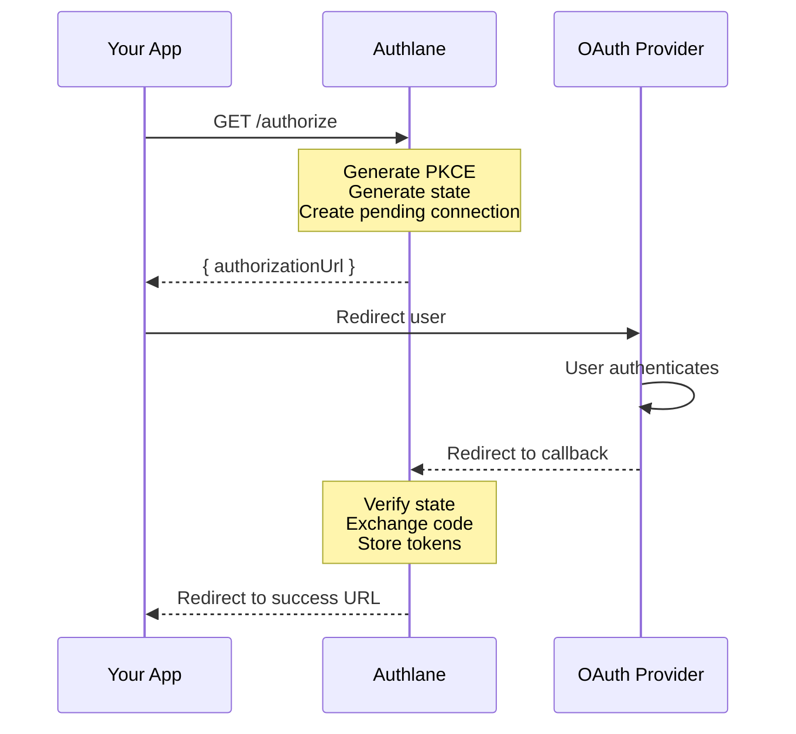

# Authorize (Start OAuth Flow)

Initiate the OAuth 2.0 authorization flow for connecting a service.

## Endpoint

```
GET /api/v1/users/:userId/connections/:serviceId/authorize
```

## Authentication

- **API Key**: Required
- **Session**: Allowed

## Parameters

### Path Parameters

| Parameter | Type | Required | Description |
|-----------|------|----------|-------------|
| `userId` | string | Yes | External user ID |
| `serviceId` | string | Yes | Service identifier (e.g., "github") |

### Query Parameters

| Parameter | Type | Required | Description |
|-----------|------|----------|-------------|
| `scope` | string | No | Connection scope: "user" or "organization" |
| `redirect_uri` | string | No | Where to redirect after OAuth |
| `state` | string | No | Additional state to preserve |

## Response

### Success (200)

```json
{
  "data": {
    "authorizationUrl": "https://github.com/login/oauth/authorize?client_id=xxx&redirect_uri=xxx&scope=repo+user&state=xxx&code_challenge=xxx&code_challenge_method=S256",
    "state": "abc123...",
    "connectionId": "conn_xyz789"
  },
  "error": null
}
```

### Error - Service Not Found (404)

```json
{
  "data": null,
  "error": {
    "message": "Service not found",
    "code": "SERVICE_NOT_FOUND",
    "hint": "Check the service ID",
    "statusCode": 404
  }
}
```

### Error - Service Disabled (400)

```json
{
  "data": null,
  "error": {
    "message": "Service is disabled for this organization",
    "code": "SERVICE_DISABLED",
    "hint": "Enable this service in the dashboard",
    "statusCode": 400
  }
}
```

## Examples

### cURL

```bash
# Start OAuth flow
curl -H "Authorization: Bearer ak_..." \
  "https://api.authlane.com/api/v1/users/user_456/connections/github/authorize"

# With custom redirect
curl -H "Authorization: Bearer ak_..." \
  "https://api.authlane.com/api/v1/users/user_456/connections/github/authorize?redirect_uri=https://myapp.com/callback"
```

### TypeScript SDK

```typescript
const { data, error } = await authlane.oauth.authorize({
  userId: 'user_456',
  serviceId: 'github',
  redirectUri: 'https://myapp.com/oauth/callback',
});

if (error) {
  console.error(error.message);
  return;
}

// Redirect user to OAuth provider
window.location.href = data.authorizationUrl;
```

### Full OAuth Flow

```typescript
// 1. Get authorization URL
const { data } = await authlane.oauth.authorize({
  userId: currentUser.id,
  serviceId: 'github',
});

// 2. Redirect to OAuth provider
window.location.href = data.authorizationUrl;

// 3. After OAuth callback, credentials are stored automatically
// 4. Now you can use getCredentials
const { data: creds } = await authlane.connections.getCredentials({
  userId: currentUser.id,
  serviceId: 'github',
});
```

### Popup Flow

```typescript
// Open OAuth in popup instead of redirect
function connectService(serviceId: string) {
  const { data } = await authlane.oauth.authorize({
    userId: currentUser.id,
    serviceId,
  });

  // Open popup
  const popup = window.open(
    data.authorizationUrl,
    'oauth',
    'width=600,height=700'
  );

  // Poll for completion
  const pollTimer = setInterval(() => {
    if (popup.closed) {
      clearInterval(pollTimer);
      // Check if connection was successful
      refreshConnections();
    }
  }, 500);
}
```

## OAuth Flow Sequence



## Response Fields

| Field | Type | Description |
|-------|------|-------------|
| `authorizationUrl` | string | Full URL to redirect user to |
| `state` | string | State parameter for verification |
| `connectionId` | string | ID of the pending connection |

## URL Parameters (in authorizationUrl)

The generated URL includes:

| Parameter | Description |
|-----------|-------------|
| `client_id` | OAuth client ID |
| `redirect_uri` | Callback URL |
| `scope` | Requested OAuth scopes |
| `state` | CSRF protection token |
| `code_challenge` | PKCE challenge |
| `code_challenge_method` | Always "S256" |
| `response_type` | Always "code" |

## Security Features

- **PKCE**: Mandatory for all OAuth flows
- **State parameter**: Prevents CSRF attacks
- **Exact redirect URI matching**: No wildcards
- **Short-lived state**: Expires in 10 minutes

## Notes

- The returned URL must be used within 10 minutes
- Each authorize call creates a new pending connection
- Previous pending connections for the same user+service are invalidated
- Callback must be to a registered redirect URI
