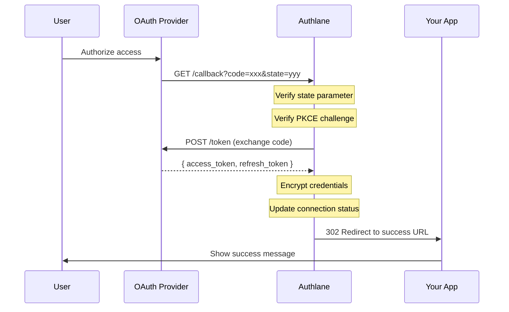

# OAuth Callback

Handle the OAuth 2.0 callback from the provider after user authorization.

## Endpoint

```
GET /api/v1/oauth/callback
```

## Authentication

- **None**: This endpoint is called by OAuth providers

## Parameters

### Query Parameters

| Parameter | Type | Required | Description |
|-----------|------|----------|-------------|
| `code` | string | Yes* | Authorization code from provider |
| `state` | string | Yes | State parameter for verification |
| `error` | string | No | Error code if authorization failed |
| `error_description` | string | No | Human-readable error description |

*Required unless `error` is present

## Response

This endpoint redirects rather than returning JSON.

### Success Redirect

```
HTTP/1.1 302 Found
Location: https://yourapp.com/oauth/success?connectionId=conn_abc123&serviceId=github
```

### Error Redirect

```
HTTP/1.1 302 Found
Location: https://yourapp.com/oauth/error?error=access_denied&error_description=User%20denied%20access
```

## Flow Sequence



## Callback Processing

When Authlane receives the callback, it performs these steps:

### 1. State Validation

```typescript
// Pseudocode of state validation
const pendingAuth = await findPendingAuth(state);

if (!pendingAuth) {
  throw new Error('INVALID_STATE');
}

if (pendingAuth.expiresAt < now) {
  throw new Error('STATE_EXPIRED');
}
```

### 2. PKCE Verification

```typescript
// Code verifier was stored with pending auth
const tokenResponse = await exchangeCode({
  code,
  codeVerifier: pendingAuth.codeVerifier,
  redirectUri: pendingAuth.redirectUri,
});
```

### 3. Token Storage

```typescript
// Encrypt and store credentials
const encryptedCredentials = await encrypt({
  access_token: tokenResponse.access_token,
  refresh_token: tokenResponse.refresh_token,
  expires_at: calculateExpiry(tokenResponse.expires_in),
  scope: tokenResponse.scope,
});

await updateConnection(pendingAuth.connectionId, {
  status: 'connected',
  encryptedCredentials,
  connectedAt: new Date(),
});
```

## Error Codes

### Provider Errors

| Error | Description | User Action |
|-------|-------------|-------------|
| `access_denied` | User denied authorization | Inform user, offer retry |
| `invalid_scope` | Invalid scopes requested | Contact support |
| `server_error` | Provider error | Retry later |

### Authlane Errors

| Error | Description | Cause |
|-------|-------------|-------|
| `INVALID_STATE` | State parameter invalid | CSRF attack or stale request |
| `STATE_EXPIRED` | State expired (>10 min) | User took too long |
| `TOKEN_EXCHANGE_FAILED` | Code exchange failed | Provider issue or invalid code |
| `ENCRYPTION_ERROR` | Failed to encrypt credentials | Internal error |

## Redirect URL Configuration

Redirect URLs are configured per organization in the dashboard:

```typescript
// Organization settings
{
  oauthRedirectUrls: {
    success: 'https://myapp.com/oauth/success',
    error: 'https://myapp.com/oauth/error',
  }
}
```

### URL Parameters

**Success URL receives:**

| Parameter | Description |
|-----------|-------------|
| `connectionId` | ID of the new connection |
| `serviceId` | Service that was connected |
| `state` | Original state (if custom state provided) |

**Error URL receives:**

| Parameter | Description |
|-----------|-------------|
| `error` | Error code |
| `error_description` | Human-readable description |
| `serviceId` | Service that failed |
| `state` | Original state (if available) |

## Handling the Callback in Your App

### Success Handler

```typescript
// pages/oauth/success.tsx
export default function OAuthSuccess() {
  const searchParams = useSearchParams();
  const connectionId = searchParams.get('connectionId');
  const serviceId = searchParams.get('serviceId');

  useEffect(() => {
    // If in popup, notify parent and close
    if (window.opener) {
      window.opener.postMessage(
        { type: 'oauth_success', connectionId, serviceId },
        window.location.origin
      );
      window.close();
    }
  }, []);

  return (
    <div>
      <h1>Connected to {serviceId}!</h1>
      <p>You can close this window.</p>
    </div>
  );
}
```

### Error Handler

```typescript
// pages/oauth/error.tsx
export default function OAuthError() {
  const searchParams = useSearchParams();
  const error = searchParams.get('error');
  const description = searchParams.get('error_description');
  const serviceId = searchParams.get('serviceId');

  const errorMessages = {
    access_denied: 'You denied access to your account.',
    invalid_scope: 'The requested permissions are not available.',
    server_error: 'The service is temporarily unavailable.',
    INVALID_STATE: 'This request has expired. Please try again.',
    STATE_EXPIRED: 'The authorization took too long. Please try again.',
  };

  return (
    <div>
      <h1>Connection Failed</h1>
      <p>{errorMessages[error] || description || 'An unknown error occurred.'}</p>
      <button onClick={() => window.close()}>Close</button>
    </div>
  );
}
```

### Popup Message Listener

```typescript
// In your main app
useEffect(() => {
  const handleMessage = (event: MessageEvent) => {
    if (event.origin !== window.location.origin) return;

    if (event.data.type === 'oauth_success') {
      // Refresh connections list
      refreshConnections();
      showSuccessToast(`Connected to ${event.data.serviceId}`);
    }

    if (event.data.type === 'oauth_error') {
      showErrorToast(`Failed to connect: ${event.data.error}`);
    }
  };

  window.addEventListener('message', handleMessage);
  return () => window.removeEventListener('message', handleMessage);
}, []);
```

## Security Considerations

### State Parameter

- Cryptographically random (32 bytes)
- Single-use (deleted after callback)
- Short-lived (10 minute expiry)
- Bound to specific user and service

### PKCE

- Mandatory for all OAuth flows
- Code verifier: 43-128 characters
- Method: S256 (SHA-256)
- Prevents authorization code interception

### Redirect URI Validation

- Must exactly match registered URIs
- No wildcards allowed
- HTTPS required in production
- Localhost allowed in development

## Webhook Alternative

For server-to-server flows, you can use webhooks instead of redirects:

```typescript
// Webhook payload on successful connection
{
  event: 'connection.created',
  data: {
    connectionId: 'conn_abc123',
    userId: 'user_456',
    serviceId: 'github',
    status: 'connected',
    connectedAt: '2024-12-12T10:30:00Z'
  }
}
```

## Notes

- Callback must complete within 30 seconds
- Code can only be exchanged once
- Provider tokens are never exposed to the client
- All callback data is logged for debugging (except tokens)

