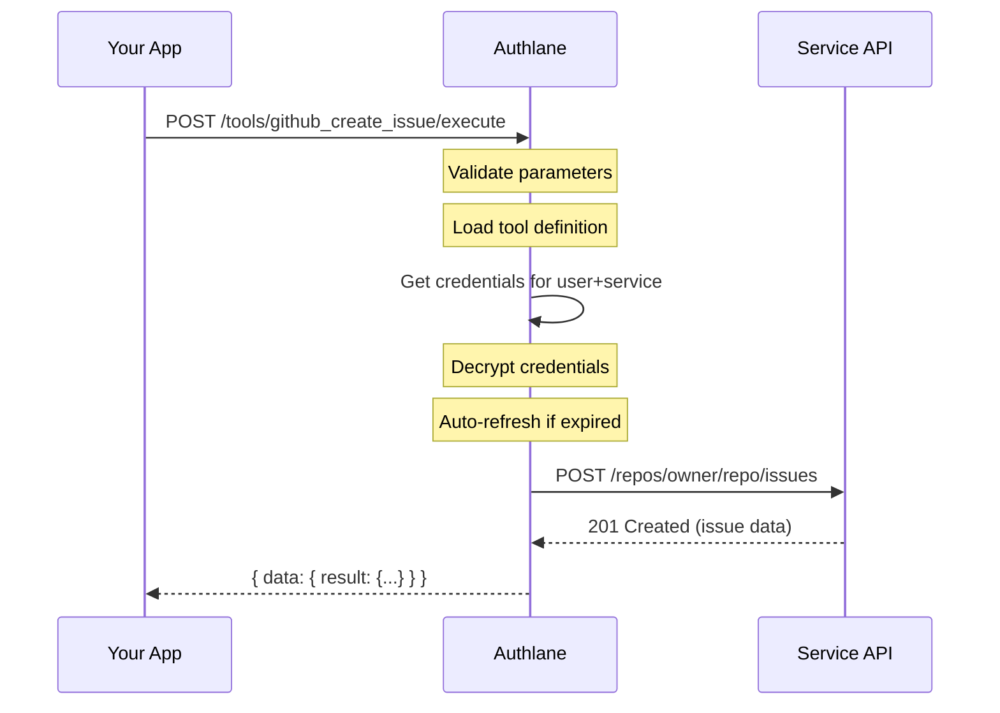

# Execute Tool

Execute a tool on behalf of a user using their connected service credentials.

## Endpoint

```
POST /api/v1/users/:userId/tools/:toolName/execute
```

## Authentication

- **API Key**: Required
- **Session**: Not allowed (API only)

## Parameters

### Path Parameters

| Parameter | Type | Required | Description |
|-----------|------|----------|-------------|
| `userId` | string | Yes | External user ID |
| `toolName` | string | Yes | Tool identifier (e.g., "github_create_issue") |

### Request Body

```json
{
  "parameters": {
    "owner": "acme",
    "repo": "my-project",
    "title": "Bug: Login button not working",
    "body": "Steps to reproduce...",
    "labels": ["bug", "high-priority"]
  }
}
```

## Response

### Success (200)

```json
{
  "data": {
    "result": {
      "id": 12345,
      "number": 42,
      "title": "Bug: Login button not working",
      "html_url": "https://github.com/acme/my-project/issues/42",
      "state": "open",
      "created_at": "2024-12-12T10:30:00Z"
    },
    "executionTime": 342
  },
  "error": null
}
```

### Error - Tool Not Found (404)

```json
{
  "data": null,
  "error": {
    "message": "Tool not found",
    "code": "TOOL_NOT_FOUND",
    "hint": "Check the tool name or ensure the service is connected",
    "statusCode": 404
  }
}
```

### Error - Connection Required (400)

```json
{
  "data": null,
  "error": {
    "message": "Service connection required",
    "code": "CONNECTION_REQUIRED",
    "hint": "User needs to connect github before using this tool",
    "statusCode": 400
  }
}
```

### Error - Invalid Parameters (400)

```json
{
  "data": null,
  "error": {
    "message": "Invalid parameters",
    "code": "INVALID_PARAMETERS",
    "hint": "Missing required parameter: title",
    "statusCode": 400,
    "details": {
      "missing": ["title"],
      "invalid": []
    }
  }
}
```

### Error - Provider Error (502)

```json
{
  "data": null,
  "error": {
    "message": "Provider API error",
    "code": "PROVIDER_ERROR",
    "hint": "GitHub API returned an error",
    "statusCode": 502,
    "details": {
      "providerStatus": 403,
      "providerMessage": "Resource not accessible by integration"
    }
  }
}
```

## Examples

### cURL

```bash
curl -X POST \
  -H "Authorization: Bearer ak_..." \
  -H "Content-Type: application/json" \
  -d '{
    "parameters": {
      "owner": "acme",
      "repo": "my-project",
      "title": "Bug: Login button not working"
    }
  }' \
  "https://api.authlane.com/api/v1/users/user_456/tools/github_create_issue/execute"
```

### TypeScript SDK

```typescript
const { data, error } = await authlane.tools.execute({
  userId: 'user_456',
  tool: 'github_create_issue',
  parameters: {
    owner: 'acme',
    repo: 'my-project',
    title: 'Bug: Login button not working',
    body: 'Steps to reproduce...',
    labels: ['bug'],
  },
});

if (error) {
  if (error.code === 'CONNECTION_REQUIRED') {
    // Prompt user to connect GitHub
    promptConnect('github');
  } else {
    console.error(error.message);
  }
  return;
}

console.log(`Issue created: ${data.result.html_url}`);
```

### With Claude (AI Agent)

```typescript
import Anthropic from '@anthropic-ai/sdk';

const anthropic = new Anthropic();

// Get available tools
const { data: toolsData } = await authlane.tools.list({
  userId: currentUser.id,
});

// Create message with tools
const response = await anthropic.messages.create({
  model: 'claude-sonnet-4-20250514',
  max_tokens: 1024,
  tools: toolsData.tools,
  messages: [
    {
      role: 'user',
      content: 'Create an issue about the login bug in acme/my-project',
    },
  ],
});

// Handle tool calls
for (const block of response.content) {
  if (block.type === 'tool_use') {
    const { data, error } = await authlane.tools.execute({
      userId: currentUser.id,
      tool: block.name,
      parameters: block.input,
    });

    // Continue conversation with tool result
    // ...
  }
}
```

### With OpenAI

```typescript
import OpenAI from 'openai';

const openai = new OpenAI();

// Get tools in OpenAI format
const { data: toolsData } = await authlane.tools.list({
  userId: currentUser.id,
  format: 'openai',
});

// Create completion
const response = await openai.chat.completions.create({
  model: 'gpt-4',
  messages: [
    { role: 'user', content: 'Create an issue about the login bug' },
  ],
  functions: toolsData.functions,
});

// Handle function calls
const functionCall = response.choices[0].message.function_call;
if (functionCall) {
  const { data, error } = await authlane.tools.execute({
    userId: currentUser.id,
    tool: functionCall.name,
    parameters: JSON.parse(functionCall.arguments),
  });

  // Continue with function result...
}
```

## Execution Flow



## Available Tools

Tools are defined per service in the integrations directory. Common tools include:

### GitHub Tools

| Tool | Description |
|------|-------------|
| `github_create_issue` | Create a new issue |
| `github_list_issues` | List repository issues |
| `github_create_pull_request` | Create a pull request |
| `github_list_repos` | List user's repositories |
| `github_get_file` | Get file contents |
| `github_create_file` | Create or update a file |
| `github_search_code` | Search code in repositories |

### Slack Tools

| Tool | Description |
|------|-------------|
| `slack_send_message` | Send a message to a channel |
| `slack_list_channels` | List available channels |
| `slack_list_users` | List workspace users |
| `slack_create_channel` | Create a new channel |

### Linear Tools

| Tool | Description |
|------|-------------|
| `linear_create_issue` | Create an issue |
| `linear_list_issues` | List issues |
| `linear_update_issue` | Update an issue |
| `linear_list_projects` | List projects |

## Error Handling

```typescript
async function executeTool(userId: string, tool: string, params: any) {
  const { data, error } = await authlane.tools.execute({
    userId,
    tool,
    parameters: params,
  });

  if (error) {
    switch (error.code) {
      case 'CONNECTION_REQUIRED':
        throw new NeedsConnectionError(tool.split('_')[0]);

      case 'CONNECTION_EXPIRED':
        throw new NeedsReconnectError(tool.split('_')[0]);

      case 'INVALID_PARAMETERS':
        throw new ValidationError(error.hint, error.details);

      case 'PROVIDER_ERROR':
        // Provider-specific error
        throw new ProviderError(
          error.details.providerMessage,
          error.details.providerStatus
        );

      case 'RATE_LIMITED':
        throw new RateLimitError(error.hint);

      default:
        throw new Error(error.message);
    }
  }

  return data.result;
}
```

## Rate Limiting

Tool execution has specific rate limits:

| Limit Type | Value |
|------------|-------|
| Per user per minute | 60 |
| Per tool per minute | 30 |
| Per organization per minute | 1000 |

Provider rate limits also apply and are passed through in error responses.

## Security

- Parameters are validated against the tool's input schema
- Credentials are never exposed to the client
- All executions are logged with audit trail
- Provider errors are sanitized (no credential leakage)

## Notes

- Tool execution is synchronous (waits for provider response)
- Timeout is 30 seconds per execution
- Results are not cached (always fresh from provider)
- Some tools may require specific OAuth scopes

