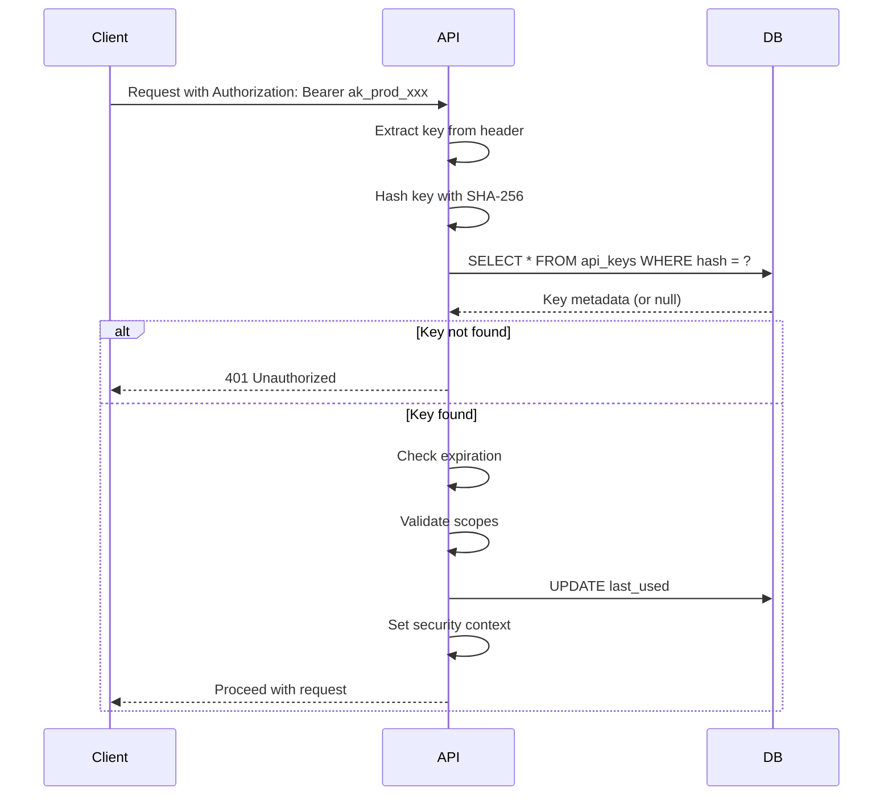

# API Key Security

Security implementation for API key authentication in Authlane.

## Overview

API keys provide programmatic access to the Authlane API. They are designed with security best practices to prevent unauthorized access and enable fine-grained access control.

## Key Generation

### Key Format

```
ak_prod_xxxxxxxxxxxxxxxxxxxxxxxxxxxxxxxxxxxx
│  │    │
│  │    └── 32 bytes of random data (base64url encoded)
│  └─────── Environment identifier
└────────── Prefix identifier
```

### Generation Process

```typescript
function generateApiKey(environment: string): { key: string; hash: string } {
  // Generate 32 bytes of cryptographically secure random data
  const randomBytes = crypto.randomBytes(32);

  // Encode as base64url
  const randomPart = randomBytes
    .toString('base64')
    .replace(/\+/g, '-')
    .replace(/\//g, '_')
    .replace(/=/g, '');

  // Construct full key with prefix
  const prefix = `ak_${environment}_`;
  const key = `${prefix}${randomPart}`;

  // Hash for storage (key is never stored in plaintext)
  const hash = crypto.createHash('sha256').update(key).digest('hex');

  return { key, hash };
}
```

### Key Properties

| Property | Value | Purpose |
|----------|-------|---------|
| Prefix | `ak_` | Identifies as Authlane key |
| Environment | `prod_`, `dev_`, `stg_` | Environment identification |
| Random part | 32 bytes | 256 bits of entropy |
| Total length | ~50 characters | Practical for headers |

## Key Storage

### One-Way Hashing

API keys are **never stored in plaintext**. Only the SHA-256 hash is stored:

```typescript
// Storage structure
interface StoredApiKey {
  id: string;                  // key_abc123
  prefix: string;              // ak_prod_ (for identification)
  hash: string;                // SHA-256 hash of full key
  name: string;                // User-provided name
  scopes: string[];            // Permissions
  organizationId: string;      // Owner organization
  environment: string;         // prod, dev, staging
  lastUsed: Date | null;       // Last usage timestamp
  expiresAt: Date | null;      // Optional expiration
  createdAt: Date;
  createdBy: string;           // User who created
}
```

### Database Schema

```sql
CREATE TABLE api_keys (
  id TEXT PRIMARY KEY,
  prefix TEXT NOT NULL,
  hash TEXT NOT NULL UNIQUE,  -- SHA-256 hash, indexed for lookup
  name TEXT NOT NULL,
  scopes TEXT[] NOT NULL,
  organization_id UUID NOT NULL REFERENCES organizations(id),
  environment TEXT NOT NULL CHECK (environment IN ('production', 'development', 'staging')),
  last_used TIMESTAMPTZ,
  expires_at TIMESTAMPTZ,
  created_at TIMESTAMPTZ NOT NULL DEFAULT NOW(),
  created_by TEXT NOT NULL REFERENCES users(id)
);

-- Index for fast hash lookup
CREATE UNIQUE INDEX api_keys_hash_idx ON api_keys(hash);
```

## Key Validation

### Authentication Flow



### Validation Code

```typescript
async function validateApiKey(key: string): Promise<ApiKeyContext> {
  // Hash the provided key
  const hash = crypto.createHash('sha256').update(key).digest('hex');

  // Lookup by hash
  const apiKey = await db.query(
    'SELECT * FROM api_keys WHERE hash = $1',
    [hash]
  );

  if (!apiKey) {
    throw new AuthError('INVALID_API_KEY', 'API key not found');
  }

  // Check expiration
  if (apiKey.expiresAt && apiKey.expiresAt < new Date()) {
    throw new AuthError('API_KEY_EXPIRED', 'API key has expired');
  }

  // Update last used (async, don't wait)
  db.query(
    'UPDATE api_keys SET last_used = NOW() WHERE id = $1',
    [apiKey.id]
  ).catch(console.error);

  return {
    keyId: apiKey.id,
    organizationId: apiKey.organizationId,
    scopes: apiKey.scopes,
    environment: apiKey.environment,
  };
}
```

## Scope System

### Available Scopes

```typescript
const API_KEY_SCOPES = {
  // Read operations
  'connections:read': 'List and view connections',
  'services:read': 'List and view services',
  'tools:list': 'List available tools',
  'users:read': 'Read user information',

  // Write operations
  'connections:write': 'Create and delete connections',
  'tools:execute': 'Execute tools',
  'users:write': 'Create and manage users',

  // Admin operations (restricted)
  'admin:read': 'Read admin data',
  'admin:write': 'Modify admin settings',
};
```

### Scope Validation

```typescript
function validateScope(requiredScope: string, grantedScopes: string[]): boolean {
  // Check exact match
  if (grantedScopes.includes(requiredScope)) {
    return true;
  }

  // Check wildcard (e.g., 'connections:*' grants all connections operations)
  const [resource] = requiredScope.split(':');
  if (grantedScopes.includes(`${resource}:*`)) {
    return true;
  }

  // Check super-admin scope
  if (grantedScopes.includes('*')) {
    return true;
  }

  return false;
}
```

### Scope Enforcement

```typescript
// Middleware for scope enforcement
function requireScope(scope: string) {
  return async (c: Context, next: Next) => {
    const keyContext = c.get('apiKeyContext');

    if (!keyContext) {
      throw new AuthError('UNAUTHORIZED', 'API key required');
    }

    if (!validateScope(scope, keyContext.scopes)) {
      throw new AuthError(
        'INSUFFICIENT_SCOPE',
        `Scope '${scope}' required for this operation`
      );
    }

    await next();
  };
}

// Usage
app.get('/api/v1/connections', requireScope('connections:read'), handler);
app.post('/api/v1/tools/execute', requireScope('tools:execute'), handler);
```

## Key Lifecycle

### Creation

```typescript
async function createApiKey(
  organizationId: string,
  createdBy: string,
  options: CreateApiKeyOptions
): Promise<{ key: string; keyRecord: StoredApiKey }> {
  const { key, hash } = generateApiKey(options.environment);

  const keyRecord = await db.query(`
    INSERT INTO api_keys (id, prefix, hash, name, scopes, organization_id, environment, expires_at, created_by)
    VALUES ($1, $2, $3, $4, $5, $6, $7, $8, $9)
    RETURNING *
  `, [
    generateId('key'),
    getPrefix(options.environment),
    hash,
    options.name,
    options.scopes,
    organizationId,
    options.environment,
    options.expiresAt,
    createdBy,
  ]);

  // Audit log
  await auditLog({
    event: 'api_key_created',
    actor: createdBy,
    resource: keyRecord.id,
    organizationId,
    metadata: { name: options.name, scopes: options.scopes },
  });

  // Return key ONCE - it cannot be retrieved again
  return { key, keyRecord };
}
```

### Rotation

```typescript
async function rotateApiKey(
  keyId: string,
  actor: string
): Promise<{ oldKeyPrefix: string; newKey: string }> {
  const oldKey = await db.query('SELECT * FROM api_keys WHERE id = $1', [keyId]);

  // Generate new key with same settings
  const { key: newKey, hash: newHash } = generateApiKey(oldKey.environment);

  // Update hash in database
  await db.query(
    'UPDATE api_keys SET hash = $1, last_used = NULL WHERE id = $2',
    [newHash, keyId]
  );

  // Audit log
  await auditLog({
    event: 'api_key_rotated',
    actor,
    resource: keyId,
    organizationId: oldKey.organizationId,
  });

  return {
    oldKeyPrefix: oldKey.prefix,
    newKey,
  };
}
```

### Revocation

```typescript
async function revokeApiKey(
  keyId: string,
  actor: string,
  reason?: string
): Promise<void> {
  const key = await db.query('SELECT * FROM api_keys WHERE id = $1', [keyId]);

  // Soft delete - keep record for audit
  await db.query(
    'UPDATE api_keys SET revoked_at = NOW(), revoked_by = $1, revoke_reason = $2 WHERE id = $3',
    [actor, reason, keyId]
  );

  // Audit log
  await auditLog({
    event: 'api_key_revoked',
    actor,
    resource: keyId,
    organizationId: key.organizationId,
    metadata: { reason },
  });
}
```

## Security Controls

### Rate Limiting

```typescript
// Per-key rate limits
const KEY_RATE_LIMITS = {
  production: { requests: 1000, window: 60 },  // 1000/min
  development: { requests: 100, window: 60 },  // 100/min
  staging: { requests: 500, window: 60 },      // 500/min
};

// Implement with Redis
async function checkRateLimit(keyId: string, environment: string): Promise<void> {
  const limit = KEY_RATE_LIMITS[environment];
  const key = `ratelimit:apikey:${keyId}`;

  const current = await redis.incr(key);
  if (current === 1) {
    await redis.expire(key, limit.window);
  }

  if (current > limit.requests) {
    throw new RateLimitError(`Rate limit exceeded: ${limit.requests}/${limit.window}s`);
  }
}
```

### IP Restrictions (Enterprise)

```typescript
interface ApiKeyRestrictions {
  allowedIps?: string[];      // Whitelist
  blockedIps?: string[];      // Blacklist
  allowedCountries?: string[];
}

function validateIpRestriction(ip: string, restrictions: ApiKeyRestrictions): boolean {
  if (restrictions.blockedIps?.includes(ip)) {
    return false;
  }
  if (restrictions.allowedIps && !restrictions.allowedIps.includes(ip)) {
    return false;
  }
  return true;
}
```

### Usage Monitoring

```typescript
// Track key usage patterns for anomaly detection
interface KeyUsageMetrics {
  keyId: string;
  hour: string;  // ISO hour
  requests: number;
  endpoints: Record<string, number>;
  ips: string[];
  errors: number;
}

async function recordUsage(keyId: string, endpoint: string, ip: string): Promise<void> {
  const hour = new Date().toISOString().slice(0, 13);
  await redis.multi()
    .hincrby(`usage:${keyId}:${hour}`, 'requests', 1)
    .hincrby(`usage:${keyId}:${hour}`, `endpoint:${endpoint}`, 1)
    .sadd(`usage:${keyId}:${hour}:ips`, ip)
    .expire(`usage:${keyId}:${hour}`, 86400 * 7)  // 7 days
    .exec();
}
```

## Attack Prevention

### Timing Attack Prevention

```typescript
// Use constant-time comparison for hashes
import { timingSafeEqual } from 'crypto';

function compareHashes(a: string, b: string): boolean {
  const bufA = Buffer.from(a, 'hex');
  const bufB = Buffer.from(b, 'hex');

  if (bufA.length !== bufB.length) {
    return false;
  }

  return timingSafeEqual(bufA, bufB);
}
```

### Key Enumeration Prevention

```typescript
// Always return same error for invalid/missing keys
async function validateKey(key: string): Promise<ApiKeyContext> {
  try {
    // ... validation logic
  } catch (error) {
    // Always return generic error
    throw new AuthError('INVALID_API_KEY', 'Invalid API key');
    // Don't: throw new AuthError('KEY_EXPIRED') or throw new AuthError('KEY_NOT_FOUND')
  }
}
```

### Brute Force Prevention

```typescript
// Track failed attempts by IP
async function trackFailedAttempt(ip: string): Promise<void> {
  const key = `auth:failed:${ip}`;
  const attempts = await redis.incr(key);
  await redis.expire(key, 3600); // 1 hour window

  if (attempts > 10) {
    throw new AuthError('TOO_MANY_ATTEMPTS', 'Too many failed attempts');
  }
}
```

## Best Practices

### For Users

1. **Keep keys secret** - Never commit to source control
2. **Use environment variables** - Store keys in secure configuration
3. **Rotate regularly** - Monthly for production keys
4. **Use minimal scopes** - Only request needed permissions
5. **Monitor usage** - Review access logs regularly

### For Operators

1. **Enable key expiration** - Force rotation with expiration
2. **Implement IP restrictions** - Limit access to known IPs
3. **Monitor for anomalies** - Alert on unusual patterns
4. **Audit key access** - Regular review of key usage
5. **Immediate revocation** - Quick response to compromises

### Key Storage in Client Apps

```typescript
// GOOD: Environment variable
const apiKey = process.env.AUTHLANE_API_KEY;

// GOOD: Secrets manager
const apiKey = await secretsManager.getSecret('authlane-api-key');

// BAD: Hardcoded
const apiKey = 'ak_prod_xxx';  // NEVER DO THIS

// BAD: In source control
// .env file committed to git
```

## Audit Trail

### Events Logged

| Event | Data Logged |
|-------|-------------|
| `api_key_created` | Creator, name, scopes, expiration |
| `api_key_used` | Endpoint, IP, response code |
| `api_key_rotated` | Actor, timestamp |
| `api_key_revoked` | Actor, reason |
| `api_key_expired` | Key ID, organization |

### Log Retention

- Active key usage: 90 days
- Key lifecycle events: 7 years (compliance)

