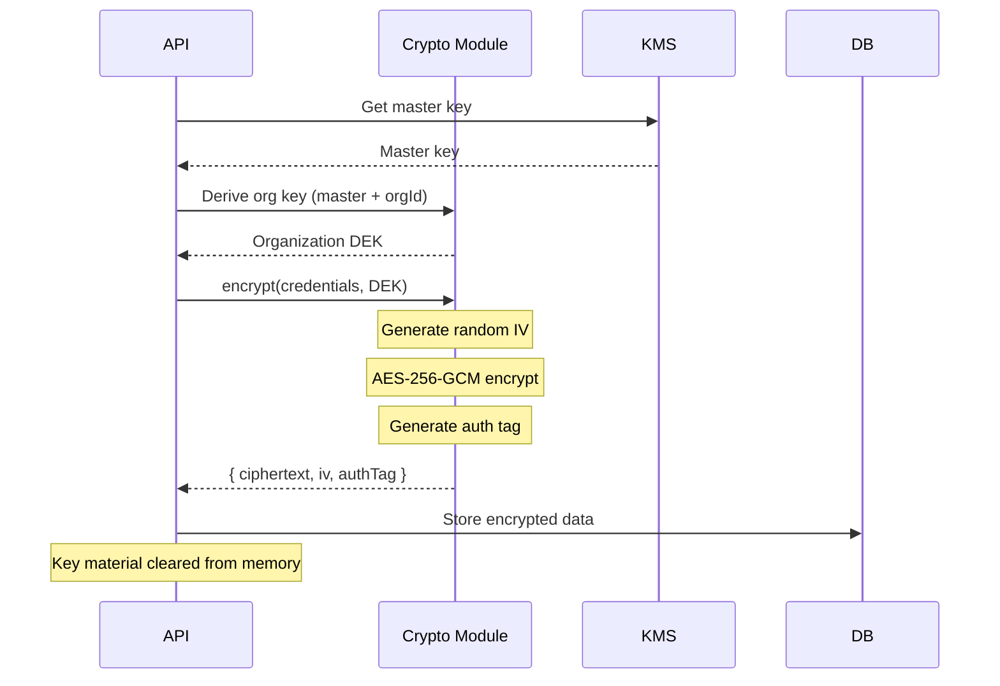
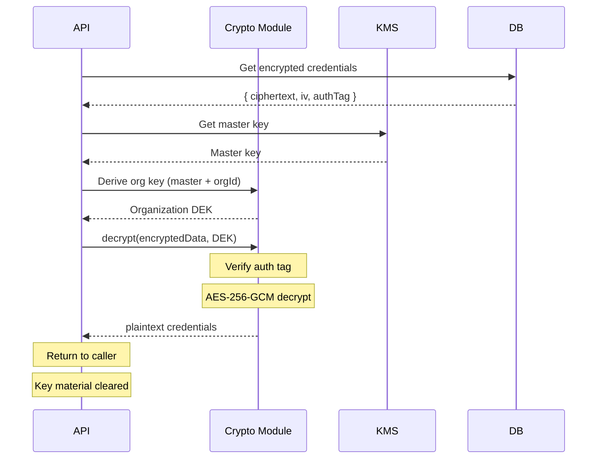
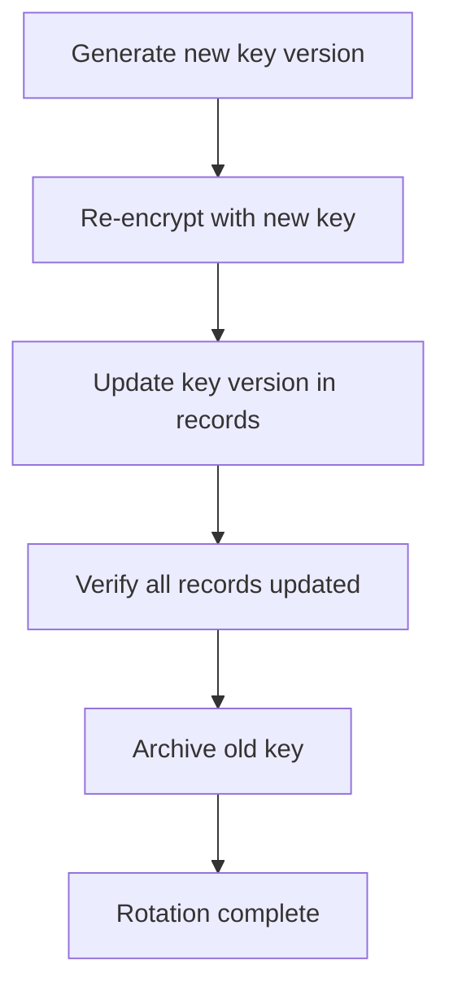

# Encryption

Detailed documentation of Authlane's encryption implementation.

## Overview

Authlane uses **AES-256-GCM** (Galois/Counter Mode) for encrypting sensitive data, providing both confidentiality and authenticity.

## Algorithm Details

### AES-256-GCM Properties

| Property | Value |
|----------|-------|
| Algorithm | AES (Advanced Encryption Standard) |
| Key size | 256 bits |
| Block size | 128 bits |
| Mode | GCM (Galois/Counter Mode) |
| IV/Nonce size | 96 bits (12 bytes) |
| Auth tag size | 128 bits (16 bytes) |

### Why AES-256-GCM?

1. **Authenticated encryption**: Provides integrity verification
2. **Industry standard**: NIST-approved, widely audited
3. **Performance**: Hardware acceleration (AES-NI) support
4. **No padding oracle**: GCM mode immune to padding attacks

## Implementation

### Core Encryption Module

```typescript
// packages/crypto/src/index.ts
import crypto from 'crypto';

const ALGORITHM = 'aes-256-gcm';
const IV_LENGTH = 12;
const AUTH_TAG_LENGTH = 16;

export interface EncryptedData {
  ciphertext: string;   // Base64 encoded
  iv: string;           // Base64 encoded
  authTag: string;      // Base64 encoded
  version: number;      // Encryption version for upgrades
}

export function encrypt(plaintext: string, key: Buffer): EncryptedData {
  // Generate unique IV for each encryption
  const iv = crypto.randomBytes(IV_LENGTH);

  // Create cipher
  const cipher = crypto.createCipheriv(ALGORITHM, key, iv, {
    authTagLength: AUTH_TAG_LENGTH,
  });

  // Encrypt
  const encrypted = Buffer.concat([
    cipher.update(plaintext, 'utf8'),
    cipher.final(),
  ]);

  // Get authentication tag
  const authTag = cipher.getAuthTag();

  return {
    ciphertext: encrypted.toString('base64'),
    iv: iv.toString('base64'),
    authTag: authTag.toString('base64'),
    version: 1,
  };
}

export function decrypt(data: EncryptedData, key: Buffer): string {
  const decipher = crypto.createDecipheriv(
    ALGORITHM,
    key,
    Buffer.from(data.iv, 'base64'),
    { authTagLength: AUTH_TAG_LENGTH }
  );

  // Set auth tag for verification
  decipher.setAuthTag(Buffer.from(data.authTag, 'base64'));

  // Decrypt and verify
  const decrypted = Buffer.concat([
    decipher.update(Buffer.from(data.ciphertext, 'base64')),
    decipher.final(),  // Throws if auth tag doesn't match
  ]);

  return decrypted.toString('utf8');
}
```

### Key Derivation

```typescript
// Derive encryption key from master key + context
export function deriveKey(
  masterKey: Buffer,
  context: string,  // e.g., organization ID
  salt: Buffer
): Buffer {
  return crypto.hkdfSync(
    'sha256',
    masterKey,
    salt,
    context,
    32  // 256 bits
  );
}
```

## Key Management

### Key Hierarchy

```
┌────────────────────────────────────────────┐
│              Master Key (KEK)              │
│   Stored in: Environment / KMS / HSM       │
│   Rotation: Annual or on compromise        │
└───────────────────┬────────────────────────┘
                    │ HKDF derivation
                    ▼
┌────────────────────────────────────────────┐
│       Organization Data Key (DEK)          │
│   Derived per organization                 │
│   Allows per-org key rotation              │
└───────────────────┬────────────────────────┘
                    │
                    ▼
┌────────────────────────────────────────────┐
│         Encrypted Credentials              │
│   Unique IV per record                     │
│   Auth tag for integrity                   │
└────────────────────────────────────────────┘
```

### Master Key Storage

| Environment | Storage Method | Notes |
|-------------|----------------|-------|
| Development | Environment variable | `ENCRYPTION_KEY` in .env |
| Staging | AWS Secrets Manager | Automatic rotation |
| Production | AWS KMS / HashiCorp Vault | Hardware-backed |

### Key Format

```bash
# Generate a master key
openssl rand -base64 32

# Example key (DO NOT USE)
# ENCRYPTION_KEY=K7gNU3sdo+OL0wNhqoVWhr3g6s1xYv72ol/pe/Unols=
```

## Data Storage Format

### Database Column

```sql
-- Credentials stored as JSONB
CREATE TABLE connections (
  id TEXT PRIMARY KEY,
  -- ... other columns
  encrypted_credentials JSONB
);

-- Example encrypted credentials
{
  "ciphertext": "2xmQWzSVRh5pXG...",
  "iv": "dGhpcyBpcyBhIHRl...",
  "authTag": "YXV0aGVudGljYXRp...",
  "version": 1
}
```

### Credential Structure (Before Encryption)

```typescript
interface OAuthCredentials {
  access_token: string;
  refresh_token?: string;
  token_type: string;
  scope: string;
  expires_at: string;  // ISO 8601
}
```

## Encryption Flow

### Storing Credentials



### Retrieving Credentials



## Security Considerations

### IV/Nonce Management

**Critical**: Never reuse an IV with the same key.

```typescript
// CORRECT: Generate fresh IV for every encryption
const iv = crypto.randomBytes(12);

// WRONG: Static or predictable IV
const iv = Buffer.from('000000000000', 'hex'); // NEVER DO THIS
```

### Authentication Tag Verification

The auth tag ensures data hasn't been tampered with:

```typescript
try {
  const decrypted = decrypt(encryptedData, key);
  // Success - data is authentic and confidential
} catch (error) {
  // Auth tag mismatch - data was tampered with
  throw new Error('Credential integrity check failed');
}
```

### Memory Handling

```typescript
// Clear sensitive data from memory after use
function clearBuffer(buffer: Buffer): void {
  buffer.fill(0);
}

async function getCredentials(connectionId: string): Promise<Credentials> {
  const key = await getKey();
  try {
    const decrypted = decrypt(encryptedData, key);
    return JSON.parse(decrypted);
  } finally {
    clearBuffer(key);  // Clear key from memory
  }
}
```

## Key Rotation

### Rotation Process



### Implementation

```typescript
async function rotateKeys(organizationId: string): Promise<void> {
  const oldKey = await getKey(organizationId, 'current');
  const newKey = await generateKey();

  // Get all encrypted records
  const records = await db.query(
    'SELECT id, encrypted_credentials FROM connections WHERE organization_id = $1',
    [organizationId]
  );

  // Re-encrypt each record
  for (const record of records) {
    const decrypted = decrypt(record.encrypted_credentials, oldKey);
    const reencrypted = encrypt(decrypted, newKey);
    reencrypted.version = 2;  // Increment version

    await db.query(
      'UPDATE connections SET encrypted_credentials = $1 WHERE id = $2',
      [reencrypted, record.id]
    );
  }

  // Store new key, archive old key
  await keyStore.rotate(organizationId, newKey);
}
```

## Error Handling

### Encryption Errors

| Error | Cause | Action |
|-------|-------|--------|
| `ENCRYPTION_KEY_MISSING` | Master key not configured | Check environment |
| `INVALID_KEY_LENGTH` | Key is not 256 bits | Regenerate key |
| `ENCRYPTION_FAILED` | Crypto operation failed | Log and retry |

### Decryption Errors

| Error | Cause | Action |
|-------|-------|--------|
| `AUTH_TAG_MISMATCH` | Data tampered with | Alert security team |
| `INVALID_CIPHERTEXT` | Corrupted data | Restore from backup |
| `KEY_VERSION_MISMATCH` | Wrong key version | Use correct key version |

## Testing

### Unit Tests

```typescript
describe('Encryption', () => {
  const testKey = crypto.randomBytes(32);

  it('should encrypt and decrypt correctly', () => {
    const plaintext = 'sensitive data';
    const encrypted = encrypt(plaintext, testKey);
    const decrypted = decrypt(encrypted, testKey);
    expect(decrypted).toBe(plaintext);
  });

  it('should fail with wrong key', () => {
    const encrypted = encrypt('data', testKey);
    const wrongKey = crypto.randomBytes(32);
    expect(() => decrypt(encrypted, wrongKey)).toThrow();
  });

  it('should fail with tampered ciphertext', () => {
    const encrypted = encrypt('data', testKey);
    encrypted.ciphertext = 'tampered' + encrypted.ciphertext;
    expect(() => decrypt(encrypted, testKey)).toThrow();
  });

  it('should generate unique IVs', () => {
    const encrypted1 = encrypt('same data', testKey);
    const encrypted2 = encrypt('same data', testKey);
    expect(encrypted1.iv).not.toBe(encrypted2.iv);
  });
});
```

## Compliance

### FIPS 140-2

AES-256-GCM is FIPS 140-2 approved when using:
- NIST-approved implementation (Node.js OpenSSL)
- Proper key management
- Random IV generation from CSPRNG

### PCI DSS

Meets PCI DSS requirements for:
- Strong cryptography (AES-256)
- Key management procedures
- Secure key storage

