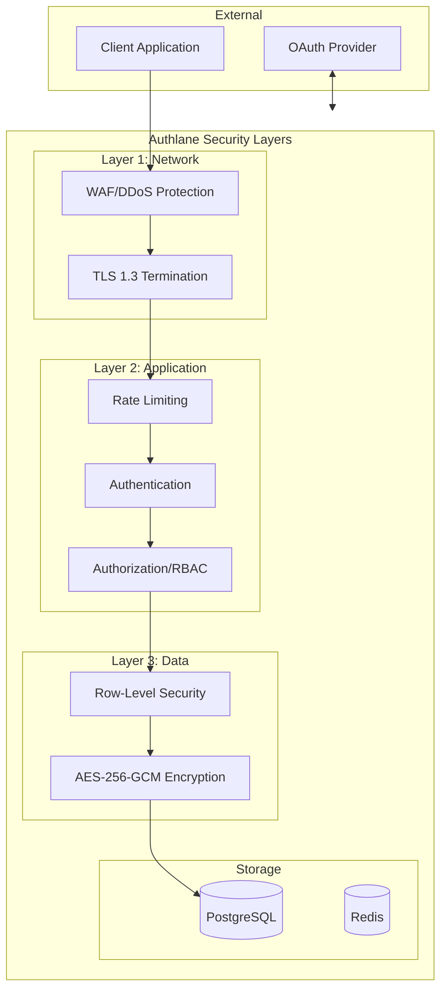

# Security Documentation

Comprehensive security documentation for the Authlane platform.

## Contents

- [Security Model](./security-model.md) - Comprehensive security overview
- [Encryption](./encryption.md) - AES-256-GCM implementation
- [OAuth Security](./oauth-security.md) - OAuth 2.0 + PKCE security
- [API Key Security](./api-key-security.md) - API key management
- [Multi-Tenancy Isolation](./multi-tenancy-isolation.md) - Tenant data isolation
- [Threat Model](./threat-model.md) - Threat analysis and mitigations

## Security Principles

Authlane is built with a **defense-in-depth** approach, implementing multiple security layers:

### 1. Data Protection

- **Encryption at rest**: AES-256-GCM for all credentials
- **Encryption in transit**: TLS 1.3 for all communications
- **Key management**: Hardware-backed key storage in production
- **Minimal data retention**: Only store what's necessary

### 2. Access Control

- **Multi-tenancy isolation**: RLS (Row-Level Security) at database level
- **API key scoping**: Granular permissions per key
- **Session management**: Secure, short-lived sessions
- **Role-based access**: Owner, Admin, Member roles

### 3. OAuth Security

- **Mandatory PKCE**: Prevents authorization code interception
- **State validation**: CSRF protection
- **Token rotation**: Automatic refresh token rotation
- **Scope limitation**: Minimal required permissions

### 4. Audit & Monitoring

- **Comprehensive logging**: All security events logged
- **Anomaly detection**: Suspicious activity alerts
- **Audit trail**: Complete history of sensitive operations

## Security Architecture Overview

## Quick Reference

### Encryption Standards

| Data Type | Algorithm | Key Size |
|-----------|-----------|----------|
| OAuth Credentials | AES-256-GCM | 256-bit |
| API Keys (storage) | SHA-256 | N/A (one-way hash) |
| Passwords | Argon2id | N/A (one-way hash) |
| Session Tokens | Random | 256-bit |

### Authentication Methods

| Method | Use Case | Security Level |
|--------|----------|----------------|
| API Key | Programmatic access | High |
| Session Cookie | Dashboard access | High |
| OAuth Token | User connections | High |

### Rate Limits (Security)

| Endpoint Type | Limit | Purpose |
|---------------|-------|---------|
| Login attempts | 5/min | Brute force protection |
| Password reset | 3/hour | Abuse prevention |
| OAuth initiation | 10/min | Flow abuse prevention |
| Credential access | 60/min | Token theft mitigation |

## Compliance Considerations

Authlane is designed to support:

- **GDPR**: Data minimization, right to deletion
- **SOC 2**: Comprehensive audit logging
- **OWASP**: Top 10 vulnerability prevention

## Security Contacts

For security issues:

- **Security email**: security@authlane.com
- **Bug bounty**: See [Security Policy](https://github.com/authlane/authlane/security)
- **Responsible disclosure**: 90-day disclosure policy

## Related Documentation

- [Architecture: Security](../01-architecture/security-architecture.md)
- [Database: Row-Level Security](../02-database/row-level-security.md)
- [API: Authentication](../03-api-reference/authentication.md)

