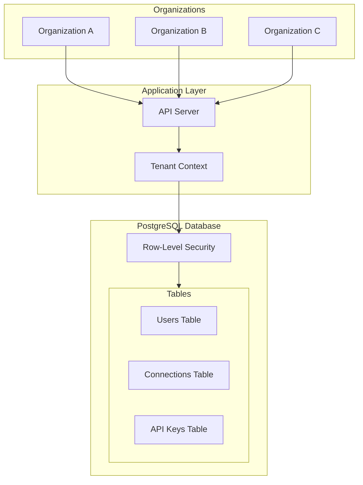

# Multi-Tenancy Isolation

Detailed documentation of tenant data isolation in Authlane.

## Overview

Authlane uses a **shared database, shared schema** multi-tenancy model with **Row-Level Security (RLS)** to ensure complete data isolation between organizations.

## Architecture

### Multi-Tenancy Model



### Isolation Layers

1. **Application Layer**: Tenant context set on every request
2. **Database Layer**: RLS policies enforce isolation
3. **Query Layer**: All queries automatically filtered
4. **Index Layer**: No cross-tenant index scans

## Row-Level Security (RLS)

### Enabling RLS

```sql
-- Enable RLS on all tenant-scoped tables
ALTER TABLE users ENABLE ROW LEVEL SECURITY;
ALTER TABLE connections ENABLE ROW LEVEL SECURITY;
ALTER TABLE api_keys ENABLE ROW LEVEL SECURITY;
ALTER TABLE organization_services ENABLE ROW LEVEL SECURITY;
ALTER TABLE members ENABLE ROW LEVEL SECURITY;
ALTER TABLE invitations ENABLE ROW LEVEL SECURITY;
```

### Policy Definition

```sql
-- Users table policy
CREATE POLICY org_isolation_users ON users
  USING (organization_id = current_setting('app.current_organization')::uuid);

-- Connections table policy
CREATE POLICY org_isolation_connections ON connections
  USING (organization_id = current_setting('app.current_organization')::uuid);

-- API keys table policy
CREATE POLICY org_isolation_api_keys ON api_keys
  USING (organization_id = current_setting('app.current_organization')::uuid);

-- Members table policy
CREATE POLICY org_isolation_members ON members
  USING (organization_id = current_setting('app.current_organization')::uuid);
```

### Bypass for Admin Operations

```sql
-- Service account can bypass RLS for admin operations
ALTER TABLE users FORCE ROW LEVEL SECURITY;

-- Create policy for service role
CREATE POLICY service_bypass ON users
  TO service_role
  USING (true);
```

## Tenant Context Management

### Setting Context

```typescript
// Middleware to set tenant context
async function setTenantContext(c: Context, next: Next) {
  const organizationId = c.get('organizationId');

  if (!organizationId) {
    throw new AuthError('TENANT_REQUIRED', 'Organization context required');
  }

  // Set PostgreSQL session variable
  await c.get('db').execute(
    sql`SELECT set_config('app.current_organization', ${organizationId}, true)`
  );

  await next();
}
```

### Context from Authentication

```typescript
// API Key authentication
async function apiKeyAuth(c: Context, next: Next) {
  const key = extractApiKey(c);
  const keyData = await validateApiKey(key);

  // Set organization context from API key
  c.set('organizationId', keyData.organizationId);
  c.set('apiKeyId', keyData.id);

  await next();
}

// Session authentication
async function sessionAuth(c: Context, next: Next) {
  const session = await getSession(c);

  // Get user's organization membership
  const membership = await getMembership(session.userId);

  c.set('organizationId', membership.organizationId);
  c.set('userId', session.userId);
  c.set('role', membership.role);

  await next();
}
```

### Context Verification

```typescript
// Verify context is set before database operations
function requireTenantContext(c: Context): string {
  const orgId = c.get('organizationId');

  if (!orgId) {
    throw new Error('Tenant context not set - this is a bug');
  }

  return orgId;
}
```

## Query Isolation

### Automatic Filtering

With RLS enabled, all queries are automatically filtered:

```typescript
// This query will ONLY return connections for the current organization
const connections = await db.query('SELECT * FROM connections WHERE user_id = $1', [userId]);

// Equivalent to (but enforced at database level):
// SELECT * FROM connections WHERE user_id = $1 AND organization_id = current_org
```

### Cross-Tenant Query Prevention

```typescript
// This will return empty results even if the connection exists in another org
const conn = await db.query(
  'SELECT * FROM connections WHERE id = $1',
  ['conn_from_other_org']
);
// conn = null (RLS filtered out)

// Attempting to update another org's data silently fails
await db.query(
  'UPDATE connections SET status = $1 WHERE id = $2',
  ['expired', 'conn_from_other_org']
);
// 0 rows affected (RLS prevents access)
```

## Data Isolation Patterns

### User Data

```sql
-- Users belong to one organization
CREATE TABLE users (
  id TEXT PRIMARY KEY,
  organization_id UUID NOT NULL REFERENCES organizations(id),
  external_user_id TEXT NOT NULL,
  -- ...
  UNIQUE (organization_id, external_user_id)  -- External ID unique within org
);
```

### Connections

```sql
-- Connections belong to org via user
CREATE TABLE connections (
  id TEXT PRIMARY KEY,
  user_id TEXT NOT NULL REFERENCES users(id),
  organization_id UUID NOT NULL REFERENCES organizations(id),
  service_id TEXT NOT NULL,
  -- ...
  -- RLS uses organization_id directly
);
```

### Shared Resources

```sql
-- Services are global (not tenant-specific)
CREATE TABLE services (
  id TEXT PRIMARY KEY,
  name TEXT NOT NULL,
  -- ...
);
-- NO RLS on services table

-- But organization service configuration IS tenant-specific
CREATE TABLE organization_services (
  id TEXT PRIMARY KEY,
  organization_id UUID NOT NULL REFERENCES organizations(id),
  service_id TEXT NOT NULL REFERENCES services(id),
  enabled BOOLEAN NOT NULL DEFAULT true,
  -- Encrypted client credentials
  encrypted_client_id TEXT,
  encrypted_client_secret TEXT,
  -- ...
);
-- RLS on organization_services table
```

## Cache Isolation

### Redis Key Namespacing

```typescript
// All cache keys include organization ID
function cacheKey(orgId: string, type: string, id: string): string {
  return `org:${orgId}:${type}:${id}`;
}

// Examples:
// org:org_abc:connection:conn_123
// org:org_abc:user:usr_456
// org:org_abc:rate:key_789

// Cache operations
async function getCachedConnection(orgId: string, connId: string) {
  const key = cacheKey(orgId, 'connection', connId);
  return redis.get(key);
}

async function setCachedConnection(orgId: string, connId: string, data: any) {
  const key = cacheKey(orgId, 'connection', connId);
  await redis.set(key, JSON.stringify(data), 'EX', 300);
}
```

### Cache Invalidation

```typescript
// Clear all cache for an organization
async function clearOrgCache(orgId: string) {
  const pattern = `org:${orgId}:*`;
  const keys = await redis.keys(pattern);
  if (keys.length > 0) {
    await redis.del(...keys);
  }
}
```

## Audit Log Isolation

### Per-Organization Logs

```sql
CREATE TABLE audit_logs (
  id TEXT PRIMARY KEY,
  organization_id UUID NOT NULL,  -- Always set
  event TEXT NOT NULL,
  actor_id TEXT,
  resource_type TEXT,
  resource_id TEXT,
  metadata JSONB,
  ip_address INET,
  user_agent TEXT,
  timestamp TIMESTAMPTZ NOT NULL DEFAULT NOW()
);

-- RLS on audit logs
ALTER TABLE audit_logs ENABLE ROW LEVEL SECURITY;

CREATE POLICY org_isolation_audit ON audit_logs
  USING (organization_id = current_setting('app.current_organization')::uuid);
```

### Log Querying

```typescript
// Only returns logs for current organization
async function getAuditLogs(filters: AuditLogFilters) {
  return db.query(`
    SELECT * FROM audit_logs
    WHERE event = COALESCE($1, event)
    AND timestamp >= COALESCE($2, '1970-01-01')
    ORDER BY timestamp DESC
    LIMIT $3 OFFSET $4
  `, [filters.event, filters.since, filters.limit, filters.offset]);
}
```

## Background Job Isolation

### Job Queuing

```typescript
// Jobs include organization context
interface TenantJob {
  id: string;
  type: string;
  organizationId: string;  // Always required
  payload: any;
}

async function queueJob(orgId: string, type: string, payload: any) {
  await queue.add({
    id: generateId(),
    type,
    organizationId: orgId,
    payload,
  });
}
```

### Job Processing

```typescript
// Set tenant context when processing jobs
async function processJob(job: TenantJob) {
  // Set database context for this job
  await db.execute(
    sql`SELECT set_config('app.current_organization', ${job.organizationId}, true)`
  );

  // Process job - all queries now filtered by organization
  await handlers[job.type](job.payload);
}
```

## Testing Isolation

### Isolation Tests

```typescript
describe('Multi-tenancy Isolation', () => {
  let orgA: Organization;
  let orgB: Organization;

  beforeAll(async () => {
    orgA = await createOrganization('Org A');
    orgB = await createOrganization('Org B');
  });

  it('should not access other org data via direct query', async () => {
    // Create connection in Org A
    const conn = await createConnection(orgA.id, {
      userId: 'user_1',
      serviceId: 'github',
    });

    // Set context to Org B
    await setTenantContext(orgB.id);

    // Try to access Org A's connection
    const result = await db.query(
      'SELECT * FROM connections WHERE id = $1',
      [conn.id]
    );

    // Should return nothing due to RLS
    expect(result.rows.length).toBe(0);
  });

  it('should not update other org data', async () => {
    const conn = await createConnection(orgA.id, {
      userId: 'user_1',
      serviceId: 'github',
      status: 'connected',
    });

    await setTenantContext(orgB.id);

    // Try to update Org A's connection
    const result = await db.query(
      'UPDATE connections SET status = $1 WHERE id = $2',
      ['expired', conn.id]
    );

    // Should affect 0 rows
    expect(result.rowCount).toBe(0);

    // Verify original status unchanged
    await setTenantContext(orgA.id);
    const original = await db.query(
      'SELECT status FROM connections WHERE id = $1',
      [conn.id]
    );
    expect(original.rows[0].status).toBe('connected');
  });

  it('should not delete other org data', async () => {
    const conn = await createConnection(orgA.id, {
      userId: 'user_1',
      serviceId: 'github',
    });

    await setTenantContext(orgB.id);

    // Try to delete Org A's connection
    await db.query('DELETE FROM connections WHERE id = $1', [conn.id]);

    // Verify still exists in Org A
    await setTenantContext(orgA.id);
    const result = await db.query(
      'SELECT * FROM connections WHERE id = $1',
      [conn.id]
    );
    expect(result.rows.length).toBe(1);
  });
});
```

## Security Guarantees

### What RLS Prevents

| Attack | Without RLS | With RLS |
|--------|-------------|----------|
| Direct SQL injection accessing other tenant | Possible | Blocked |
| Application bug exposing wrong tenant | Possible | Blocked |
| Index side-channel attacks | Possible | Blocked |
| Query manipulation | Possible | Blocked |

### Defense in Depth

RLS is one layer of defense. Additional protections include:

1. **Application-level checks**: Validate tenant before queries
2. **API authorization**: Verify access rights
3. **Input validation**: Prevent injection attacks
4. **Audit logging**: Detect suspicious access patterns

## Performance Considerations

### Index Strategy

```sql
-- Include organization_id in indexes for efficient filtering
CREATE INDEX connections_org_user_idx ON connections(organization_id, user_id);
CREATE INDEX connections_org_service_idx ON connections(organization_id, service_id);
CREATE INDEX api_keys_org_idx ON api_keys(organization_id);
```

### Query Planning

PostgreSQL's query planner recognizes RLS filters:

```sql
-- With RLS, this query
SELECT * FROM connections WHERE user_id = 'user_123';

-- Is planned as
SELECT * FROM connections
WHERE user_id = 'user_123'
AND organization_id = current_setting('app.current_organization')::uuid;

-- Index on (organization_id, user_id) is used efficiently
```

## Compliance

### Data Residency

For organizations requiring data residency:

```typescript
// Shard by region (Enterprise feature)
const regionShards = {
  'us-east': 'postgresql://us-east.db...',
  'eu-west': 'postgresql://eu-west.db...',
  'ap-south': 'postgresql://ap-south.db...',
};

async function getDbForOrg(orgId: string): Promise<Database> {
  const org = await getOrganization(orgId);
  return new Database(regionShards[org.dataRegion]);
}
```

### Data Export

```typescript
// Export all data for an organization (GDPR compliance)
async function exportOrgData(orgId: string): Promise<OrgExport> {
  await setTenantContext(orgId);

  // RLS ensures we only get this org's data
  return {
    users: await db.query('SELECT * FROM users'),
    connections: await db.query('SELECT * FROM connections'),
    // ... etc
  };
}
```

### Data Deletion

```typescript
// Delete all data for an organization (right to be forgotten)
async function deleteOrgData(orgId: string): Promise<void> {
  await setTenantContext(orgId);

  // Delete in order respecting foreign keys
  await db.query('DELETE FROM audit_logs');
  await db.query('DELETE FROM connections');
  await db.query('DELETE FROM api_keys');
  await db.query('DELETE FROM users');
  await db.query('DELETE FROM organization_services');
  await db.query('DELETE FROM members');
  await db.query('DELETE FROM invitations');

  // Finally delete the organization
  await db.query('DELETE FROM organizations WHERE id = $1', [orgId]);

  // Clear all caches
  await clearOrgCache(orgId);
}
```

