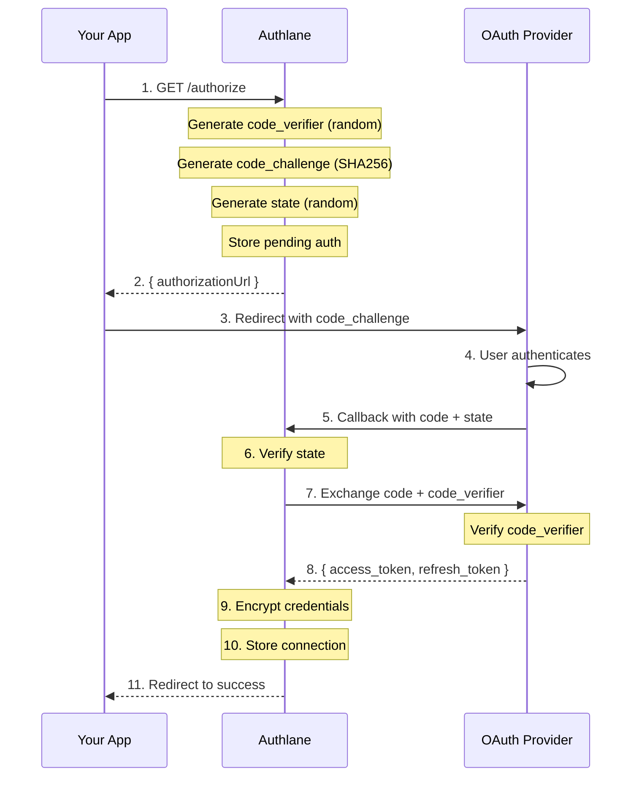

# OAuth Security

Security implementation details for OAuth 2.0 flows in Authlane.

## Overview

Authlane implements OAuth 2.0 with **mandatory PKCE** (Proof Key for Code Exchange) for all authorization flows, providing protection against authorization code interception attacks.

## OAuth 2.0 + PKCE Flow



## PKCE Implementation

### Code Verifier Generation

```typescript
// Generate cryptographically random code verifier
function generateCodeVerifier(): string {
  // 32 bytes = 256 bits of entropy
  const buffer = crypto.randomBytes(32);
  // Base64url encode (RFC 7636)
  return buffer
    .toString('base64')
    .replace(/\+/g, '-')
    .replace(/\//g, '_')
    .replace(/=/g, '');
}

// Result: 43-character random string
// Example: "dBjftJeZ4CVP-mB92K27uhbUJU1p1r_wW1gFWFOEjXk"
```

### Code Challenge Generation

```typescript
// S256 method (SHA-256 hash of verifier)
function generateCodeChallenge(verifier: string): string {
  const hash = crypto.createHash('sha256').update(verifier).digest();
  return hash
    .toString('base64')
    .replace(/\+/g, '-')
    .replace(/\//g, '_')
    .replace(/=/g, '');
}

// Always use S256, never plain
const CODE_CHALLENGE_METHOD = 'S256';
```

### Why PKCE is Mandatory

| Attack | Without PKCE | With PKCE |
|--------|--------------|-----------|
| Authorization code interception | Vulnerable | Protected |
| Malicious app redirect | Vulnerable | Protected |
| Token theft via logs | Vulnerable | Protected |

## State Parameter

### State Generation

```typescript
interface PendingAuth {
  state: string;           // CSRF token
  codeVerifier: string;    // PKCE verifier
  userId: string;          // User ID
  serviceId: string;       // Service being connected
  redirectUri: string;     // Where to redirect after
  expiresAt: Date;         // State expiration
  organizationId: string;  // Tenant context
}

function generateState(): string {
  // 32 bytes of random data
  return crypto.randomBytes(32).toString('base64url');
}
```

### State Validation

```typescript
async function validateState(state: string): Promise<PendingAuth> {
  const pending = await db.query(
    'SELECT * FROM pending_oauth WHERE state = $1',
    [state]
  );

  if (!pending) {
    throw new SecurityError('INVALID_STATE', 'State parameter not found');
  }

  if (pending.expiresAt < new Date()) {
    await db.query('DELETE FROM pending_oauth WHERE state = $1', [state]);
    throw new SecurityError('STATE_EXPIRED', 'Authorization request expired');
  }

  // Delete after use (single-use)
  await db.query('DELETE FROM pending_oauth WHERE state = $1', [state]);

  return pending;
}
```

### State Properties

| Property | Value | Purpose |
|----------|-------|---------|
| Length | 32 bytes | Sufficient entropy |
| Encoding | Base64url | URL-safe |
| Lifetime | 10 minutes | Prevent stale requests |
| Usage | Single-use | Prevent replay |

## Redirect URI Validation

### Exact Match Requirement

```typescript
// Registered redirect URIs (no wildcards)
const ALLOWED_REDIRECTS = [
  'https://app.example.com/oauth/callback',
  'https://staging.example.com/oauth/callback',
  'http://localhost:3000/oauth/callback',  // Dev only
];

function validateRedirectUri(uri: string): boolean {
  // Exact match only
  return ALLOWED_REDIRECTS.includes(uri);
}

// WRONG: Don't allow partial matches or wildcards
// 'https://app.example.com/*'  // NEVER
// uri.startsWith('https://app.example.com')  // NEVER
```

### URI Security Checks

```typescript
function isSecureRedirectUri(uri: string): boolean {
  const parsed = new URL(uri);

  // Must be HTTPS in production
  if (process.env.NODE_ENV === 'production') {
    if (parsed.protocol !== 'https:') {
      return false;
    }
  }

  // No fragments allowed
  if (parsed.hash) {
    return false;
  }

  // Must be on allowed domains
  if (!ALLOWED_DOMAINS.includes(parsed.hostname)) {
    return false;
  }

  return true;
}
```

## Token Security

### Token Storage

```typescript
// Tokens are ALWAYS encrypted before storage
async function storeTokens(
  connectionId: string,
  tokens: OAuthTokens
): Promise<void> {
  const encrypted = encrypt(JSON.stringify({
    access_token: tokens.access_token,
    refresh_token: tokens.refresh_token,
    token_type: tokens.token_type,
    scope: tokens.scope,
    expires_at: tokens.expires_at,
  }), encryptionKey);

  await db.query(
    'UPDATE connections SET encrypted_credentials = $1 WHERE id = $2',
    [encrypted, connectionId]
  );
}
```

### Token Refresh

```typescript
async function refreshTokenIfNeeded(connection: Connection): Promise<Credentials> {
  const credentials = await decryptCredentials(connection);

  // Check if expired (with 5-minute buffer)
  const expiresAt = new Date(credentials.expires_at);
  const buffer = 5 * 60 * 1000; // 5 minutes
  const needsRefresh = expiresAt.getTime() - Date.now() < buffer;

  if (!needsRefresh) {
    return credentials;
  }

  if (!credentials.refresh_token) {
    throw new Error('CONNECTION_EXPIRED');
  }

  // Exchange refresh token
  const newTokens = await exchangeRefreshToken(
    connection.serviceId,
    credentials.refresh_token
  );

  // Store new tokens
  await storeTokens(connection.id, newTokens);

  return newTokens;
}
```

### Token Rotation

Some providers rotate refresh tokens on use:

```typescript
interface RefreshResponse {
  access_token: string;
  refresh_token?: string;  // May be new token
  expires_in: number;
}

async function handleRefreshResponse(
  connectionId: string,
  response: RefreshResponse,
  oldRefreshToken: string
): Promise<void> {
  await storeTokens(connectionId, {
    access_token: response.access_token,
    // Use new refresh token if provided, otherwise keep old
    refresh_token: response.refresh_token || oldRefreshToken,
    expires_at: calculateExpiry(response.expires_in),
  });
}
```

## Scope Management

### Minimal Scopes

```typescript
// Request only necessary scopes
const SERVICE_SCOPES = {
  github: {
    minimal: ['repo', 'user'],  // Default
    extended: ['repo', 'user', 'read:org', 'admin:repo_hook'],
  },
  slack: {
    minimal: ['channels:read', 'chat:write'],
    extended: ['channels:read', 'chat:write', 'users:read', 'files:write'],
  },
};

// Validate requested scopes
function validateScopes(serviceId: string, requestedScopes: string[]): string[] {
  const allowed = SERVICE_SCOPES[serviceId];
  return requestedScopes.filter(scope =>
    [...allowed.minimal, ...allowed.extended].includes(scope)
  );
}
```

### Scope Verification

```typescript
// Verify returned scopes match requested
function verifyScopes(requested: string[], granted: string[]): void {
  const missing = requested.filter(s => !granted.includes(s));
  if (missing.length > 0) {
    console.warn('Scopes not granted:', missing);
    // Continue - user may have denied some scopes
  }
}
```

## Error Handling

### OAuth Errors

| Error Code | Description | Security Action |
|------------|-------------|-----------------|
| `access_denied` | User denied authorization | Log, show friendly message |
| `invalid_grant` | Code expired or invalid | Clear pending auth |
| `invalid_scope` | Invalid scopes requested | Log, contact support |
| `server_error` | Provider error | Retry with backoff |

### Security Errors

```typescript
const OAUTH_ERRORS = {
  INVALID_STATE: {
    message: 'Invalid state parameter',
    hint: 'The authorization request is invalid or expired',
    log: 'Possible CSRF attack or expired request',
    severity: 'high',
  },
  STATE_EXPIRED: {
    message: 'Authorization request expired',
    hint: 'Please try connecting again',
    log: 'State expired after 10 minutes',
    severity: 'low',
  },
  PKCE_MISMATCH: {
    message: 'PKCE verification failed',
    hint: 'Please try connecting again',
    log: 'Code verifier does not match challenge - possible interception',
    severity: 'critical',
  },
};
```

## Attack Mitigations

### Authorization Code Interception

**Attack**: Malicious app intercepts authorization code.

**Mitigation**: PKCE requires code_verifier that only the legitimate client knows.

```
Attacker has: authorization_code
Attacker needs: code_verifier (256 bits of entropy)
Result: Cannot exchange code without verifier
```

### Cross-Site Request Forgery (CSRF)

**Attack**: Attacker tricks user into authorizing attacker's account.

**Mitigation**: State parameter bound to user session.

```typescript
// State is verified against user's session
async function verifyStateOwnership(state: string, sessionId: string): Promise<void> {
  const pending = await getPendingAuth(state);
  if (pending.sessionId !== sessionId) {
    throw new SecurityError('STATE_MISMATCH', 'State does not match session');
  }
}
```

### Open Redirect

**Attack**: Attacker redirects user to malicious site.

**Mitigation**: Exact redirect URI matching.

```typescript
// Only exact matches allowed
const isAllowed = registeredUris.includes(requestedUri);
// NOT: requestedUri.startsWith(registeredUri)
```

### Token Leakage

**Attack**: Tokens exposed in logs, URLs, or referrer headers.

**Mitigation**:
- Tokens never in URLs (except authorization code, single-use)
- Tokens encrypted at rest
- No token logging
- Response-type code only (not token)

## Provider-Specific Security

### GitHub

```typescript
{
  // Use GitHub Apps for better security
  useGitHubApp: true,
  // Request fine-grained permissions
  permissions: {
    issues: 'write',
    pull_requests: 'write',
    contents: 'read',
  },
}
```

### Google

```typescript
{
  // Use access_type=offline for refresh tokens
  access_type: 'offline',
  // Prompt=consent to ensure refresh token
  prompt: 'consent',
  // Include granted scopes in response
  include_granted_scopes: true,
}
```

### Slack

```typescript
{
  // Use Bot tokens for app actions
  user_scope: 'channels:read',
  scope: 'chat:write,channels:read',  // Bot scopes
}
```

## Audit Logging

### What's Logged

```typescript
interface OAuthAuditLog {
  event: 'oauth_initiated' | 'oauth_callback' | 'oauth_error' | 'token_refresh';
  timestamp: string;
  userId: string;
  serviceId: string;
  organizationId: string;
  metadata: {
    state?: string;  // For correlation
    error?: string;
    scopes?: string[];
    ip: string;
    userAgent: string;
  };
}
```

### Security Events

| Event | Severity | Alert |
|-------|----------|-------|
| Invalid state | High | Yes |
| PKCE mismatch | Critical | Yes |
| Multiple failures | Medium | Yes |
| Unusual scope request | Low | No |

## Best Practices

### For Developers

1. **Always use PKCE** - Never implement without it
2. **Validate all callbacks** - Check state, validate origin
3. **Minimize scopes** - Only request what's needed
4. **Handle errors gracefully** - Don't expose internal errors
5. **Log security events** - But never log tokens

### For Operations

1. **Monitor OAuth failures** - High failure rate may indicate attack
2. **Rotate client secrets** - Regular rotation schedule
3. **Review scope usage** - Remove unused scopes
4. **Audit connections** - Periodic review of active connections

