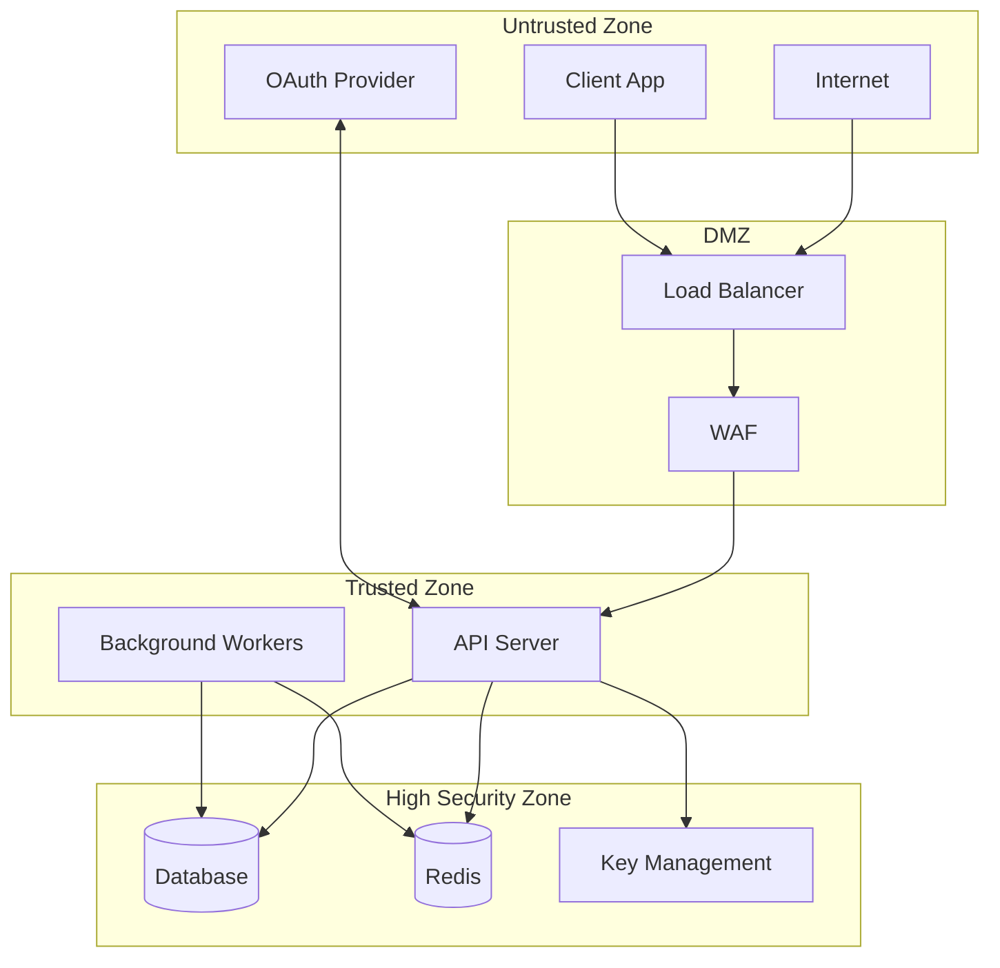
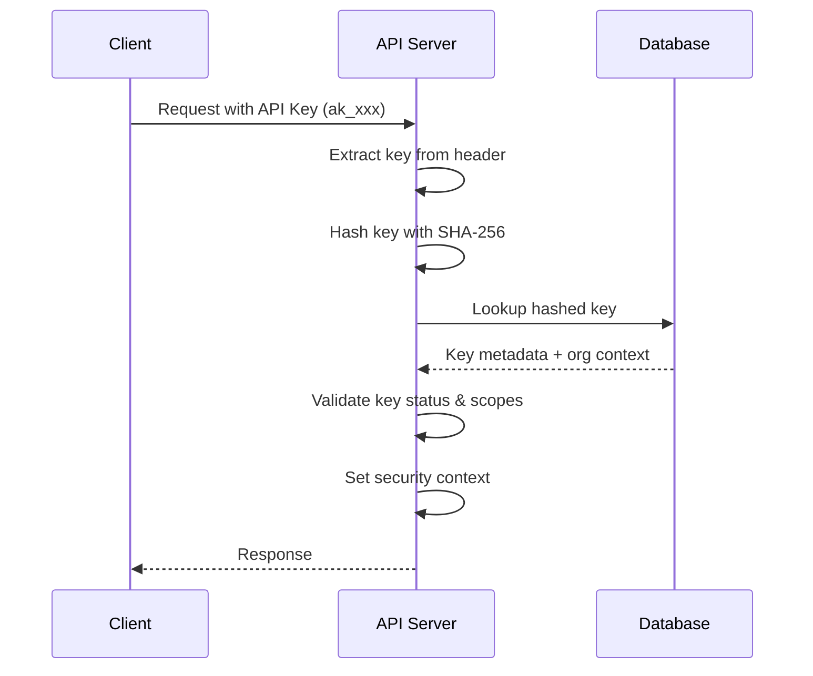
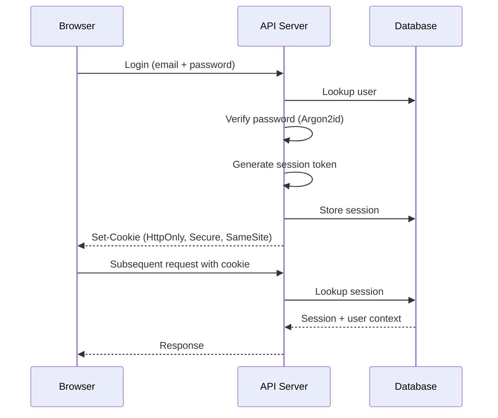

# Security Model

Comprehensive overview of Authlane's security architecture and implementation.

## Overview

Authlane's security model is built on the principle of **defense in depth**, implementing multiple overlapping security controls at every layer of the stack.

## Trust Boundaries



### Trust Levels

1. **Untrusted**: All external traffic (clients, providers, internet)
2. **DMZ**: Network edge components with limited access
3. **Trusted**: Application layer with validated requests
4. **High Security**: Data storage with encryption and isolation

## Authentication Architecture

### API Key Authentication



**Security properties:**
- Keys are hashed before storage (cannot be recovered)
- Keys include environment prefix for identification
- Scopes limit what actions are allowed
- Keys can be revoked instantly

### Session Authentication



**Cookie attributes:**
- `HttpOnly`: Not accessible via JavaScript
- `Secure`: Only sent over HTTPS
- `SameSite=Lax`: CSRF protection
- Short expiration: 24 hours max

## Authorization Model

### Role-Based Access Control (RBAC)

```
Organization
├── Owner (1 per org)
│   ├── Full administrative access
│   ├── Billing management
│   └── Organization deletion
├── Admin (0+)
│   ├── Member management
│   ├── Service configuration
│   └── API key management
└── Member (0+)
    ├── View dashboard
    └── Manage own connections
```

### Permission Matrix

| Action | Owner | Admin | Member |
|--------|-------|-------|--------|
| View dashboard | ✓ | ✓ | ✓ |
| Manage own connections | ✓ | ✓ | ✓ |
| View all connections | ✓ | ✓ | ✗ |
| Create API keys | ✓ | ✓ | ✗ |
| Configure services | ✓ | ✓ | ✗ |
| Invite members | ✓ | ✓ | ✗ |
| Remove members | ✓ | ✓* | ✗ |
| Update organization | ✓ | ✓ | ✗ |
| Delete organization | ✓ | ✗ | ✗ |
| Billing management | ✓ | ✗ | ✗ |

*Admins cannot remove other admins or the owner

### API Key Scopes

```typescript
enum ApiKeyScope {
  // Read operations
  'connections:read',    // List/get connections
  'services:read',       // List/get services
  'tools:list',          // List tool definitions
  'users:read',          // Read user data

  // Write operations
  'connections:write',   // Create/delete connections
  'tools:execute',       // Execute tools
  'users:write',         // Manage users
}
```

## Data Protection

### Encryption Hierarchy

```
┌─────────────────────────────────────────┐
│           Master Key (KMS/HSM)          │
│         (256-bit, hardware-backed)      │
└──────────────────┬──────────────────────┘
                   │
                   ▼
┌─────────────────────────────────────────┐
│        Data Encryption Key (DEK)        │
│    (Per-organization, rotatable)        │
└──────────────────┬──────────────────────┘
                   │
                   ▼
┌─────────────────────────────────────────┐
│       Encrypted Credentials             │
│    (AES-256-GCM, unique IV per record)  │
└─────────────────────────────────────────┘
```

### What's Encrypted

| Data | Encryption | Storage |
|------|------------|---------|
| OAuth tokens | AES-256-GCM | Database (encrypted column) |
| Refresh tokens | AES-256-GCM | Database (encrypted column) |
| Service secrets | AES-256-GCM | Database (encrypted column) |
| API keys | SHA-256 hash | Database (hashed, not recoverable) |
| Passwords | Argon2id | Database (hashed, not recoverable) |
| Session tokens | N/A (random) | Redis (ephemeral) |

### Encryption Process

```typescript
// Encryption
function encrypt(plaintext: string, key: Buffer): EncryptedData {
  const iv = crypto.randomBytes(12);  // Unique per encryption
  const cipher = crypto.createCipheriv('aes-256-gcm', key, iv);

  const encrypted = Buffer.concat([
    cipher.update(plaintext, 'utf8'),
    cipher.final()
  ]);

  const authTag = cipher.getAuthTag();  // Integrity verification

  return {
    ciphertext: encrypted.toString('base64'),
    iv: iv.toString('base64'),
    authTag: authTag.toString('base64')
  };
}

// Decryption
function decrypt(data: EncryptedData, key: Buffer): string {
  const decipher = crypto.createDecipheriv(
    'aes-256-gcm',
    key,
    Buffer.from(data.iv, 'base64')
  );

  decipher.setAuthTag(Buffer.from(data.authTag, 'base64'));

  return Buffer.concat([
    decipher.update(Buffer.from(data.ciphertext, 'base64')),
    decipher.final()
  ]).toString('utf8');
}
```

## Multi-Tenancy Isolation

### Database-Level Isolation

All tables with tenant data include `organization_id` with RLS policies:

```sql
-- Enable RLS on connections table
ALTER TABLE connections ENABLE ROW LEVEL SECURITY;

-- Policy: Organizations can only see their own connections
CREATE POLICY org_isolation ON connections
  USING (organization_id = current_setting('app.current_organization')::uuid);

-- Set context on each request
SET app.current_organization = 'org_abc123';
```

### Request Isolation

```typescript
// Middleware sets tenant context
async function tenantContext(c: Context, next: Next) {
  const orgId = c.get('organizationId');

  // Set PostgreSQL session variable
  await db.execute(`SET app.current_organization = '${orgId}'`);

  await next();
}
```

### Isolation Guarantees

1. **Query isolation**: RLS prevents cross-tenant queries
2. **Index isolation**: No index leakage of tenant data
3. **Cache isolation**: Redis keys prefixed with tenant ID
4. **Log isolation**: Tenant ID included for filtering

## Network Security

### TLS Configuration

```yaml
# Minimum TLS 1.2, prefer TLS 1.3
ssl_protocols: TLSv1.2 TLSv1.3

# Strong cipher suites only
ssl_ciphers: ECDHE-ECDSA-AES256-GCM-SHA384:ECDHE-RSA-AES256-GCM-SHA384

# HSTS enabled
Strict-Transport-Security: max-age=31536000; includeSubDomains
```

### Request Validation

```typescript
// Content-Type validation
if (method !== 'GET' && !contentType?.includes('application/json')) {
  throw new BadRequest('Content-Type must be application/json');
}

// Request size limits
const MAX_BODY_SIZE = 1024 * 1024; // 1MB
app.use(bodyLimit({ maxSize: MAX_BODY_SIZE }));

// Input sanitization
const sanitized = sanitizeInput(request.body);
```

## Audit Logging

### What's Logged

| Event Type | Data Logged |
|------------|-------------|
| Authentication | Success/failure, IP, user agent |
| Authorization | Resource, action, result |
| Credential access | User, service, timestamp |
| Configuration changes | Before/after, actor |
| Security events | Type, details, severity |

### Log Format

```json
{
  "timestamp": "2024-12-12T10:30:00Z",
  "event": "credential_access",
  "actor": {
    "type": "api_key",
    "id": "key_abc123",
    "organizationId": "org_xyz"
  },
  "resource": {
    "type": "connection",
    "id": "conn_123",
    "userId": "user_456",
    "serviceId": "github"
  },
  "context": {
    "ip": "192.168.1.1",
    "userAgent": "MyApp/1.0",
    "requestId": "req_abc123"
  },
  "result": "success"
}
```

### Log Retention

| Log Type | Retention |
|----------|-----------|
| Access logs | 90 days |
| Security events | 1 year |
| Audit logs | 7 years (compliance) |
| Debug logs | 7 days |

## Security Incident Response

### Severity Levels

| Level | Description | Response Time |
|-------|-------------|---------------|
| P0 | Active exploitation | Immediate |
| P1 | Critical vulnerability | < 4 hours |
| P2 | High vulnerability | < 24 hours |
| P3 | Medium vulnerability | < 1 week |
| P4 | Low vulnerability | < 1 month |

### Response Procedures

1. **Detection**: Automated alerts or manual report
2. **Triage**: Assess severity and scope
3. **Containment**: Isolate affected systems
4. **Eradication**: Remove threat
5. **Recovery**: Restore normal operations
6. **Lessons learned**: Post-incident review

## Security Testing

### Automated Testing

- **Static Analysis**: CodeQL, Semgrep
- **Dependency Scanning**: Dependabot, Snyk
- **Container Scanning**: Trivy
- **Secret Scanning**: Git hooks, Gitleaks

### Manual Testing

- **Penetration Testing**: Annual third-party assessment
- **Code Review**: Security-focused PR reviews
- **Red Team Exercises**: Quarterly simulated attacks

## Compliance Controls

| Control | Implementation |
|---------|----------------|
| Access logging | All API access logged |
| Encryption at rest | AES-256-GCM for sensitive data |
| Encryption in transit | TLS 1.2+ required |
| Key management | AWS KMS / HashiCorp Vault |
| Data retention | Configurable per compliance |
| Right to deletion | User data purge API |
| Audit trail | Immutable audit log |

